# Digital Electronics and Circuits (DEC)
## Complete First-Principles Comprehensive Lecture Notes

---

### Course & Curriculum Reference
- **Course Title:** Digital Electronics Circuits (DEC)
- **Course Code:** BEL5T16C
- **Target Audience:** Engineering Students (Sem V, B.Tech Electrical/Electronics Engineering) & Beginners with **Zero Prior Background** in Electronics.
- **Syllabus Baseline:** Rashtrasant Tukadoji Maharaj Nagpur University (RTMNU) NEP Curriculum, aligned with national model curricula (AICTE/GATE).
- **Core Authorized Source Books:**
  1. **A. Anand Kumar**, *Fundamentals of Digital Circuits*, 4th Edition, PHI Learning Private Limited, 2016. [Cited throughout as *Kumar*].
  2. **M. Morris Mano & Michael D. Ciletti**, *Digital Design: With an Introduction to the Verilog HDL, VHDL, and SystemVerilog*, 6th Global Edition, Pearson Education, 2017. [Cited throughout as *Mano*].
  3. **Thomas L. Floyd**, *Digital Fundamentals: A Systems Approach*, 1st Edition, Pearson, 2013. [Cited throughout as *Floyd*].
  4. **R. P. Jain**, *Modern Digital Electronics*, McGraw-Hill Education, 2009. [Cited throughout as *Jain*].

---

### Pedagogical Architecture & Reader Contract

This document is engineered under a strict pedagogical mandate: **assume the reader has never seen an electric circuit, never written a binary number, and never encountered Boolean logic in their life**. It is neither an exam cram-sheet nor a compressed summary. Every concept is constructed systematically from physical reality, following thirteen core structural rules:

1. **Entry Point Assuming Nothing:** Every topic begins with everyday physical intuition and plain words before any formal mathematical notation appears. Every variable and symbol ($V$, $I$, $A$, $B$, $Q$, $\oplus$, etc.) is defined inline at its immediate point of use, even if previously defined.
2. **One New Idea Per Step:** Concepts are unpacked sequentially. Derivations explain what each step is *doing conceptually*, not just the algebraic transformation.
3. **Concrete Before Abstract:** Simple, round numerical examples and tangible physical scenarios precede generalized formulas.
4. **Three Parallel Representations:** Every core concept is presented in three synchronized formats: **plain words**, an **authentic textbook diagram** sourced directly from the reference literature, and a **governing equation or truth table**.
5. **The "Why" Behind the "How":** Engineering tricks, circuit simplifications, and mathematical conventions are accompanied by the reason they were invented and what disaster happens without them.
6. **Understanding Checkpoints & Dual Misconception Audits:** Each major topic concludes with an immediate self-check question (with answer supplied immediately below) along with explicit corrections of both **conceptual misconceptions** (fundamental mental errors) and **arithmetic/bookkeeping slip-ups**.
7. **Exhaustive Ground-Up Prerequisites:** A comprehensive foundational section precedes Unit I, developing voltage, current, ground, transistors as switches, and timing waveforms from first principles.
8. **Explicit Pacing Signals:** Every section explicitly alerts the reader whether to read slowly and deliberately for deep conceptual grounding, or to move briskly through routine algorithmic procedures.
9. **Universal Concept Spine (Need $	o$ Chain $	o$ How $	o$ Check):**
   - **Need (Problem-First):** What physical failure or real-world bottleneck forces this idea to exist?
   - **Chain (Cause and Effect):** How does one physical action trigger the next?
   - **How (Mechanism & Math):** The complete physical working, circuit operation, and mathematical derivation.
   - **Check:** An immediate understanding verification question.
10. **Deliberate Vocabulary Building:** Technical terms are defined upon first introduction and used consistently throughout.
11. **Continuous Subject Mapping:** The master architectural map below is echoed at the head of every individual unit.
12. **Style Anchoring:** Plainspoken engineering prose grounded in real physical devices.
13. **Explicit Added Characteristic — Physical Wire & Internal Node Signal Walkthrough (Hardware Reality Check):**
    *Added pedagogical rationale:* To prevent a zero-background reader from confusing digital electronics with purely abstract paper mathematics, every circuit topic includes a step-by-step physical walkthrough of moving charge carriers, node voltages (e.g., $0	ext{ V}$ vs. $5	ext{ V}$), and transistor conduction states across internal circuit wires.

---

### Master Subject Map: How Electricity Becomes a Digital Computer

To understand Digital Electronics, you must see the complete five-layer pyramid before exploring its individual stones:

```
[ PHYSICAL WORLD ]  Continuous analog variables (Sound, Temperature, Light, Pressure)
         │
         ▼
┌──────────────────────────────────────────────────────────────────────────────────┐
│ LAYER 0: PHYSICAL PREREQUISITES                                                  │
│ Charge, Current (I), Voltage (V), Ground (0 V), Transistors as Electronic Switches│
└────────────────────────────────────────┬─────────────────────────────────────────┘
                                         ▼
┌──────────────────────────────────────────────────────────────────────────────────┐
│ LAYER 1: THE DIGITAL ABSTRACTION & LOGIC FAMILIES (UNIT I)                       │
│ High/Low Voltage Bands, Binary Math (2's Comp), Gate Circuits (TTL, CMOS, RTL)  │
└────────────────────────────────────────┬─────────────────────────────────────────┘
                                         ▼
┌──────────────────────────────────────────────────────────────────────────────────┐
│ LAYER 2: LOGIC MINIMIZATION & BOOLEAN ALGEBRA (UNIT II)                          │
│ Axioms, De Morgan's Theorems, Standard Forms (SOP/POS), Karnaugh Maps (K-Maps)   │
└────────────────────────────────────────┬─────────────────────────────────────────┘
                                         ▼
┌──────────────────────────────────────────────────────────────────────────────────┐
│ LAYER 3: COMBINATIONAL DIGITAL CIRCUITS (UNIT III)                               │
│ Memoryless Decision Logic: Adders, Subtractors, Multiplexers, Decoders, Displays │
└────────────────────────────────────────┬─────────────────────────────────────────┘
                                         ▼
┌──────────────────────────────────────────────────────────────────────────────────┐
│ LAYER 4: SEQUENTIAL CIRCUITS & STATE MACHINES (UNIT IV)                          │
│ Memory Elements: Latches, Flip-Flops, Shift Registers, Synchronous/Ripple Counters│
└────────────────────────────────────────┬─────────────────────────────────────────┘
                                         ▼
┌──────────────────────────────────────────────────────────────────────────────────┐
│ LAYER 5: CONVERTERS & SEMICONDUCTOR MEMORIES (UNIT V)                            │
│ Interfacing & Storage: DAC (R-2R), ADC (SAR, Dual-Slope), SRAM/DRAM, PLDs (PLA/PAL)│
└────────────────────────────────────────┬─────────────────────────────────────────┘
                                         │
                                         ▼
[ REAL-WORLD DIGITAL SYSTEMS ] Microprocessors, Controllers, Automotive & Audio Systems
```

- **Layer 0 (Prerequisites):** Establishes that electricity is moving charge, voltage is electrical push, and a transistor is a valve that can turn electricity ON or OFF without human fingers.
- **Layer 1 (Unit I):** Defines that $0	ext{ V}$ represents the symbol `0` and $+5	ext{ V}$ represents `1`. We show how basic transistors combine into primitive decision blocks called **Logic Gates** (AND, OR, NOT, NAND, NOR, XOR), build binary number systems, and examine the silicon hardware families (**RTL**, **TTL**, **CMOS**) that realize them.
- **Layer 2 (Unit II):** Demonstrates how to take complex word problems or large truth tables and mathematically boil them down to the smallest possible number of gates using **Boolean Algebra** and visual **Karnaugh Maps (K-maps)**.
- **Layer 3 (Unit III):** Combines minimized gates into instantaneous calculating machines (**Combinational Circuits**) that have no memory—calculating sums (Adders), steering signals (Multiplexers), and decoding symbols for human eyes (Seven-Segment Displays).
- **Layer 4 (Unit IV):** Adds **feedback** to gates, creating circuits that remember their previous state (**Sequential Circuits**). This gives rise to 1-bit memory cells (Flip-Flops), serial data pipelines (Shift Registers), and rhythmic step-counters (Counters for Traffic Light Controllers).
- **Layer 5 (Unit V):** Completes the digital universe by bridging back to the physical world through **Digital-to-Analog Converters (DAC)** and **Analog-to-Digital Converters (ADC)**, and organizing massive arrays of bit storage (**Semiconductor Memories: SRAM, DRAM, ROM**) and field-customizable chips (**PLDs: PLA, PAL**).

---


# Comprehensive Ground-Up Prerequisites
## Building the Physical and Mathematical Foundations from Zero

> **Reader Guidance & Scope Notice:**  
> Before reading Unit I, you do not need to have taken courses in semiconductor physics, electromagnetic theory, or advanced calculus. This dedicated section builds every single required concept from scratch—beginning with the physical nature of an electron and ending with how an integrated circuit chip is numbered.  
> *Sourcing transparency:* Foundational electrical concepts not explicitly covered in the digital textbook chapters are clearly designated as **"Added background (not from the provided books)"**. All digital signal waveforms, pulse parameters, and integrated circuit package descriptions are sourced directly from *Floyd (pp. 6–35)* and *Kumar (pp. 32–45)*.

---

### Prerequisites Inventory
Before proceeding into digital logic, ensure you understand this sequenced dependency chain:
1. **Physical Electricity:** Charge ($Q$), Electric Current ($I$), Voltage ($V$), Resistance ($R$), and Ohm's Law ($V = IR$).
2. **Circuit References:** Ground ($0\text{ V}$), Supply Rails ($V_{CC} / V_{DD}$), and the necessity of a closed conductive loop.
3. **The Electronic Switch:** How a 3-terminal semiconductor device (BJT or MOSFET) acts like a light switch flipped by a control voltage rather than a human finger.
4. **The Digital Abstraction:** Why real-world circuits convert continuous, messy analog voltages into two rigid digital states: `0` (LOW) and `1` (HIGH).
5. **Time and Waveforms:** Pulse definitions, rising edges, falling edges, rise time ($t_r$), fall time ($t_f$), pulse width ($t_w$), frequency ($f$), and clock periods ($T$).
6. **Mathematical Notation:** Powers of 2, radix subscripts (e.g., $101_2$ vs. $101_{10}$), Boolean variables, and truth table reading.
7. **Physical Hardware Reality:** Silicon dies, wire bonds, Dual In-line Packages (DIP), and pin numbering rules.

---

### Prerequisite 1: Electric Charge, Current, Voltage, and Resistance
*Added background (not from the provided books)*  
**[Pacing: Slow & Intuitive — Read Every Word]**

#### Need (Problem-First)
All computing hardware is made of physical matter. If you do not understand what electricity is physically doing inside a copper trace or a silicon channel, digital logic chips will seem like magic black boxes. Without understanding the relationship between voltage and current, you cannot understand why a gate draws power, why chips get hot, or why an output pin can only drive a limited number of other chips before failing.

#### Chain of Cause and Effect
Subatomic particles have charge $\to$ mobile electrons move through a conductor under an electric field $\to$ this movement of charge constitutes an electric current $\to$ the force pushing these charges is electrical potential difference (voltage) $\to$ materials resist this motion (resistance) $\to$ energy is converted to heat.

#### How It Works (The Physical Mechanism)
1. **Electric Charge ($Q$):** Matter is composed of atoms containing positively charged protons and negatively charged electrons. In conductive metals (like copper wires) and treated semiconductors (silicon), outer electrons can detach from their host atoms and drift freely. Charge is measured in **Coulombs (C)**. One electron carries an elementary negative charge of approximately $1.602 \times 10^{-19}\text{ C}$.
2. **Electric Current ($I$):** Current is the rate at which electric charge flows past a specific cross-section of a wire:
   $$I = \frac{dQ}{dt}$$
   Current is measured in **Amperes (A)**, where $1\text{ A} = 1\text{ Coulomb per second}$. In digital circuits, currents are typically tiny, measured in **milliamperes** ($1\text{ mA} = 10^{-3}\text{ A}$) or **microamperes** ($1\text{ }\mu\text{A} = 10^{-6}\text{ A}$).
3. **Voltage ($V$ or $E$):** Voltage is the electrical pressure or potential energy difference between two distinct points. It measures how much work is required to move a unit charge between those points:
   $$V = \frac{dW}{dQ}$$
   Voltage is measured in **Volts (V)**, where $1\text{ V} = 1\text{ Joule per Coulomb}$. A battery or power supply creates an excess of electrons at its negative terminal and a deficit at its positive terminal. This difference in potential creates an electric field that pushes electrons through an external path.
4. **Resistance ($R$):** As electrons travel through a conductor, they collide with lattice atoms, hindering their flow. This opposition is electrical resistance, measured in **Ohms ($\Omega$)**.
5. **Ohm's Law:** In an ideal resistive conductor, the current flowing through is directly proportional to the applied voltage difference across its terminals:
   $$V = I \cdot R \quad \iff \quad I = \frac{V}{R} \quad \iff \quad R = \frac{V}{I}$$
   *Concrete Round-Number Example:* Suppose a $+5\text{ V}$ voltage is applied across a resistor of $R = 1000\text{ }\Omega$ ($1\text{ k}\Omega$). The resulting current is:
   $$I = \frac{5\text{ V}}{1000\text{ }\Omega} = 0.005\text{ A} = 5\text{ mA}$$

#### Understanding Checkpoint
- **Question:** If you have a $+5\text{ V}$ power supply connected to a resistor and you double the resistance from $1\text{ k}\Omega$ to $2\text{ k}\Omega$, what happens to the electric current flowing through it?
- **Answer:** The current is cut in half, dropping from $5\text{ mA}$ to $2.5\text{ mA}$, because current is inversely proportional to resistance ($I = V/R$).

---

### Prerequisite 2: Ground Reference ($0	ext{ V}$) and Supply Rails ($V_{CC} / V_{DD}$)
*Added background (not from the provided books)*  
**[Pacing: Fundamental Concept — Establish Firmly]**

#### Need (Problem-First)
Beginners often ask: "If a wire is labeled $+5\text{ V}$, where does the electricity go? Why doesn't a circuit work with just one wire?" In physics, an absolute voltage at a single isolated point does not exist. Voltage is strictly a *difference* between two points. If you do not establish a shared zero-volt baseline across all components on a circuit board, none of the chips can agree on what a `0` or `1` is.

#### Chain of Cause and Effect
Electrons need a complete loop to circulate $\to$ circuits designate a shared common conductor called Ground ($0\text{ V}$) $\to$ a power source maintains a fixed positive potential difference above this ground (e.g., $+5\text{ V}$) $\to$ current leaves the positive supply, travels through the gates, and returns to ground.

#### How It Works (The Physical Mechanism)
- **Ground (GND / $0\text{ V}$):** In digital electronics, "Ground" does not necessarily mean driving a copper rod into the literal earth outside. It is simply the common return wire or circuit board copper plane that we arbitrarily define as the $0.00\text{ V}$ baseline reference point. All other voltages in the circuit are measured *with respect to this ground node*.
- **Positive Supply Rail ($V_{CC}$ or $V_{DD}$):** In bipolar transistor logic (TTL), the positive power supply pin is labeled **$V_{CC}$** (standing for Collector Supply Voltage, historically $+5.0\text{ V}$). In MOS/CMOS transistor logic, the positive power supply pin is labeled **$V_{DD}$** (standing for Drain Supply Voltage, typically $+5.0\text{ V}$, $+3.3\text{ V}$, or $+1.8\text{ V}$ in modern silicon).
- **The Closed Loop Requirement:** Electric charge cannot accumulate indefinitely on an open wire. For steady current to flow, every milliampere that leaves the $+5\text{ V}$ supply terminal must physically travel through components and enter the ground return terminal back to the power supply.

#### Understanding Checkpoint
- **Question:** If a voltmeter lead touches a wire carrying $+5\text{ V}$ while the meter's black reference lead is left hanging in empty air, what voltage does the meter read?
- **Answer:** It reads an unpredictable, floating noise value (essentially meaningless), because voltage can only be measured as the potential difference *between two connected points*.

---

### Prerequisite 3: The Electronic Switch — How Transistors Turn Signals ON and OFF
*Added background (not from the provided books), supported by Kumar (Ch. 16, pp. 892, 917)*  
**[Pacing: Conceptually Critical — Read Slowly]**

#### Need (Problem-First)
To build a machine that calculates, we cannot have human hands mechanically toggling wall switches millions of times per second. We need an electrical switch that can be toggled by *another electrical voltage*. That device is the semiconductor transistor.

#### Chain of Cause and Effect
A physical switch connects or disconnects two terminals $\to$ an electronic transistor has a conduction channel whose resistance can be made near zero or near infinite $\to$ applying a control voltage to the gate/base turns this channel ON or OFF $\to$ this enables one circuit to control another without moving mechanical parts.

#### How It Works (The Physical Mechanism)
In digital circuits, transistors are **never used as linear amplifiers** (as they are in radio transmitters or audio equipment). They are operated exclusively at their extreme outer limits:
1. **Cutoff Region (The OPEN Switch):** When the control voltage is removed (or set to $0\text{ V}$), the internal conduction path between the output terminals has massive resistance (hundreds of megaohms). No current flows. The switch is **OPEN** (OFF).
2. **Saturation Region (The CLOSED Switch):** When a sufficient control voltage is applied, mobile charge carriers flood the internal channel. The electrical resistance between the output terminals collapses to near zero ohms (a fraction of an ohm to a few ohms). Current flows freely. The switch is **CLOSED** (ON).

Two main families of transistors perform this electronic switching in digital history:
- **Bipolar Junction Transistor (BJT):** Used in Transistor-Transistor Logic (**TTL**). A small input current injected into the middle terminal (Base, $B$) controls a large current between the Collector ($C$) and Emitter ($E$).
- **Metal-Oxide-Semiconductor Field-Effect Transistor (MOSFET):** Used in Complementary MOS (**CMOS**). A voltage applied to the insulated control terminal (Gate, $G$) sets up an electric field across an oxide insulator, opening or closing a conductive path between the Drain ($D$) and Source ($S$). Because the Gate is insulated by silicon dioxide, the steady-state control current is essentially **zero** ($I_G \approx 0$), making CMOS consume vastly less electrical power than BJT logic.

*Transistor Inverter Action (The Pull-Down Mechanism):*
Consider a simple switch circuit where a resistor connects an output wire to $+5\text{ V}$, and an electronic transistor switch connects that same output wire to Ground ($0\text{ V}$):
- When the transistor switch is **OPEN (control input = $0\text{ V}$)**: No current can flow through the transistor to ground. The output wire is pulled up to $+5\text{ V}$ through the resistor. Output = $+5\text{ V}$ (HIGH).
- When the transistor switch is **CLOSED (control input = $+5\text{ V}$)**: The transistor creates a direct short-circuit path from the output wire to Ground ($0\text{ V}$). Current rushes through the resistor and drains straight into ground. The output wire is clamped to $0\text{ V}$. Output = $0\text{ V}$ (LOW).
Notice what just happened: an input of $0\text{ V}$ produced an output of $+5\text{ V}$, and an input of $+5\text{ V}$ produced an output of $0\text{ V}$. **This is the fundamental electronic INVERTER (NOT gate)**.

#### Understanding Checkpoint
- **Question:** When an electronic transistor switch is fully ON (saturated), what is the voltage drop across its main switching terminals?
- **Answer:** Near zero volts (ideally $0\text{ V}$, practically $0.1\text{ V}$ to $0.2\text{ V}$ in silicon BJTs).

---

### Prerequisite 4: The Digital Abstraction — Logic Levels, Voltage Bands, and Noise Margins
*Source: Floyd (Ch. 1, pp. 6–15); Kumar (Ch. 1, pp. 32–36)*  
**[Pacing: Core Foundation — Essential Reading]**

#### Need (Problem-First)
Real electronic components are imperfect. Power supplies ripple, radio waves induce stray voltages into wires, and temperature fluctuations shift component values. If a circuit relied on precise analog voltages—such that $2.500\text{ V}$ meant "number 5" and $2.505\text{ V}$ meant "number 6"—stray electrical noise would immediately corrupt every calculation. Digital systems achieve complete immunity to this noise through the **Digital Abstraction**.

#### Chain of Cause and Effect
Continuous analog voltages are inherently vulnerable to physical noise $\to$ engineers define two broad, non-overlapping voltage ranges separated by an illegal buffer zone $\to$ any voltage falling in the upper band is treated identically as logic `1` $\to$ any voltage in the lower band is treated identically as logic `0` $\to$ noise that stays within the allowed bands is completely rejected.

#### How It Works (The Physical Mechanism)
In binary digital electronics, circuits recognize only two operational states:
- **Logic 1 (HIGH):** Represents the assertion of a condition, a binary TRUE, or a binary digit `1`.
- **Logic 0 (LOW):** Represents the non-assertion of a condition, a binary FALSE, or a binary digit `0`.

Instead of requiring an exact voltage like $+5.000\text{ V}$, practical IC logic families define **voltage bands** with four critical thresholds (*Kumar*, p. 896):
1. **$V_{OH(\min)}$ (Minimum Output High Voltage):** The lowest voltage that a transmitting logic gate will output when it asserts a HIGH state (e.g., $+2.7\text{ V}$ in standard TTL, or $+4.9\text{ V}$ in CMOS).
2. **$V_{IH(\min)}$ (Minimum Input High Voltage):** The lowest voltage that a receiving logic gate will reliably accept as a legitimate HIGH input (e.g., $+2.0\text{ V}$ in standard TTL, or $+3.5\text{ V}$ in CMOS).
3. **$V_{IL(\max)}$ (Maximum Input Low Voltage):** The highest voltage that a receiving logic gate will reliably accept as a legitimate LOW input (e.g., $+0.8\text{ V}$ in standard TTL, or $+1.5\text{ V}$ in CMOS).
4. **$V_{OL(\max)}$ (Maximum Output Low Voltage):** The highest voltage that a transmitting logic gate will output when it asserts a LOW state (e.g., $+0.4\text{ V}$ in standard TTL, or $+0.1\text{ V}$ in CMOS).

Between $V_{IL(\max)}$ and $V_{IH(\min)}$ lies the **Forbidden / Undefined Region** (e.g., between $0.8\text{ V}$ and $2.0\text{ V}$ in standard TTL). A gate's input must never be allowed to float or dwell in this middle zone during steady-state operation; otherwise, internal transistors can enter unpredictable conduction states, causing false outputs or burning excessive power.

**Noise Margin ($NM$):**  
The noise margin is the maximum amplitude of unwanted noise voltage that can be superimposed on a digital signal without causing the receiving gate to misinterpret the logic level (*Kumar*, p. 896):
- **High-state Noise Margin ($NM_H$):**
  $$NM_H = V_{OH(\min)} - V_{IH(\min)}$$
  *Example (Standard TTL):* $NM_H = 2.7\text{ V} - 2.0\text{ V} = 0.7\text{ V}$. A noise spike would have to pull the output down by more than $0.7\text{ V}$ before the receiver misreads it.
- **Low-state Noise Margin ($NM_L$):**
  $$NM_L = V_{IL(\max)} - V_{OL(\max)}$$
  *Example (Standard TTL):* $NM_L = 0.8\text{ V} - 0.4\text{ V} = 0.4\text{ V}$. A positive noise spike would have to raise the ground potential by more than $0.4\text{ V}$ before the receiver misreads a LOW as a HIGH.

#### Understanding Checkpoint
- **Question:** A digital sensor produces an output of $+1.2\text{ V}$ connected to a standard TTL logic gate whose input thresholds are $V_{IL(\max)} = 0.8\text{ V}$ and $V_{IH(\min)} = 2.0\text{ V}$. Does the gate read this as a `0` or a `1`?
- **Answer:** Neither reliably. $+1.2\text{ V}$ falls directly in the forbidden/indeterminate region between $0.8\text{ V}$ and $2.0\text{ V}$. The circuit behavior is unpredictable and represents a design fault.

---

### Prerequisite 5: Pulse Waveforms, Clock Signals, and Timing Parameters
*Source: Kumar (Ch. 1, pp. 34–36, Figures 1.1 & 1.2); Floyd (Ch. 1, pp. 11–14)*  
**[Pacing: Conceptually Important — Master the Waveform Vocabulary]**

#### Need (Problem-First)
Digital circuits do not live in frozen time. Voltages must switch back and forth to carry messages, count events, and clock calculations. In textbook theory, people draw square waves that change instantly. In real silicon, electrons take time to travel and parasitic capacitors take time to charge. If an engineer assumes pulses switch instantaneously, high-speed sequential circuits will glitch and fail.

#### Chain of Cause and Effect
Transistors turn ON and OFF $\to$ voltages rise from LOW to HIGH and fall from HIGH to LOW $\to$ capacitive loads in physical wires prevent instant voltage changes $\to$ pulses have finite rise times and fall times $\to$ engineers define exact 10% and 90% measurement points to characterize signal speed.

#### How It Works (The Physical Mechanism)

##### 1. Ideal Pulses vs. Real-World Pulses
An **ideal pulse** changes between the LOW and HIGH level in zero time, forming perfectly vertical edges:
- **Positive Pulse:** Starts at the baseline LOW level, transitions to the HIGH level at its **leading edge** (or rising edge), remains HIGH for duration $t_w$, and returns to the LOW level at its **trailing edge** (or falling edge) (*Kumar*, p. 35, Figure 1.1a).
- **Negative Pulse:** Starts at the baseline HIGH level, transitions to the LOW level at its leading edge, and returns to HIGH at its trailing edge (*Kumar*, p. 35, Figure 1.1b).

<figure>
  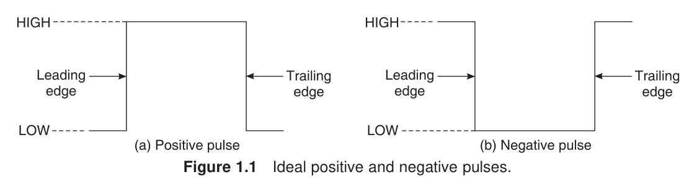
  <figcaption><strong>Figure 1.1:</strong> Ideal positive and negative pulses showing leading and trailing edges. Sourced from <em>A. Anand Kumar, Fundamentals of Digital Circuits (4th Ed.)</em>, p. 35 (printed p. 3).</figcaption>
</figure>

In physical circuits, no voltage can change in zero picoseconds. A real-world non-ideal pulse is shaped by finite transition intervals (*Kumar*, p. 35, Figure 1.2):

<figure>
  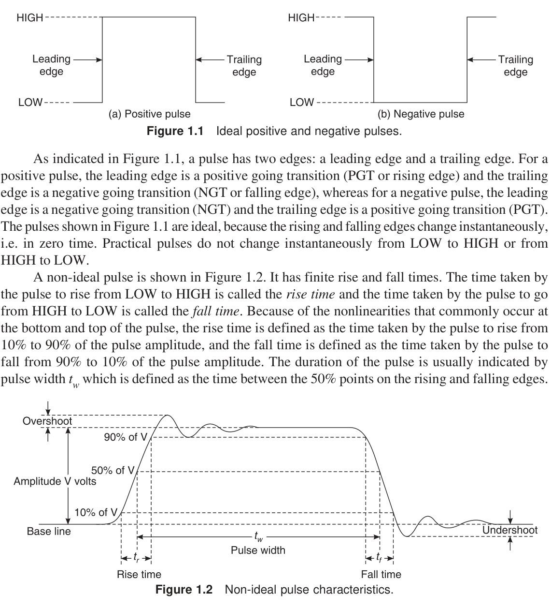
  <figcaption><strong>Figure 1.2:</strong> Non-ideal pulse characteristics defining rise time (<em>t<sub>r</sub></em>), fall time (<em>t<sub>f</sub></em>), and pulse width (<em>t<sub>w</sub></em>) measured between 10%, 50%, and 90% amplitude thresholds. Sourced from <em>A. Anand Kumar, Fundamentals of Digital Circuits (4th Ed.)</em>, p. 35 (printed p. 3).</figcaption>
</figure>

##### 2. Key Non-Ideal Pulse Parameters Defined Inline:
1. **Rise Time ($t_r$):** The time required for the pulse voltage to transition from $10\%$ of its final amplitude up to $90\%$ of its final amplitude (*Kumar*, p. 35). The lower $10\%$ and upper $10\%$ regions are excluded from the measurement because non-linear rounding ("knees") occurs near the supply rails.
2. **Fall Time ($t_f$):** The time required for the pulse voltage to transition downward from $90\%$ of its peak amplitude down to $10\%$ of its amplitude (*Kumar*, p. 35).
3. **Pulse Width ($t_w$):** The operational duration of the active pulse, standardized by international convention as the elapsed time between the **$50\%$ amplitude point on the rising edge** and the **$50\%$ amplitude point on the falling edge** (*Kumar*, p. 35).
4. **Period ($T$):** In a repeating periodic waveform (such as a system clock), the period $T$ is the total elapsed time for one complete cycle to occur, measured from a point on one pulse to the identical corresponding point on the next pulse.
5. **Frequency ($f$):** The rate at which pulses repeat per unit time, measured in **Hertz (Hz)**, where $1\text{ Hz} = 1\text{ cycle per second}$:
   $$f = \frac{1}{T} \quad \iff \quad T = \frac{1}{f}$$
   *Concrete Round-Number Example:* If a microprocessor clock has a period of $T = 10\text{ nanoseconds}$ ($10 \times 10^{-9}\text{ s}$), its operating frequency is:
   $$f = \frac{1}{10 \times 10^{-9}\text{ s}} = 100{,}000{,}000\text{ Hz} = 100\text{ MHz}$$
6. **Duty Cycle:** The ratio of the active pulse width ($t_w$) to the total repeating period ($T$), typically expressed as a percentage:
   $$\text{Duty Cycle} = \left(\frac{t_w}{T}\right) \times 100\%$$
   A symmetrical square wave has a duty cycle of exactly $50\%$ ($t_w = T/2$).

#### Understanding Checkpoint
- **Question:** A periodic clock signal has a frequency of $2\text{ MHz}$ ($2 \times 10^6\text{ Hz}$). What is its time period $T$, and if its pulse width is $0.1\text{ }\mu\text{s}$, what is its duty cycle?
- **Answer:**
  $$T = \frac{1}{2 \times 10^6\text{ s}^{-1}} = 0.5 \times 10^{-6}\text{ s} = 0.5\text{ }\mu\text{s} = 500\text{ ns}$$
  $$\text{Duty Cycle} = \frac{0.1\text{ }\mu\text{s}}{0.5\text{ }\mu\text{s}} \times 100\% = 20\%$$

---

### Prerequisite 6: Mathematical Foundations — Positional Notation, Powers of Two, and Truth Tables
*Source: Floyd (Ch. 2, pp. 52–58); Kumar (Ch. 2, pp. 59–63)*  
**[Pacing: Systematic Bookkeeping — Follow the Method]**

#### Need (Problem-First)
Human beings count in decimal (base 10) because we have ten fingers. But electronic switches can only exist stably in two physical states: fully OPEN or fully CLOSED. To map numbers and decisions onto two-state hardware, we must understand positional numbering in arbitrary bases—especially base 2.

#### Chain of Cause and Effect
Positional notation weights each column by powers of the base $\to$ decimal weights are powers of $10$ ($10^0, 10^1, 10^2 \dots$) $\to$ binary weights are powers of $2$ ($2^0, 2^1, 2^2 \dots$) $\to$ any positive integer can be uniquely expressed as a sum of active powers of two.

#### How It Works (The Mechanism & Math)

##### 1. Positional Number Systems
In any positional number system with base (or radix) $r$, a number sequence $d_n d_{n-1} \dots d_1 d_0$ represents the polynomial value:
$$\text{Value} = \sum_{i=0}^{n} d_i \cdot r^i = d_n r^n + d_{n-1} r^{n-1} + \dots + d_1 r^1 + d_0 r^0$$
- In base 10 ($r=10$), the symbols are $\{0, 1, 2, 3, 4, 5, 6, 7, 8, 9\}$.  
  Example: $742_{10} = 7 \times 10^2 + 4 \times 10^1 + 2 \times 10^0 = 700 + 40 + 2 = 742$.
- In base 2 ($r=2$), the only allowed symbols are $\{0, 1\}$.  
  Each binary digit is called a **bit** (portmanteau of **bi**nary digi**t**).

##### 2. The Powers of Two (Memorize These Columns):
$$2^0 = 1, \quad 2^1 = 2, \quad 2^2 = 4, \quad 2^3 = 8, \quad 2^4 = 16, \quad 2^5 = 32, \quad 2^6 = 64, \quad 2^7 = 128, \quad 2^8 = 256, \quad 2^9 = 512, \quad 2^{10} = 1024$$
*Concrete Round-Number Example:* Evaluate the 4-bit binary number $1101_2$:
$$1101_2 = (1 \times 2^3) + (1 \times 2^2) + (0 \times 2^1) + (1 \times 2^0) = 8 + 4 + 0 + 1 = 13_{10}$$
- The rightmost bit ($2^0 = 1$) is called the **Least Significant Bit (LSB)** because it has the smallest numerical weight.
- The leftmost bit ($2^3 = 8$ in a 4-bit number) is called the **Most Significant Bit (MSB)** because it carries the largest numerical weight.

##### 3. Truth Table Reading
A **Truth Table** is an exhaustive tabular ledger listing every possible combination of input logic states alongside the resulting output logic state for a digital circuit.
- If a circuit has $n$ independent binary inputs, there are exactly $2^n$ unique input combinations.
  - 1 input ($n=1$): $2^1 = 2$ rows ($0, 1$).
  - 2 inputs ($n=2$): $2^2 = 4$ rows ($00, 01, 10, 11$).
  - 3 inputs ($n=3$): $2^3 = 8$ rows ($000$ to $111$).
  - 4 inputs ($n=4$): $2^4 = 16$ rows ($0000$ to $1111$).
The standard convention is to write the input rows in ascending binary order ($0, 1, 2, 3 \dots$) so no combination is accidentally omitted or duplicated.

#### Understanding Checkpoint
- **Question:** How many rows must a truth table contain for a logic circuit with 5 digital inputs?
- **Answer:** Exactly $2^5 = 32$ rows.

---

### Prerequisite 7: Physical Integrated Circuit Hardware — Dies, Wire Bonds, and Package Pinouts
*Source: Floyd (Ch. 1, pp. 30–32, Figures 41 & 44); Mano (Ch. 2, pp. 90–93)*  
**[Pacing: Physical Reality — High Practical Value]**

#### Need (Problem-First)
Students who only study logic diagrams on paper often fail completely when given physical components in an engineering laboratory. A logic gate drawn on paper as a triangular symbol is actually an microscopic silicon die sealed inside a black plastic package with metal legs called pins. If you wire power to the wrong pin or insert the package upside down, you will destroy the chip within milliseconds.

#### Chain of Cause and Effect
Silicon wafers are fabricated with microscopic transistors $\to$ individual dies are sliced and mounted into durable protective packages $\to$ tiny microscopic bond wires connect the silicon pads to sturdy exterior metal pins $\to$ an international indexing convention (the notch/dot) allows engineers to identify Pin 1 without ambiguity.

#### How It Works (The Physical Mechanism)
Figure 41 from *Floyd (p. 30)* illustrates the internal cutaway view of a fixed-function IC package:

<figure>
  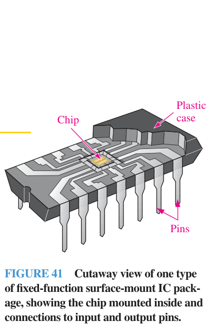
  <figcaption><strong>Figure 41:</strong> Cutaway view of a fixed-function IC package showing the internal silicon chip die, lead frame, and microscopic wire bonds connecting the silicon pads to external metal pins. Sourced from <em>Thomas L. Floyd, Digital Fundamentals: A Systems Approach (1st Ed.)</em>, p. 30 (printed p. 24).</figcaption>
</figure>

- **The Silicon Die:** A microscopic sliver of high-purity silicon (typically a few millimeters square) containing dozens to billions of interconnected transistors, diodes, and resistors.
- **Wire Bonds:** Microscopic gold or aluminum wires (thinner than a human hair) that bridge the pads on the silicon die to the exterior metal lead frame.
- **Packaging Types:**
  - **DIP (Dual In-line Package):** Standard through-hole package with two parallel rows of sturdy pins spaced $0.1\text{ inch}$ ($2.54\text{ mm}$) apart, ideal for laboratory breadboarding and educational circuit assembly.
  - **SMT / SOIC (Surface Mount Technology / Small Outline IC):** Modern compact packages whose pins sit flat against copper surface pads on a printed circuit board (PCB), saving space and reducing lead inductance.

##### The Universal Pin Numbering Rule
How do you know which pin is Pin 1? Figure 44 from *Floyd (p. 32)* demonstrates the universal standard:

<figure>
  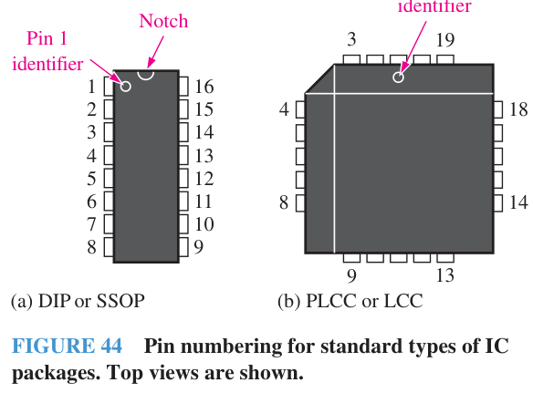
  <figcaption><strong>Figure 44:</strong> Pin numbering conventions for standard IC packages (top view). Pin 1 is always located to the immediate left of the identification notch or marked by an indented dot, with pin numbers proceeding counterclockwise around the package perimeter. Sourced from <em>Thomas L. Floyd, Digital Fundamentals: A Systems Approach (1st Ed.)</em>, p. 32 (printed p. 26).</figcaption>
</figure>

**The Counterclockwise Rule:**
1. Place the IC flat on the table, viewing it from the **top**.
2. Locate the **polarizing marker**: either a small semi-circular notch on one end of the package, or a small indented circular dot near one corner.
3. Orient the chip so the notch faces **upward** (or the dot is at the top left).
4. **Pin 1** is always the top-left pin.
5. Count **downward** along the left edge ($1, 2, 3 \dots 7$ on a 14-pin IC).
6. Jump across to the bottom right and continue counting **upward** along the right edge ($8, 9, 10 \dots 14$).
7. In standard 14-pin 7400-series TTL logic ICs:
   - **Pin 7 is always connected to Ground ($0\text{ V}$)**.
   - **Pin 14 is always connected to Supply Voltage ($V_{CC} = +5.0\text{ V}$)**.

---

### Prerequisites Audit: Misconceptions and Pitfalls to Avoid

#### 1. Conceptual Misconceptions
- **Misconception:** *"A digital `0` means zero volts, and a digital `1` means exactly five volts."*  
  **Correction:** Digital electronics relies on *bands* of voltages, not exact values. In TTL logic, any input voltage between $0.0\text{ V}$ and $0.8\text{ V}$ is accepted as a valid `0`, and any input between $2.0\text{ V}$ and $5.0\text{ V}$ is accepted as a valid `1`. Real circuits routinely output $0.2\text{ V}$ for LOW and $3.4\text{ V}$ for HIGH.
- **Misconception:** *"Transistors inside digital chips store electricity like tiny batteries."*  
  **Correction:** Transistors do not store power; they act as *valves* directing electric current from an external power supply to ground or output pins. Memory in digital circuits is created by active feedback loops (as taught in Unit IV), not by electrostatic charge storage in gate switches.

#### 2. Practical Slip-Ups
- **Pin Numbering Reversal:** Beginners often count down the left side (1 to 7) and then continue counting down the right side (8 to 14). **This is backwards!** The numbering always wraps around **counterclockwise**, meaning Pin 8 is directly opposite Pin 7 at the bottom!
- **Unconnected Power Pins:** Beginners frequently wire logic gates on a breadboard but forget to connect Pin 14 to $+5\text{ V}$ and Pin 7 to GND. Without power connections to the silicon substrate, the internal transistors cannot operate.

---


# Unit I: Fundamentals of Digital Systems and Logic Families

---

### Master Subject Map: Unit I Position
```
[ PHYSICAL PREREQUISITES: Charge, Voltage (V), Ground (0 V), Transistor Switches ]
                                  │
                                  ▼
┌──────────────────────────────────────────────────────────────────────────────────┐
│ YOU ARE HERE ──► UNIT I: FUNDAMENTALS OF DIGITAL SYSTEMS & LOGIC FAMILIES        │
│ • Number Systems: Binary, Octal, Hex, Signed Complements (1's & 2's), Codes     │
│ • Logic Gates: AND, OR, NOT, NAND, NOR, XOR, XNOR, Universality, Gate ICs       │
│ • Silicon Logic Families: RTL, TTL (Totem-Pole, Open-Collector, Tri-State), CMOS │
│ • Interfacing: Voltage/Current Compatibility (TTL Driving CMOS & Vice Versa)     │
└─────────────────────────────────┬────────────────────────────────────────────────┘
                                  ▼
[ UNIT II: BOOLEAN ALGEBRA & K-MAP MINIMIZATION ]
```
*In 3 lines:* Unit I establishes the language of digital electronics. We translate human numbers into patterns of binary voltages, use semiconductor transistors to construct primitive decision-making blocks called logic gates, and analyze the physical silicon families (RTL, TTL, CMOS) that power real integrated circuits.

---

### Prerequisites for this Unit
Before studying Unit I, you need the foundational concepts established in the Prerequisites section:
1. **Voltage and Ground (Prereq 1 & 2):** Current flows from a positive potential ($V_{CC} / V_{DD}$) to Ground ($0\text{ V}$).
2. **Transistors as Electronic Switches (Prereq 3):** An active control input creates a conducting short to ground (pull-down), while absence of control leaves the path open (pull-up).
3. **Logic Levels & Voltage Bands (Prereq 4):** A HIGH signal is a voltage in the upper band (near $+5\text{ V}$), while a LOW signal is in the lower band (near $0\text{ V}$).
4. **Positional Numbering & Powers of Two (Prereq 6):** Powers of two ($1, 2, 4, 8, 16 \dots$) form the basis of binary representations.

---

## PART 1: Number Systems, Signed Binary Arithmetic, and Codes

### 1.1 Number Base Systems: Binary, Octal, and Hexadecimal
*Source: Kumar (Ch. 2, pp. 59–68); Floyd (Ch. 2, pp. 52–65); Mano (Ch. 1, pp. 18–28)*  
**[Pacing: Systematic Bookkeeping — Follow the Step-by-Step Algorithm]**

#### Need (Problem-First)
Human beings communicate in decimal (base 10), but computer processors physically store and manipulate bits in base 2. However, long strings of binary digits (such as $1101111010101101_2$) are notoriously difficult for human engineers to read, write, and debug without making transcription errors. We need compact, human-friendly representations that map directly into binary bits without requiring painful mathematical long-division. This creates the need for **Octal (base 8)** and **Hexadecimal (base 16)**.

#### Chain of Cause and Effect
Binary is machine-native but unwieldy for humans $\to$ bases that are exact powers of two ($8 = 2^3$ and $16 = 2^4$) allow direct bit-grouping $\to$ each octal digit corresponds to exactly 3 binary bits, and each hexadecimal digit corresponds to exactly 4 binary bits $\to$ complex memory addresses and machine instructions can be inspected with ease.

#### How It Works (Mechanism & Algorithms)

##### 1. Positional Bases Defined
- **Decimal (Base 10):** Radix $r=10$. Digits $\in \{0, 1, 2, 3, 4, 5, 6, 7, 8, 9\}$.
- **Binary (Base 2):** Radix $r=2$. Digits $\in \{0, 1\}$.
- **Octal (Base 8):** Radix $r=8$. Digits $\in \{0, 1, 2, 3, 4, 5, 6, 7\}$.
- **Hexadecimal (Base 16):** Radix $r=16$. Digits $\in \{0, 1, 2, 3, 4, 5, 6, 7, 8, 9, \text{A}, \text{B}, \text{C}, \text{D}, \text{E}, \text{F}\}$.  
  Where letters represent numbers 10 through 15 inline:
  $$\text{A}_{16} = 10_{10}, \quad \text{B}_{16} = 11_{10}, \quad \text{C}_{16} = 12_{10}, \quad \text{D}_{16} = 13_{10}, \quad \text{E}_{16} = 14_{10}, \quad \text{F}_{16} = 15_{10}$$

##### 2. Conversions to Decimal (Sum-of-Weights Method)
Multiply each digit by its positional weight $r^i$ and compute the arithmetic sum (*Kumar*, p. 63).
- **Binary to Decimal:**  
  *Example:* Convert $11010.11_2$ to decimal:
  $$11010.11_2 = (1 \times 2^4) + (1 \times 2^3) + (0 \times 2^2) + (1 \times 2^1) + (0 \times 2^0) + (1 \times 2^{-1}) + (1 \times 2^{-2})$$
  $$= 16 + 8 + 0 + 2 + 0 + 0.5 + 0.25 = 26.75_{10}$$
- **Hexadecimal to Decimal:**  
  *Example:* Convert $2\text{A}6_{16}$ to decimal:
  $$2\text{A}6_{16} = (2 \times 16^2) + (10 \times 16^1) + (6 \times 16^0) = (2 \times 256) + (10 \times 16) + (6 \times 1) = 512 + 160 + 6 = 678_{10}$$

##### 3. Decimal to Binary Conversion (Double-Dabble Method)
- **Integer Part (Repeated Division by 2):** Divide the decimal integer repeatedly by 2, recording the remainder ($0$ or $1$) at each step, until the quotient reaches $0$. The **first remainder is the LSB**, and the **last remainder is the MSB** (*Kumar*, p. 64).
  *Example:* Convert $25_{10}$ to binary:
  - $25 \div 2 = 12$, remainder $1$ (LSB)
  - $12 \div 2 = 6$, remainder $0$
  - $6 \div 2 = 3$, remainder $0$
  - $3 \div 2 = 1$, remainder $1$
  - $1 \div 2 = 0$, remainder $1$ (MSB)  
  Reading remainders from bottom to top: $25_{10} = 11001_2$.
- **Fractional Part (Repeated Multiplication by 2):** Multiply the fraction repeatedly by 2, recording the integer carry ($0$ or $1$) generated at each step, until the fraction becomes zero or the desired precision is reached. The **first integer carry is the first fractional digit** (*Kumar*, p. 66).
  *Example:* Convert $0.625_{10}$ to binary:
  - $0.625 \times 2 = 1.250$ (carry $1$)
  - $0.250 \times 2 = 0.500$ (carry $0$)
  - $0.500 \times 2 = 1.000$ (carry $1$, fraction zeroed out)  
  Reading carries top to bottom: $0.625_{10} = 0.101_2$.

##### 4. Octal and Hexadecimal Bit-Grouping (The Fast Direct Shortcut)
Because $8 = 2^3$, **every octal digit converts into exactly 3 binary bits**.  
Because $16 = 2^4$, **every hexadecimal digit converts into exactly 4 binary bits**.
- **Binary to Hexadecimal:** Group bits into sets of 4 starting from the binary point moving left for integers and right for fractions (padding with leading/trailing zeros if needed), then substitute the hex digit:
  *Example:* Convert $1011110010_2$ to hex:
  - Group: $\underbrace{0010}_{2} \quad \underbrace{1111}_{\text{F}} \quad \underbrace{0010}_{2}$ (padded with two leading zeros on MSB group)
  - Result: $1011110010_2 = 2\text{F}2_{16}$.
- **Hexadecimal to Binary:** Directly expand each hex digit into its 4-bit binary equivalent:
  *Example:* Convert $3\text{B}_{16}$ to binary:
  - $3_{16} = 0011_2$
  - $\text{B}_{16} = 11_{10} = 1011_2$
  - Result: $3\text{B}_{16} = 00111011_2$.

#### Understanding Checkpoint
- **Question:** Convert $11110110_2$ directly to hexadecimal.
- **Answer:** Split into two 4-bit groups: $1111_2$ and $0110_2$. $1111_2 = 15_{10} = \text{F}_{16}$, and $0110_2 = 6_{16}$. Therefore, $11110110_2 = \text{F}6_{16}$.

---

### 1.2 Binary Arithmetic: Addition, Subtraction, Multiplication, and Division
*Source: Kumar (Ch. 2, pp. 68–71); Floyd (Ch. 2, pp. 58–63)*  
**[Pacing: Routine Bookkeeping — Master the Elementary Rules]**

#### Need (Problem-First)
To make hardware compute, we must translate mathematical operations into primitive bit manipulations that can be executed by electronic logic circuits.

#### The Four Elementary Rules of Binary Arithmetic
1. **Binary Addition (*Kumar*, p. 68):**
   - $0 + 0 = 0$ (Sum $0$, Carry $0$)
   - $0 + 1 = 1$ (Sum $1$, Carry $0$)
   - $1 + 0 = 1$ (Sum $1$, Carry $0$)
   - $1 + 1 = 10_2$ (Sum $0$, Carry $1$ to the next higher positional column)
   - $1 + 1 + 1 = 11_2$ (Sum $1$, Carry $1$)
   *Worked Example:* Add $1101_2$ ($13_{10}$) and $0111_2$ ($7_{10}$):
   ```
     1 1 1      <-- Carry row
       1 1 0 1  (13)
     + 0 1 1 1  (7)
     ──────────
     1 0 1 0 0  (20 in decimal: 16 + 4 = 20)
   ```
2. **Binary Subtraction (*Kumar*, p. 68):**
   - $0 - 0 = 0$
   - $1 - 0 = 1$
   - $1 - 1 = 0$
   - $0 - 1 = 1$ with a **Borrow of $1$** from the next higher column (which has a weight of $2$).
3. **Binary Multiplication (*Kumar*, p. 69):**
   Identical to decimal long multiplication, but vastly simpler because multiplier bits are only $0$ or $1$. A $1$ copies the multiplicand; a $0$ yields all zeros.
4. **Binary Division (*Kumar*, p. 70):**
   Performed by successive shifting and subtraction, matching long division in decimal.

#### Understanding Checkpoint
- **Question:** Compute $101_2 + 011_2$.
- **Answer:** $101_2 (5) + 011_2 (3) = 1000_2 (8)$.

---

### 1.3 Signed Binary Numbers: Sign-Magnitude, 1's Complement, and 2's Complement
*Source: Kumar (Ch. 2, pp. 71–85); Mano (Ch. 1, pp. 34–39); Floyd (Ch. 2, pp. 65–75)*  
**[Pacing: Conceptually Crucial — Read Slowly and Methodically]**

#### Need (Problem-First)
In everyday math, we indicate negative numbers by simply writing a minus sign "$-$" in front (e.g., $-15$). But an electronic circuit wire can only carry two physical voltage states: HIGH or LOW. It cannot carry a "-" symbol. How can hardware represent negative numbers, and more importantly, how can an Arithmetic Logic Unit (ALU) perform subtraction *without having to build completely separate, expensive subtraction circuitry*?

#### Chain of Cause and Effect
Circuits allocate the leftmost bit (MSB) as a sign indicator ($0 = +, 1 = -$) $\to$ direct sign-magnitude creates two zeros ($+0$ and $-0$) and requires complex decision logic $\to$ complement systems convert subtraction into simple addition ($A - B = A + (-B)$) $\to$ 2's complement eliminates duplicate zeros and discards the final carry $\to$ the exact same hardware adder circuit performs both addition and subtraction.

#### How It Works (The Three Signed Formats Defined)
In an $n$-bit binary word, the **Most Significant Bit (MSB)** is strictly reserved as the **Sign Bit**:
- $\text{MSB} = 0 \implies$ **Positive number** ($+$)
- $\text{MSB} = 1 \implies$ **Negative number** ($-$)

##### 1. Sign-Magnitude Representation (*Kumar*, p. 71)
The MSB indicates the sign, and the remaining $(n-1)$ bits represent the absolute magnitude of the number:
- For an 8-bit byte:
  - $+25_{10} = \mathbf{0}0011001_2$
  - $-25_{10} = \mathbf{1}0011001_2$
*Fatal Engineering Flaw:* Sign-magnitude has **two distinct representations for zero**: $+0 = 00000000_2$ and $-0 = 10000000_2$. This wastes bit combinations and forces processors to execute extra comparison cycles.

##### 2. 1's Complement Representation (*Kumar*, p. 72)
- Positive numbers are written in standard binary with $\text{MSB} = 0$.
- A negative number is formed by taking the positive binary number and **inverting every single bit** ($0 \to 1$ and $1 \to 0$).
- *Example (8 bits):* $+25_{10} = 00011001_2$.  
  To form $-25_{10}$, invert all bits: $-25_{10} = 11100110_2$.
*Limitation:* Like sign-magnitude, 1's complement still suffers from two zeros ($+0 = 00000000_2$ and $-0 = 11111111_2$). Furthermore, subtraction produces an "end-around carry" that must be re-added to the LSB, slowing down the processor.

##### 3. 2's Complement Representation (*Kumar*, p. 74)
The universal standard for all modern computing architectures.
- Positive numbers are written in standard binary with $\text{MSB} = 0$.
- A negative number is formed by taking its 1's complement and **adding 1 to the LSB**:
  $$\text{2's Complement} = (\text{1's Complement}) + 1$$
- *Worked Example (8-bit representation of $-25_{10}$):*
  1. Start with positive $+25_{10}$: `00011001`
  2. Invert all bits (1's complement): `11100110`
  3. Add `1`:
     ```
       11100110
     +        1
     ──────────
       11100111  <-- -25 in 2's complement
     ```
- *The Direct Shortcut for 2's Complement:* Working from right to left (LSB to MSB), copy all bits unchanged up to and including the first `1`, then invert every bit remaining to the left!  
  For `00011001`: first bit is `1` (copy it), invert rest $\to$ `11100111`. Exactly identical result in one second!

##### 4. Subtraction Using 2's Complement Arithmetic (*Kumar*, p. 81)
To compute $A - B$, the ALU converts the problem into:
$$A - B = A + (\text{2's complement of } B)$$
**The Two Golden Rules of 2's Complement Subtraction:**
1. **If a final carry of $1$ is generated past the MSB, DISCARD IT.** The remaining bits are the correct positive answer in standard binary (*Kumar*, p. 81).
2. **If NO final carry is generated, the result is NEGATIVE and is in 2's complement form.** To read its human-readable decimal magnitude, take the 2's complement of the result and attach a minus sign (*Kumar*, p. 81).

*Concrete Worked Scenario 1 (Larger minus Smaller: $28 - 15$ in 8 bits):*
- $+28_{10} = 00011100_2$
- $+15_{10} = 00001111_2 \implies -15_{10}$ in 2's complement = $11110000 + 1 = 11110001_2$.
- Add them:
  ```
    00011100  (+28)
  + 11110001  (-15)
  ──────────
  1 00001101
  ▲
  Discard this end carry!
  ```
  Result = $00001101_2 = 8 + 4 + 1 = +13_{10}$. Perfect!

*Concrete Worked Scenario 2 (Smaller minus Larger: $15 - 28$ in 8 bits):*
- $+15_{10} = 00001111_2$
- $-28_{10} = 11100100_2$ (2's complement of 28)
- Add them:
  ```
    00001111  (+15)
  + 11100100  (-28)
  ──────────
    11110011  (No end carry generated!)
  ```
  Since no carry appeared, the result is negative and stored in 2's complement.  
  To find its magnitude: take 2's complement of `11110011` $\to$ invert bits (`00001100`) + 1 = `00001101` ($13_{10}$).  
  Therefore, the answer is $-13_{10}$. Perfect!

##### 5. Arithmetic Overflow
*Source: Kumar (p. 84); Mano (p. 37)*  
In an $n$-bit signed system, the range of representable numbers is:
$$-[2^{n-1}] \quad \text{to} \quad +[2^{n-1} - 1]$$
For an 8-bit system: $-128$ to $+127$.  
**Overflow occurs if the sum of two numbers with the same sign exceeds this range.**  
- If you add two positive numbers and the MSB becomes `1` (negative), **overflow has occurred**.
- If you add two negative numbers and the MSB becomes `0` (positive), **overflow has occurred**.
- Hardware detection rule: Overflow occurs if and only if the **carry into the sign bit** ($C_{in}$) is different from the **carry out of the sign bit** ($C_{out}$):
  $$\text{Overflow} = C_{in} \oplus C_{out}$$

#### Understanding Checkpoint
- **Question:** What is the 8-bit 2's complement representation of $-1$?
- **Answer:** $+1 = 00000001_2$. Invert all bits $\to 11111110_2$. Add $1 \to 11111111_2$. Thus, $-1$ is represented as all ones (`11111111`).

---

### 1.4 Binary Codes: BCD, Excess-3, Gray Code, and ASCII
*Source: Kumar (Ch. 3, pp. 117–134); Floyd (Ch. 2, pp. 75–85); Mano (Ch. 1, pp. 39–48)*  
**[Pacing: Systematic Vocabulary — High Relevance to Practical Displays]**

#### Need (Problem-First)
Raw binary arithmetic is great for calculations, but digital systems must interface with decimal keypads, seven-segment displays, mechanical rotary encoders, and human text. If you directly send pure binary to a 7-segment display driver, the circuitry required to decode 16-bit numbers into decimal digits becomes massive. Specialized **codes** bridge these real-world interfaces.

#### The Four Core Codes Defined

##### 1. Binary Coded Decimal (BCD / 8421 Code)
*Source: Kumar (Ch. 3, pp. 117–120)*  
- **Mechanism:** Each decimal digit ($0$ through $9$) is independently encoded using its 4-bit binary equivalent with weights $8, 4, 2, 1$.
- Because 4 bits can represent 16 states ($0$ to $15$), the combinations from $10_{10}$ to $15_{10}$ (`1010` to `1111`) are **strictly invalid in BCD**.
- *Example:* Convert $952_{10}$ to BCD:
  $$9_{10} = 1001_2, \quad 5_{10} = 0101_2, \quad 2_{10} = 0010_2 \implies 952_{\text{BCD}} = 1001\ 0101\ 0010$$
  Notice that $952_{\text{BCD}}$ requires 12 bits, whereas pure binary $952_{10}$ requires only 10 bits ($1110111000_2$). BCD trades storage density for effortless decimal interfacing.

##### 2. Excess-3 Code (XS-3)
*Source: Kumar (Ch. 3, pp. 120–122)*  
- **Mechanism:** An unweighted code derived by adding decimal $3$ ($0011_2$) to each BCD code group:
  $$\text{XS-3} = \text{BCD} + 0011_2$$
  *Example:* Decimal $4 \to$ BCD `0100` $\to$ XS-3 = `0100` + `0011` = `0111`.
- **Why It Matters (Self-Complementing Property):** The 1's complement of an Excess-3 number produces the Excess-3 code of its 9's complement! This made XS-3 immensely valuable in early computing hardware for automating decimal subtraction.

##### 3. Gray Code (Reflected Binary / Unit Distance Code)
*Source: Kumar (Ch. 3, pp. 122–126); Floyd (Ch. 2, pp. 78–81)*  
- **Need:** When an optical rotary shaft encoder measures the position of a rotating motor, standard binary transitions can be catastrophic. When transitioning from state $3$ (`011`) to state $4$ (`100`), **all three bits must change simultaneously**. Because physical sensor contacts never switch in perfect mathematical synchrony, the encoder may momentarily register spurious intermediate states like `000` or `111`, causing false position errors.
- **The Gray Code Solution:** In Gray code, **only one bit changes state at a time** between any two consecutive numbers (Unit Distance property).
- **Binary to Gray Code Conversion (*Kumar*, p. 123):**
  1. The MSB of the Gray code is identical to the MSB of the binary number: $G_n = B_n$.
  2. Each subsequent Gray bit $G_i$ is formed by XORing the current binary bit $B_{i+1}$ with the next lower binary bit $B_i$:
     $$G_i = B_{i+1} \oplus B_i$$
  *Worked Example:* Convert binary $1101_2$ to Gray code:
  - $G_3 = B_3 = 1$
  - $G_2 = B_3 \oplus B_2 = 1 \oplus 1 = 0$
  - $G_1 = B_2 \oplus B_1 = 1 \oplus 0 = 1$
  - $G_0 = B_1 \oplus B_0 = 0 \oplus 1 = 1$  
  Result: $1101_2 = 1011_{\text{Gray}}$.
- **Gray Code to Binary Conversion (*Kumar*, p. 124):**
  1. The MSB of the binary number is identical to the Gray MSB: $B_n = G_n$.
  2. Each subsequent binary bit is obtained by XORing the previously calculated binary bit with the current Gray bit:
     $$B_i = B_{i+1} \oplus G_i$$

##### 4. Alphanumeric Code: ASCII
*Source: Floyd (Ch. 2, pp. 83–85); Mano (Ch. 1, pp. 44–46)*  
The **American Standard Code for Information Interchange (ASCII)** uses 7 bits to encode 128 characters, including upper and lowercase letters, numbers, punctuation, and control characters (e.g., `'A'` = $1000001_2 = 41_{16} = 65_{10}$; `'0'` = $0110000_2 = 30_{16} = 48_{10}$).

#### Understanding Checkpoint
- **Question:** What is the Gray code for binary $1000_2$?
- **Answer:**
  $G_3 = 1$  
  $G_2 = 1 \oplus 0 = 1$  
  $G_1 = 0 \oplus 0 = 0$  
  $G_0 = 0 \oplus 0 = 0$  
  Gray code = $1100$.

---

## PART 2: Basic Digital Circuits, Universal Gates, and Gate ICs

### 1.5 The Fundamental Logic Gates: AND, OR, and NOT
*Source: Kumar (Ch. 4, pp. 163–168); Mano (Ch. 2, pp. 84–90); Floyd (Ch. 3, pp. 118–138)*  
**[Pacing: Core Visual Foundation — Study the Truth Tables & Symbols]**

#### Need (Problem-First)
Mathematical statements require logical operators: "Activate the emergency cooling pump if the temperature is HIGH **AND** pressure is HIGH." "Sound the alarm if door 1 is open **OR** door 2 is open." We need hardware circuits that execute these logical decisions.

#### The Three Fundamental Gates

##### 1. The AND Gate (*Kumar*, p. 164)
- **Plain Words:** The output is HIGH ($1$) **if and only if all inputs are HIGH ($1$)**. If any input is LOW ($0$), the output is clamped to LOW ($0$).
- **Boolean Equation:** $X = A \cdot B$ (or simply $X = AB$).
- **Authentic Diagram:**

<figure>
  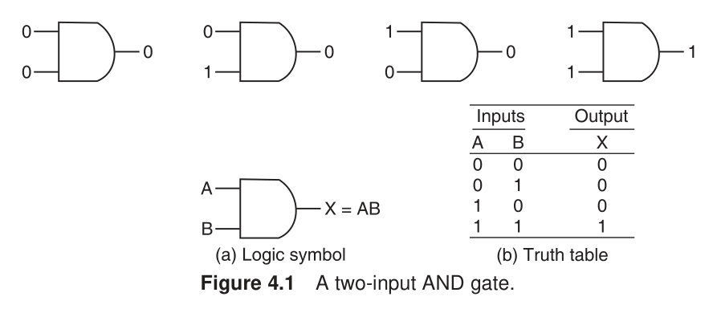
  <figcaption><strong>Figure 4.1:</strong> A two-input AND gate showing operational logic states, circuit symbol, and complete truth table. Sourced from <em>A. Anand Kumar, Fundamentals of Digital Circuits (4th Ed.)</em>, p. 164 (printed p. 132).</figcaption>
</figure>

##### 2. The OR Gate (*Kumar*, p. 166)
- **Plain Words:** The output is HIGH ($1$) **if any input is HIGH ($1$)**. The output is LOW ($0$) only when all inputs are simultaneously LOW ($0$).
- **Boolean Equation:** $X = A + B$.
- **Authentic Diagram:**

<figure>
  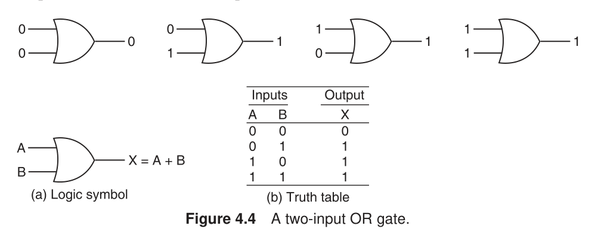
  <figcaption><strong>Figure 4.4:</strong> A two-input OR gate showing operational logic states, circuit symbol, and complete truth table. Sourced from <em>A. Anand Kumar, Fundamentals of Digital Circuits (4th Ed.)</em>, p. 166 (printed p. 134).</figcaption>
</figure>

##### 3. The NOT Gate (Inverter) (*Kumar*, p. 168)
- **Plain Words:** The output is the exact logical complement (inverse) of the input. If the input is $0$, the output is $1$; if the input is $1$, the output is $0$.
- **Boolean Equation:** $X = \overline{A}$ (or $X = A'$).
- **The Inversion Bubble:** In schematic convention, the triangle represents a buffer (current amplifier), and the small circular **bubble** represents logical inversion.
- **Authentic Diagram:**

<figure>
  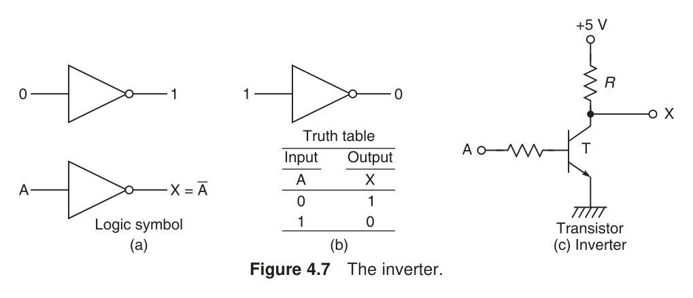
  <figcaption><strong>Figure 4.7:</strong> The logic symbol and truth table of an inverter (NOT gate). Sourced from <em>A. Anand Kumar, Fundamentals of Digital Circuits (4th Ed.)</em>, p. 168 (printed p. 136).</figcaption>
</figure>

---

### 1.6 Universal Gates: NAND and NOR Operations & Proofs of Universality
*Source: Kumar (Ch. 4, pp. 169–173); Mano (Ch. 3, pp. 119–126)*  
**[Pacing: Conceptually Crucial — Read Carefully]**

#### Need (Problem-First)
In manufacturing semiconductor integrated circuits, fabricating multiple distinct types of gates (some AND, some OR, some NOT) requires complex, multi-step silicon doping masks, driving up production costs and inventory complexity. Semiconductor manufacturers sought a **single universal building block** that could be mass-produced identically and wired to perform *any Boolean function whatsoever*. Those blocks are **NAND** and **NOR**.

#### The Universal Gates Defined

##### 1. The NAND Gate (*Kumar*, p. 169)
- **Plain Words:** A combination of an AND gate followed immediately by an inverter. The output is LOW ($0$) **only when all inputs are HIGH ($1$)**. For all other combinations, the output is HIGH ($1$).
- **Boolean Equation:** $X = \overline{A \cdot B}$.
- **Authentic Diagram:**

<figure>
  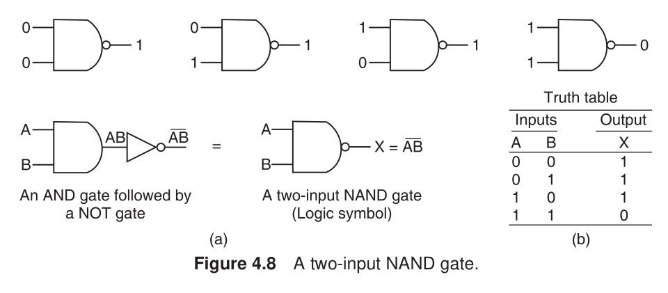
  <figcaption><strong>Figure 4.8:</strong> A two-input NAND gate showing operational states, logic symbol with inversion bubble, and truth table. Sourced from <em>A. Anand Kumar, Fundamentals of Digital Circuits (4th Ed.)</em>, p. 169 (printed p. 137).</figcaption>
</figure>

##### 2. The NOR Gate (*Kumar*, p. 171)
- **Plain Words:** A combination of an OR gate followed by an inverter. The output is HIGH ($1$) **only when all inputs are LOW ($0$)**. If any input is HIGH ($1$), the output is LOW ($0$).
- **Boolean Equation:** $X = \overline{A + B}$.
- **Authentic Diagram:**

<figure>
  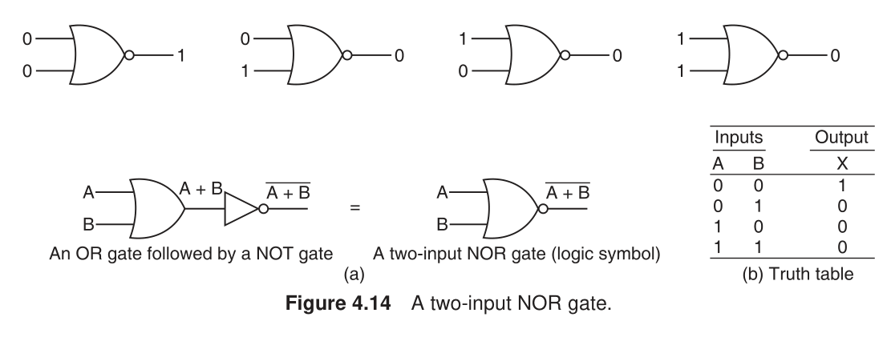
  <figcaption><strong>Figure 4.14:</strong> A two-input NOR gate showing operational states, logic symbol, and truth table. Sourced from <em>A. Anand Kumar, Fundamentals of Digital Circuits (4th Ed.)</em>, p. 171 (printed p. 139).</figcaption>
</figure>

---

#### Proofs of Universality: Realizing NOT, AND, and OR

##### 1. Universality of the NAND Gate (*Kumar*, pp. 170–171)
- **Realization of NOT using NAND (*Kumar*, Figure 4.11):**  
  Tie both inputs of a 2-input NAND gate together: $X = \overline{A \cdot A} = \overline{A}$.

<figure>
  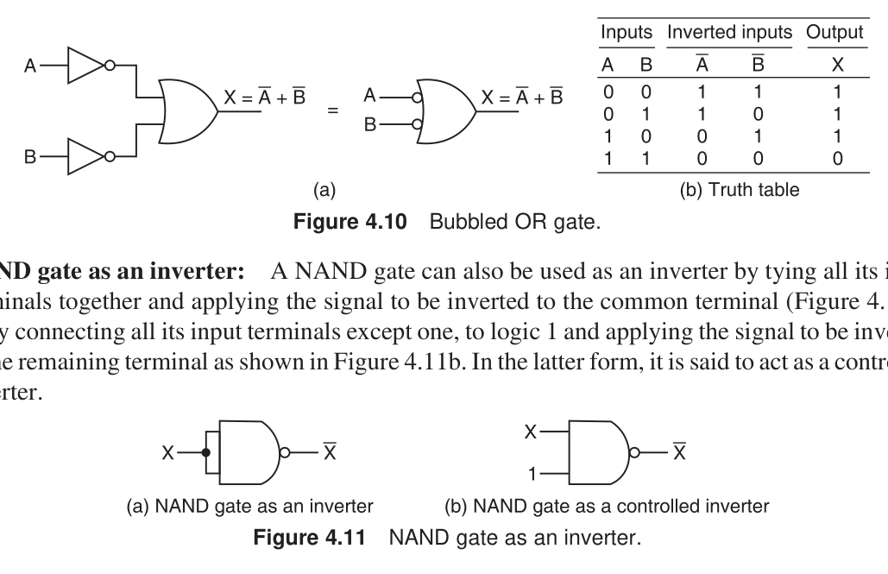
  <figcaption><strong>Figure 4.11:</strong> Realizing a NOT gate (inverter) using a NAND gate by tying inputs together or using a controlled HIGH input. Sourced from <em>A. Anand Kumar, Fundamentals of Digital Circuits (4th Ed.)</em>, p. 170 (printed p. 138).</figcaption>
</figure>

- **Realization of AND using NAND:**  
  Pass inputs through a NAND gate, then invert the result with a second NAND-inverter:
  $$X = \overline{\overline{A \cdot B}} = A \cdot B$$
- **Realization of OR using NAND (De Morgan's Equivalence):**  
  Invert $A$ with one NAND to get $\overline{A}$; invert $B$ with another NAND to get $\overline{B}$; feed both into a third NAND gate:
  $$X = \overline{\overline{A} \cdot \overline{B}} = \overline{\overline{A}} + \overline{\overline{B}} = A + B$$

##### 2. Universality of the NOR Gate (*Kumar*, pp. 171–172)
- **Realization of NOT using NOR (*Kumar*, Figure 4.17):**  
  Tie both inputs together: $X = \overline{A + A} = \overline{A}$.

<figure>
  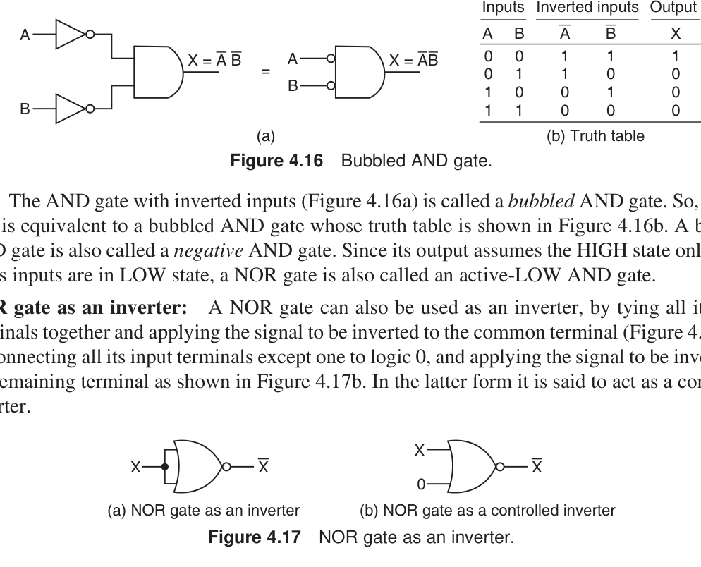
  <figcaption><strong>Figure 4.17:</strong> Realizing a NOT gate using a NOR gate. Sourced from <em>A. Anand Kumar, Fundamentals of Digital Circuits (4th Ed.)</em>, p. 172 (printed p. 140).</figcaption>
</figure>

- **Realization of OR using NOR:**  
  Feed inputs to a NOR gate, then invert with a second NOR-inverter:
  $$X = \overline{\overline{A + B}} = A + B$$
- **Realization of AND using NOR (De Morgan's Equivalence):**  
  Invert inputs to get $\overline{A}$ and $\overline{B}$, then feed into a third NOR gate:
  $$X = \overline{\overline{A} + \overline{B}} = \overline{\overline{A}} \cdot \overline{\overline{B}} = A \cdot B$$

##### 3. Two-Level NAND-NAND Implementation (*Mano*, p. 120)
Because an AND-OR network directly converts into a two-level NAND-NAND network under De Morgan's theorem, any Sum-of-Products (SOP) expression can be wired using **only NAND gates**:

<figure>
  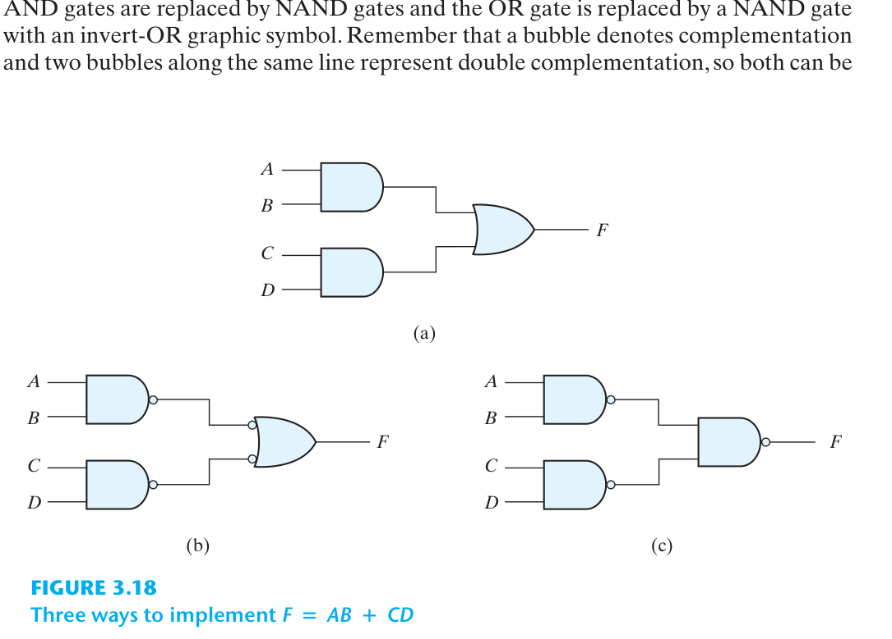
  <figcaption><strong>Figure 3.18:</strong> Demonstrating equivalence of AND-OR logic and two-level NAND-NAND logic for the function <em>F = AB + CD</em>. Sourced from <em>M. Morris Mano & Michael D. Ciletti, Digital Design (6th Global Ed.)</em>, p. 120 (printed p. 119).</figcaption>
</figure>

---

### 1.7 Exclusive-OR (XOR) and Exclusive-NOR (XNOR) Gates
*Source: Kumar (Ch. 4, pp. 173–176); Mano (Ch. 3, pp. 132–137)*  
**[Pacing: Conceptually Important — The Core of Arithmetic & Parity]**

#### Need (Problem-First)
Standard OR includes the case where both inputs are $1$ ("inclusive OR"). But in basic arithmetic addition ($1 + 1 = 0\text{ with carry } 1$), the sum bit must be $0$ when both inputs are $1$. Furthermore, in error-detection (parity checking), we need a circuit that detects whether an odd or even number of bits are asserted.

#### How It Works (The Mechanisms)

##### 1. The XOR Gate (*Kumar*, p. 173)
- **Plain Words:** The output is HIGH ($1$) if **either input is HIGH, but not both**. The output is $1$ if the inputs are different ($01$ or $10$), and $0$ if they are identical ($00$ or $11$).
- **Boolean Equation:**
  $$X = A \oplus B = \overline{A}B + A\overline{B}$$
- **Authentic Diagram:**

<figure>
  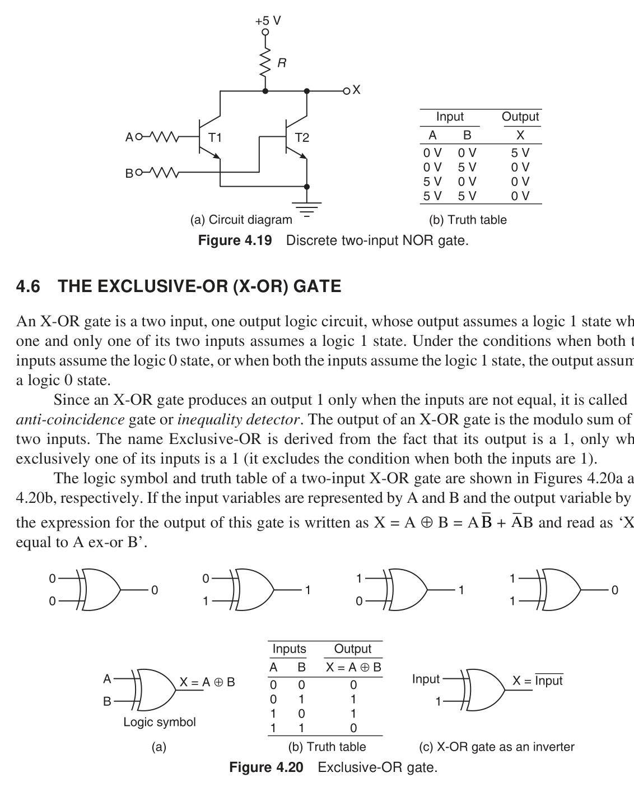
  <figcaption><strong>Figure 4.20:</strong> Exclusive-OR (XOR) gate showing logic symbol, truth table, and gate realization. Sourced from <em>A. Anand Kumar, Fundamentals of Digital Circuits (4th Ed.)</em>, p. 173 (printed p. 141).</figcaption>
</figure>

##### 2. The XNOR Gate (Equivalence Gate) (*Kumar*, p. 175)
- **Plain Words:** The exact inverse of XOR. The output is HIGH ($1$) if **both inputs are identical** ($00$ or $11$).
- **Boolean Equation:**
  $$X = A \odot B = \overline{A \oplus B} = AB + \overline{A}\ \overline{B}$$
- **Authentic Diagram:**

<figure>
  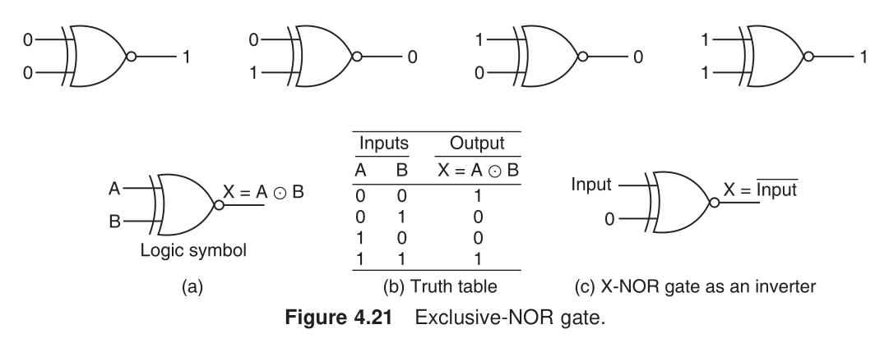
  <figcaption><strong>Figure 4.21:</strong> Exclusive-NOR (XNOR) gate showing logic symbol and truth table. Sourced from <em>A. Anand Kumar, Fundamentals of Digital Circuits (4th Ed.)</em>, p. 175 (printed p. 143).</figcaption>
</figure>

#### Understanding Checkpoint
- **Question:** If $A = 1$ and $B = 1$, what are the outputs of an XOR gate and an XNOR gate?
- **Answer:** XOR output = $0$; XNOR output = $1$.

---

## PART 3: Digital Logic Families (RTL, TTL, CMOS) and Interfacing

### 1.8 Logic Family Performance Metrics (Figures of Merit)
*Source: Kumar (Ch. 16, pp. 892–897); Mano (Ch. 2, pp. 91–93)*  
**[Pacing: Conceptually Essential — Know What Makes a Family Good or Bad]**

#### Need (Problem-First)
Logic gates are not ideal abstract equations; they are made of physical transistors. When selecting chips for an engineering project, how do you decide whether to use TTL, CMOS, or ECL? We need rigorous quantitative figures of merit to measure their speed, power, driving capability, and electrical robustness.

#### The Core Figures of Merit Defined Inline:
1. **Propagation Delay ($t_{pd}$):** The time delay between the application of an input signal transition and the resulting output transition (*Kumar*, p. 892):
   - $t_{pHL}$: Propagation delay time from HIGH to LOW output.
   - $t_{pLH}$: Propagation delay time from LOW to HIGH output.
   - Average propagation delay: $t_{pd} = \frac{t_{pHL} + t_{pLH}}{2}$. Measured in **nanoseconds (ns)**. Shorter delay means a faster processor.
2. **Power Dissipation ($P_D$):** The electrical power consumed by the gate, measured in **milliwatts (mW)**:
   $$P_D = V_{CC} \times I_{CC}$$
3. **Speed-Power Product (SPP):** The ultimate figure of merit balancing speed against energy consumption (*Kumar*, p. 894):
   $$\text{SPP} = t_{pd} \times P_D$$
   Measured in **picojoules (pJ)**. A lower SPP indicates a superior, more energy-efficient silicon architecture.
4. **Fan-Out:** The maximum number of standard logic inputs of the same family that the output of a gate can reliably drive without causing output voltages to degrade outside legitimate logic bands (*Kumar*, p. 893).
5. **Fan-In:** The number of independent input terminals available on a single gate.
6. **DC Noise Margins ($NM_H, NM_L$):** The maximum voltage amplitude of electrical noise that can be tolerated without causing false switching (*Kumar*, p. 896, Figure 16.4):

<figure>
  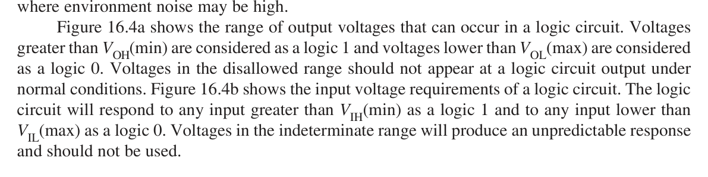
  <figcaption><strong>Figure 16.4:</strong> Graphical definition of DC noise margins showing transmitting output voltage levels (<em>V<sub>OH</sub>, V<sub>OL</sub></em>) and receiving input threshold levels (<em>V<sub>IH</sub>, V<sub>IL</sub></em>). Sourced from <em>A. Anand Kumar, Fundamentals of Digital Circuits (4th Ed.)</em>, p. 896 (printed p. 864).</figcaption>
</figure>

---

### 1.9 Resistor-Transistor Logic (RTL)
*Source: Kumar (Ch. 4, p. 173, Figure 4.19; Ch. 16, p. 892)*  
**[Pacing: Historical Foundation — How Transistor Logic Began]**

#### Need (Problem-First)
The very first integrated circuits in the 1960s (including the Apollo Guidance Computer) needed the simplest possible way to implement logic using basic bipolar transistors and resistors.

#### How It Works (The Physical Mechanism)
Figure 4.19 from *Kumar (p. 173)* shows a discrete two-input RTL NOR gate:

<figure>
  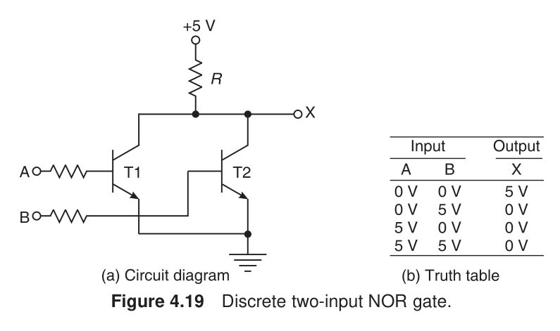
  <figcaption><strong>Figure 4.19:</strong> Discrete two-input Resistor-Transistor Logic (RTL) NOR gate. Sourced from <em>A. Anand Kumar, Fundamentals of Digital Circuits (4th Ed.)</em>, p. 173 (printed p. 141).</figcaption>
</figure>

##### Characteristic 13 Walkthrough: Hardware Reality Check
- **Case 1 ($A = 0\text{ V}, B = 0\text{ V}$):** Neither transistor $T_1$ nor $T_2$ receives base current. Both transistors are in **cutoff (OPEN)**. No current flows through collector resistor $R$. With zero voltage drop across $R$, the output node $X$ is pulled directly up to $+5\text{ V}$ (Logic 1).
- **Case 2 ($A = 5\text{ V}$ or $B = 5\text{ V}$):** Base current floods the corresponding transistor, driving it into **saturation (CLOSED)**. The saturated transistor creates a low-resistance path from output node $X$ directly to Ground ($0\text{ V}$). The output voltage collapses to $V_{CE(\text{sat})} \approx 0.2\text{ V}$ (Logic 0).
- This produces the exact truth table of a **NOR gate**.
- **Fatal Flaw of RTL:** The collector resistor $R$ severely limits speed. When switching HIGH, parasitic capacitances must charge through $R$, giving poor rise times, tiny noise margins ($0.2\text{ V}$), and poor fan-out (only 4 to 5 loads).

---

### 1.10 Transistor-Transistor Logic (TTL): Totem-Pole, Open-Collector, and Tri-State
*Source: Kumar (Ch. 16, pp. 898–907, Figures 16.5, 16.7, 16.8, 16.9)*  
**[Pacing: Conceptually Heavy — Study the Transistor Conduction States Carefully]**

#### Need (Problem-First)
RTL was too slow and noise-sensitive. Engineers realized that if they replaced the passive pull-up resistor with an **active transistor switch** (push-pull / totem-pole), the circuit could actively drive both HIGH and LOW transitions with blazing speed, giving rise to TTL (the 7400 series).

#### The Standard Totem-Pole TTL NAND Gate (*Kumar*, p. 898, Figure 16.5)

<figure>
  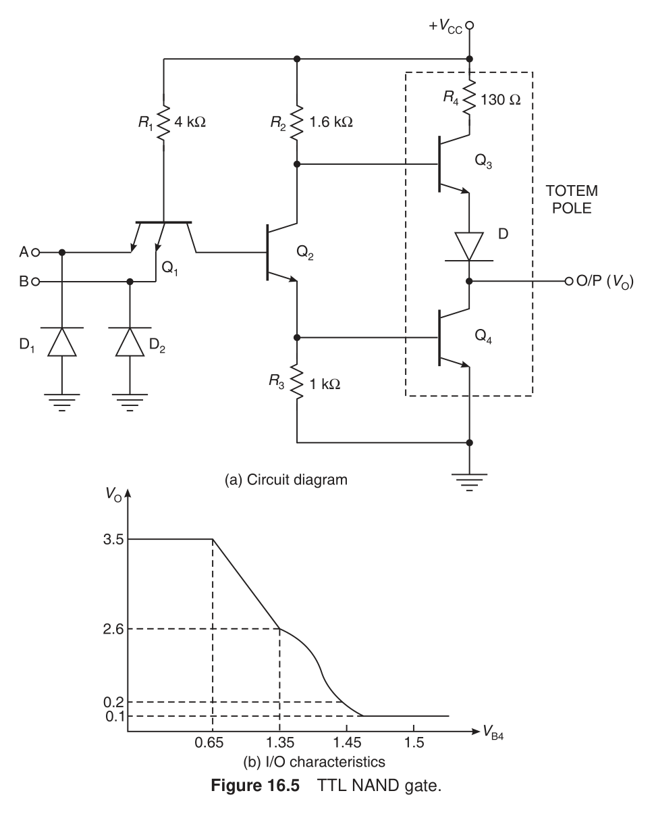
  <figcaption><strong>Figure 16.5:</strong> Schematic diagram and voltage transfer characteristics of a standard Transistor-Transistor Logic (TTL) NAND gate with active totem-pole output stage. Sourced from <em>A. Anand Kumar, Fundamentals of Digital Circuits (4th Ed.)</em>, p. 898 (printed p. 866).</figcaption>
</figure>

##### Four Key Functional Stages in TTL:
1. **Multi-Emitter Input Transistor ($Q_1$):** Has multiple emitters (one for each input $A, B$). It performs the AND operation directly on electrons.
2. **Phase Splitter Transistor ($Q_2$):** Produces two out-of-phase output voltages simultaneously: its collector voltage and emitter voltage are complementary.
3. **Totem-Pole Output Stage ($Q_3, D, Q_4$):**
   - **$Q_4$ (Pull-down transistor):** When turned ON, it pulls the output node down to Ground ($0\text{ V}$).
   - **$Q_3$ (Pull-up transistor):** When turned ON, it pulls the output node up to $+V_{CC}$ ($+5\text{ V}$).
   - **Diode $D$:** Crucial engineering component! It ensures $Q_3$ and $Q_4$ can **never be ON at the same time**. Without diode $D$, the base-emitter drops would allow both transistors to conduct simultaneously during transitions, creating a massive current spike from $V_{CC}$ straight to ground.

##### Characteristic 13 Walkthrough: Hardware Reality Check
- **Condition 1 (Any Input $A$ or $B$ is LOW, $0.2\text{ V}$):**  
  Current flows from $V_{CC}$ through $R_1$ ($4\text{ k}\Omega$) and out through the LOW input emitter to ground. The base of $Q_1$ is clamped to $0.2\text{ V} + 0.7\text{ V} = 0.9\text{ V}$. Because $Q_2$ and $Q_4$ need $0.7\text{ V} + 0.7\text{ V} = 1.4\text{ V}$ across their base-emitter junctions to turn ON, **$Q_2$ and $Q_4$ are completely OFF (cutoff)**. With $Q_2$ OFF, no current flows through $R_2$, pulling the base of $Q_3$ HIGH. $Q_3$ turns ON, actively driving the output node $V_O$ to:
  $$V_{OH} = V_{CC} - V_{BE3} - V_D = 5.0\text{ V} - 0.7\text{ V} - 0.7\text{ V} \approx 3.6\text{ V} \quad (\text{Logic 1})$$
- **Condition 2 (Both Inputs $A$ and $B$ are HIGH, $3.5\text{ V}$):**  
  The emitter junctions of $Q_1$ are reverse-biased. Current from $V_{CC}$ through $R_1$ now flows forward through the base-collector junction of $Q_1$ directly into the base of $Q_2$. **$Q_2$ turns ON hard**, which in turn floods the base of $Q_4$ with current, turning **$Q_4$ ON into saturation**. Saturated $Q_4$ pulls the output node down to ground:
  $$V_{OL} = V_{CE4(\text{sat})} \approx 0.2\text{ V} \quad (\text{Logic 0})$$
  Meanwhile, the collector of $Q_2$ drops to $V_{CE2(\text{sat})} + V_{BE4} \approx 0.2 + 0.7 = 0.9\text{ V}$. To turn $Q_3$ ON would require $V_O + V_D + V_{BE3} \approx 0.2 + 0.7 + 0.7 = 1.6\text{ V}$. Since $0.9\text{ V} < 1.6\text{ V}$, **$Q_3$ is held completely OFF**.
- Output = $0$ only when all inputs are $1$. **This is a NAND gate!**

---

#### Open-Collector TTL Gates & Wired-AND
*Source: Kumar (Ch. 16, pp. 903–905, Figures 16.7 & 16.8)*

##### Need (Problem-First)
Totem-pole outputs can **never be directly connected together**! If Gate 1 outputs HIGH ($+3.6\text{ V}$) while Gate 2 outputs LOW ($0.2\text{ V}$), a direct low-resistance short circuit is created between $V_{CC}$ and Ground through $Q_3$ of Gate 1 and $Q_4$ of Gate 2. Enormous current ($>100\text{ mA}$) will surge through the transistors, permanently destroying both chips. How can multiple gates safely share a single common communication wire (a bus)?

##### The Solution: Open-Collector Output (*Kumar*, p. 904, Figure 16.7)
In an **open-collector** gate, the upper totem-pole components ($Q_3$, diode $D$, and resistor $R_4$) are completely omitted. The collector of pull-down transistor $Q_4$ is left floating in open air.

<figure>
  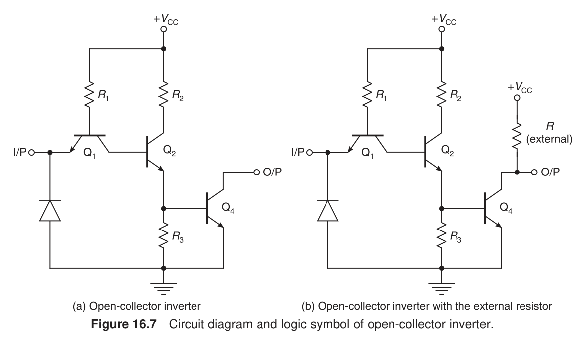
  <figcaption><strong>Figure 16.7:</strong> Circuit diagram and logic symbol (showing internal open-collector marking) of an open-collector TTL inverter. Sourced from <em>A. Anand Kumar, Fundamentals of Digital Circuits (4th Ed.)</em>, p. 904 (printed p. 872).</figcaption>
</figure>

- **Requirement:** An external **pull-up resistor ($R_L$)** must be connected between the output wire and $+V_{CC}$.
- **Wired-AND Operation (*Kumar*, p. 905, Figure 16.8):** Multiple open-collector outputs can be tied directly to the same wire! If *any* gate turns its $Q_4$ ON, it pulls the shared wire to $0\text{ V}$. The wire only reaches $+5\text{ V}$ if *all* gates release their transistors into cutoff. This performs an automatic **Wired-AND** function without requiring an extra physical AND gate:

<figure>
  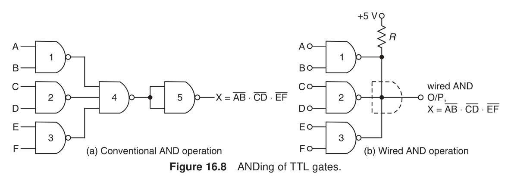
  <figcaption><strong>Figure 16.8:</strong> Direct wired-AND connection of two open-collector TTL gates using an external pull-up resistor. Sourced from <em>A. Anand Kumar, Fundamentals of Digital Circuits (4th Ed.)</em>, p. 905 (printed p. 873).</figcaption>
</figure>

---

#### Tri-State (Three-State) TTL Logic
*Source: Kumar (Ch. 16, pp. 905–907, Figure 16.9)*

##### Need (Problem-First)
Open-collector gates solve the bus contention problem, but they are relatively slow because the output line rises slowly through external resistor $R_L$. We want the blazing speed of an active totem-pole output, but the bus-sharing ability of an open collector.

##### The Solution: Tri-State Logic
A **tri-state gate** has three distinct output states:
1. **Logic 0:** Low impedance path to Ground ($Q_4$ ON, $Q_3$ OFF).
2. **Logic 1:** Low impedance path to $+V_{CC}$ ($Q_3$ ON, $Q_4$ OFF).
3. **High-Impedance State ($Z$ / Hi-Z):** **Both $Q_3$ and $Q_4$ are turned OFF simultaneously!** The gate physically disconnects itself from the output wire, behaving like an open switch with infinite resistance ($>10\text{ M}\Omega$).

<figure>
  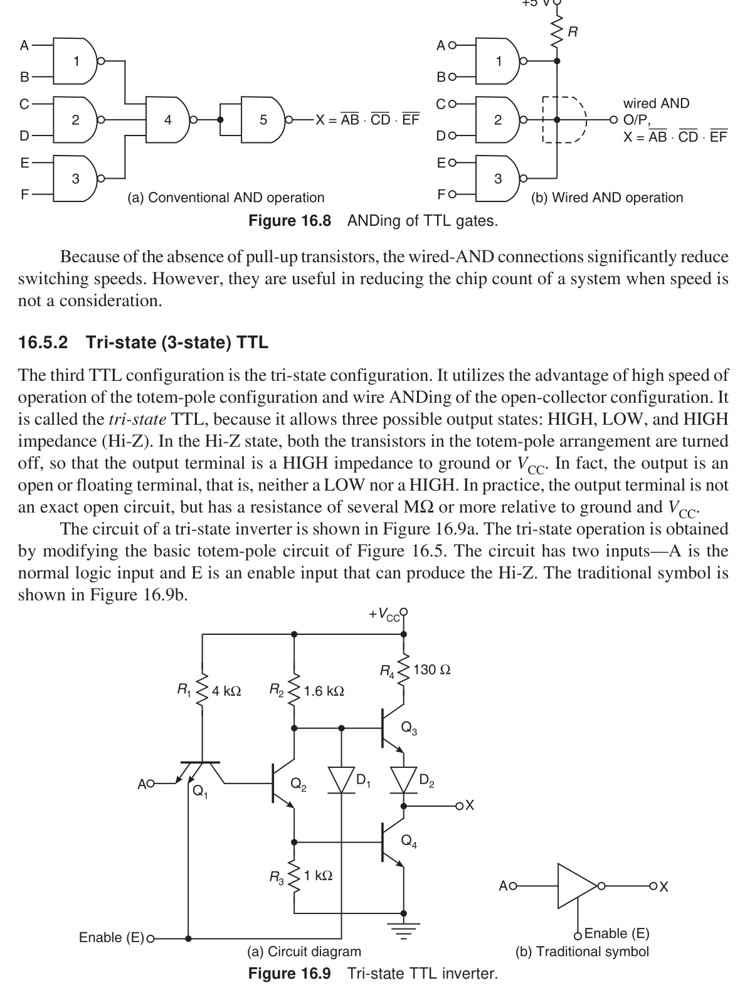
  <figcaption><strong>Figure 16.9:</strong> Schematic circuit diagram and logic symbol of a tri-state TTL inverter with active-LOW Enable input. Sourced from <em>A. Anand Kumar, Fundamentals of Digital Circuits (4th Ed.)</em>, p. 905 (printed p. 873).</figcaption>
</figure>

- **Operation:** When the **Enable** line is asserted, the gate behaves as a normal high-speed inverter. When Enable is de-asserted, internal diode steering holds the bases of both $Q_3$ and $Q_4$ at ground, placing the output into the floating $Z$ state. This enables microprocessors to connect hundreds of memory and peripheral chips to a single shared data bus.

---

### 1.11 CMOS Logic: Inverter, NAND, and NOR Gates
*Source: Kumar (Ch. 16, pp. 917–924, Figures 16.23, 16.24, 16.25)*  
**[Pacing: The King of Modern VLSI — Master This Section Thoroughly]**

#### Need (Problem-First)
TTL gates consume substantial continuous electric power because current flows through internal resistors even when the gate is not switching. In a modern computer processor with billions of transistors, TTL logic would consume kilowatts of power and instantly melt the silicon chip. The world needed a logic family that draws **virtually zero electric power** when idling. That technology is **CMOS** (Complementary Metal-Oxide-Semiconductor).

#### The Secret of CMOS: Complementary Pairs
CMOS pairs an **n-channel MOSFET (NMOS)** with a **p-channel MOSFET (PMOS)**:
- **NMOS ($Q_1$):** Turns **ON** when Gate voltage is HIGH ($+5\text{ V}$), and turns **OFF** when Gate is LOW ($0\text{ V}$). Connected between output and Ground (the **Pull-Down Network**).
- **PMOS ($Q_2$):** Turns **ON** when Gate voltage is LOW ($0\text{ V}$), and turns **OFF** when Gate is HIGH ($+5\text{ V}$). Connected between $+V_{DD}$ and output (the **Pull-Up Network**).

---

#### 1. The CMOS Inverter (*Kumar*, p. 921, Figure 16.23)

<figure>
  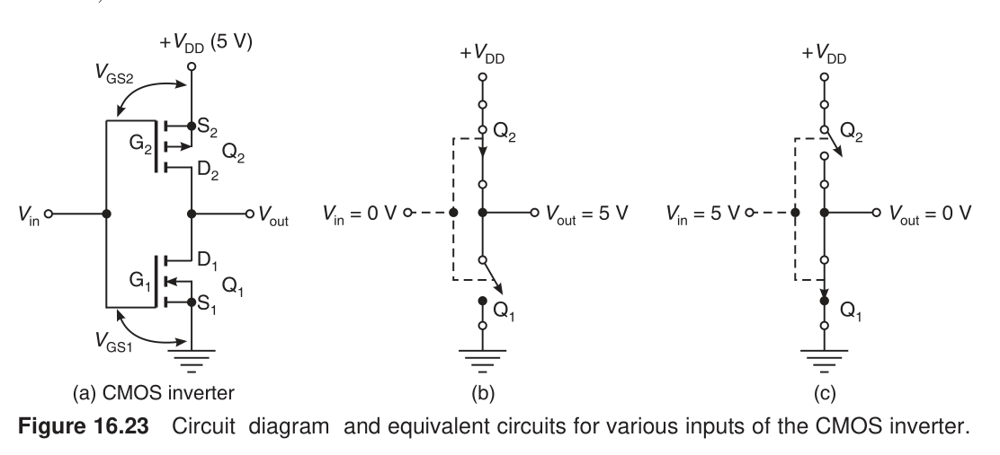
  <figcaption><strong>Figure 16.23:</strong> CMOS Inverter schematic and equivalent switch circuits for LOW and HIGH input states. Sourced from <em>A. Anand Kumar, Fundamentals of Digital Circuits (4th Ed.)</em>, p. 921 (printed p. 889).</figcaption>
</figure>

##### Characteristic 13 Walkthrough: Hardware Reality Check
- **When $V_{in} = 0\text{ V}$ (LOW):**  
  $V_{GS1} = 0\text{ V} \implies$ NMOS $Q_1$ is **OFF (OPEN switch)**.  
  $V_{GS2} = -5\text{ V} \implies$ PMOS $Q_2$ is **ON (CLOSED switch)**.  
  Output node $V_{out}$ is connected directly to $+V_{DD}$ through the conducting PMOS channel, while completely isolated from Ground.  
  $$V_{out} = +V_{DD} = +5\text{ V} \quad (\text{Logic 1})$$
- **When $V_{in} = +5\text{ V}$ (HIGH):**  
  $V_{GS1} = +5\text{ V} \implies$ NMOS $Q_1$ is **ON (CLOSED switch)**.  
  $V_{GS2} = 0\text{ V} \implies$ PMOS $Q_2$ is **OFF (OPEN switch)**.  
  Output node $V_{out}$ is connected directly to Ground through the conducting NMOS channel, while completely isolated from $+V_{DD}$.  
  $$V_{out} = 0\text{ V} \quad (\text{Logic 0})$$
- **Why Static Power is ZERO:** In both steady-state conditions, **one of the two series transistors is always completely OFF**. There is never a direct DC path from $+V_{DD}$ to Ground! Current only flows for a few picoseconds during the actual transition while charging the load capacitance.

---

#### 2. The CMOS NAND Gate (*Kumar*, p. 922, Figure 16.24)
- **Architecture:** Two PMOS transistors ($Q_1, Q_2$) connected in **parallel** between $+V_{DD}$ and output; two NMOS transistors ($Q_3, Q_4$) connected in **series** between output and Ground.

<figure>
  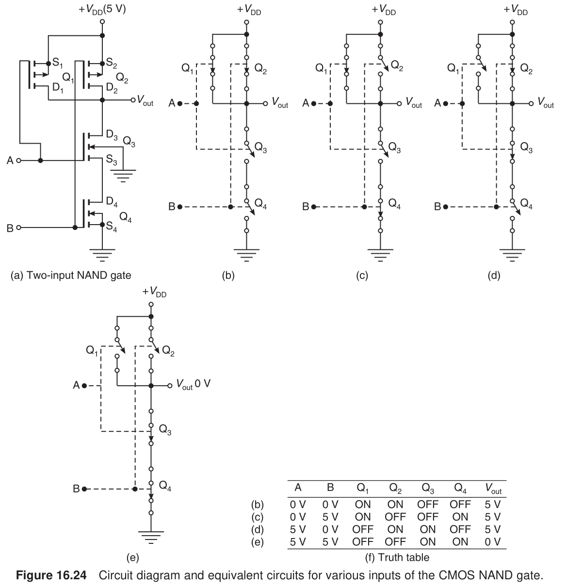
  <figcaption><strong>Figure 16.24:</strong> CMOS two-input NAND gate schematic, equivalent switch circuits, and operational truth table. Sourced from <em>A. Anand Kumar, Fundamentals of Digital Circuits (4th Ed.)</em>, p. 922 (printed p. 890).</figcaption>
</figure>

- **Operation:**
  - If *either* $A$ or $B$ is $0\text{ V}$, the corresponding PMOS is ON, pulling $V_{out}$ to $+5\text{ V}$. Because NMOS are in series, the path to ground is broken.
  - Only when *both* $A$ and $B$ are $+5\text{ V}$ are both series NMOS ($Q_3, Q_4$) ON simultaneously, while both parallel PMOS are OFF. Output is pulled to $0\text{ V}$.

---

#### 3. The CMOS NOR Gate (*Kumar*, p. 923, Figure 16.25)
- **Architecture:** Two PMOS transistors ($Q_1, Q_2$) connected in **series** between $+V_{DD}$ and output; two NMOS transistors ($Q_3, Q_4$) connected in **parallel** between output and Ground.

<figure>
  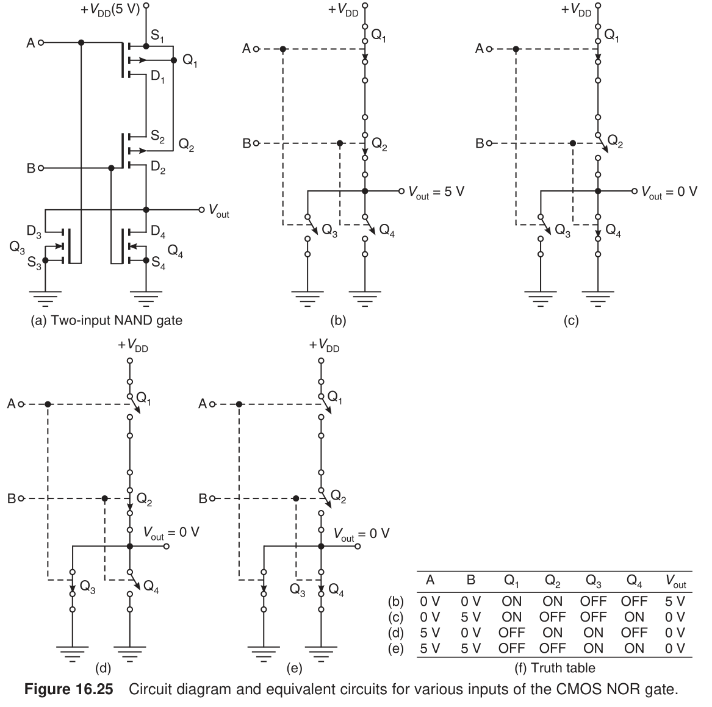
  <figcaption><strong>Figure 16.25:</strong> CMOS two-input NOR gate schematic, equivalent switch circuits, and operational truth table. Sourced from <em>A. Anand Kumar, Fundamentals of Digital Circuits (4th Ed.)</em>, p. 923 (printed p. 891). (Note: Sub-label (a) contains an authentic textbook typographical misprint labeling the schematic as NAND; the circuit is verified as NOR by its series PMOS and parallel NMOS configuration and verified caption).</figcaption>
</figure>

- **Operation:**
  - If *either* $A$ or $B$ is $+5\text{ V}$, the corresponding parallel NMOS conducts, clamping $V_{out}$ to $0\text{ V}$.
  - Only when *both* $A$ and $B$ are $0\text{ V}$ are both series PMOS transistors ON simultaneously, pulling $V_{out}$ to $+5\text{ V}$.

---

### 1.12 Interfacing CMOS and TTL Logic Families
*Source: Kumar (Ch. 16, pp. 930–933, Figures 16.32 & 16.33)*  
**[Pacing: Critical Practical Engineering — Read Deliberately]**

#### Need (Problem-First)
In practical engineering systems, you often need to connect a TTL microprocessor to a modern CMOS memory chip, or vice versa. If you blindly connect a copper wire between their pins without analyzing voltage and current compatibility, the circuit will fail to recognize logic states or destroy the chips.

#### The Fundamental Voltage & Current Mismatch

| Parameter | Standard TTL ($5\text{ V}$) | Standard CMOS ($5\text{ V}$) | Compatibility Conflict |
|---|---|---|---|
| **$V_{OH(\min)}$** (Output High Min) | $+2.4\text{ V}$ to $+2.7\text{ V}$ | $+4.9\text{ V}$ | TTL output high is too low for CMOS! |
| **$V_{IH(\min)}$** (Input High Min) | $+2.0\text{ V}$ | $+3.5\text{ V}$ ($70\%\text{ of } V_{DD}$) | CMOS requires $\ge 3.5\text{ V}$ to see a `1` |
| **$V_{OL(\max)}$** (Output Low Max) | $+0.4\text{ V}$ | $+0.1\text{ V}$ | Compatible ($0.4\text{ V} < 1.5\text{ V}$) |
| **$V_{IL(\max)}$** (Input Low Max) | $+0.8\text{ V}$ | $+1.5\text{ V}$ ($30\%\text{ of } V_{DD}$) | Compatible |

---

#### Case 1: TTL Driving CMOS (*Kumar*, p. 931, Figure 16.32)
- **The Physical Problem:** Standard TTL guarantees a minimum output HIGH voltage of only $V_{OH} = 2.4\text{ V}$ to $2.7\text{ V}$. But a $5\text{ V}$ CMOS gate requires at least $V_{IH} = 3.5\text{ V}$ to reliably recognize a HIGH! A standard TTL output falls directly into the CMOS **forbidden/undefined region**.
- **The Solution:** Connect an external **pull-up resistor ($R_p$, typically $1\text{ k}\Omega$ to $3.3\text{ k}\Omega$)** from the interconnect wire to $+V_{CC}$ (*Kumar*, Figure 16.32a), or use a dedicated TTL-compatible CMOS buffer (such as the 74HCT series). When the TTL output goes HIGH, $R_p$ pulls the line all the way up to $+5.0\text{ V}$, well above the CMOS $3.5\text{ V}$ threshold.

<figure>
  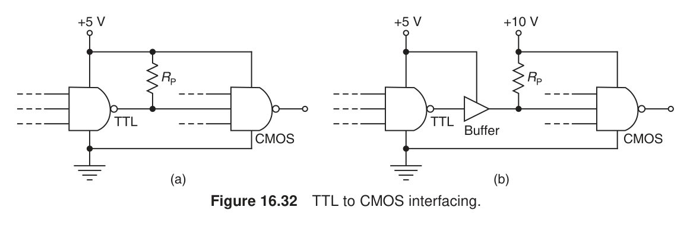
  <figcaption><strong>Figure 16.32:</strong> Interfacing TTL to CMOS logic using an external pull-up resistor or a supply-level shifting transistor. Sourced from <em>A. Anand Kumar, Fundamentals of Digital Circuits (4th Ed.)</em>, p. 931 (printed p. 899).</figcaption>
</figure>

---

#### Case 2: CMOS Driving TTL (*Kumar*, p. 932, Figure 16.33)
- **Voltage Compatibility:** CMOS $V_{OH(\min)} = 4.9\text{ V}$, which easily exceeds TTL $V_{IH(\min)} = 2.0\text{ V}$. CMOS $V_{OL(\max)} = 0.1\text{ V}$, which is well below TTL $V_{IL(\max)} = 0.8\text{ V}$. **Voltages are 100% compatible!**
- **The Current Sinking Problem:** When a TTL input is driven LOW, current physically **flows out of the TTL emitter into the driving CMOS output** ($I_{IL} \approx 1.6\text{ mA}$ per standard TTL gate). A standard 4000-series CMOS gate can only sink about $0.4\text{ mA}$ to $1.0\text{ mA}$ before its internal NMOS channel resistance causes $V_{OL}$ to rise above $0.8\text{ V}$!
- **The Solution:** Use a high-current CMOS buffer (such as 74HCT / 74ACT) or limit the fan-out to a single low-power Schottky TTL (74LS) input:

<figure>
  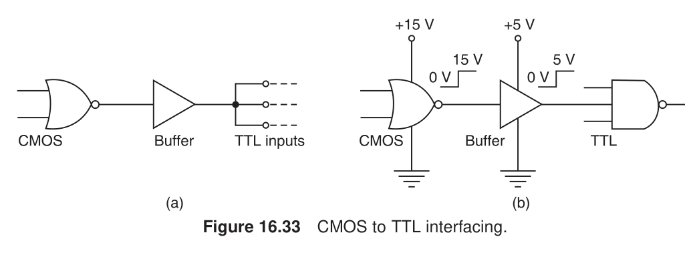
  <figcaption><strong>Figure 16.33:</strong> Interfacing CMOS to TTL showing buffer requirements for driving standard TTL loads. Sourced from <em>A. Anand Kumar, Fundamentals of Digital Circuits (4th Ed.)</em>, p. 932 (printed p. 900).</figcaption>
</figure>

---

### Unit I Understanding Checkpoints & Misconception Audit

#### 1. Does This Make Sense? Self-Check
- **Question 1:** Why is two-level NAND-NAND logic completely equivalent to AND-OR logic?
  - **Answer:** By De Morgan's theorem, an inverted-input OR gate (bubble-OR) is logically identical to a NAND gate ($\overline{A} + \overline{B} = \overline{AB}$). The output bubbles of the first-stage NAND gates cancel the input bubbles of the second-stage NAND gate, preserving the original AND-OR function.
- **Question 2:** Why must you never directly tie two standard totem-pole TTL outputs together?
  - **Answer:** If one outputs HIGH and the other outputs LOW, a direct, destructive short circuit is created from $V_{CC}$ to Ground through their low-impedance transistors, burning out the devices.
- **Question 3:** What component is mandatory when interfacing a standard TTL output to a standard CMOS input?
  - **Answer:** A pull-up resistor to $+V_{CC}$, because standard TTL output HIGH ($pprox 2.7	ext{ V}$) is below the CMOS input HIGH threshold ($3.5	ext{ V}$).

#### 2. Conceptual Misconceptions Corrected
- **Misconception:** *"A CMOS gate consumes zero power."*  
  **Correction:** It consumes virtually zero *static* (idle) power. But every time the output switches between 0 and 1, internal capacitances must be charged and discharged ($P_{	ext{dynamic}} = C \cdot V^2 \cdot f$). At high clock frequencies (gigahertz), CMOS chips consume immense power and generate significant heat!
- **Misconception:** *"In 2's complement subtraction, if an end-carry is produced, you must add it back to the LSB."*  
  **Correction:** No! That is the obsolete rule for **1's complement**. In **2's complement**, an end carry past the MSB is **strictly discarded**.

---


# Unit II: Logic Function and Minimization

---

### Master Subject Map: Unit II Position
```
[ UNIT I: FUNDAMENTALS OF DIGITAL SYSTEMS & LOGIC FAMILIES ]
                                  │
                                  ▼
┌──────────────────────────────────────────────────────────────────────────────────┐
│ YOU ARE HERE ──► UNIT II: LOGIC FUNCTION & MINIMIZATION                          │
│ • Boolean Algebra: Axioms, Theorems (De Morgan's, Involution, Absorption), Duality│
│ • Standard Representations: Minterms, Maxterms, SOP (∑m), POS (∏M) Forms        │
│ • Karnaugh Maps (2, 3, and 4 Variables): Gray Adjacency, Grouping Rules (2, 4, 8)│
│ • Prime Implicants, Essential Prime Implicants, Don't Care Conditions (d / X)    │
└─────────────────────────────────┬────────────────────────────────────────────────┘
                                  ▼
[ UNIT III: COMBINATIONAL DIGITAL CIRCUITS ]
```
*In 3 lines:* In Unit I, we learned how logic gates operate physically. But when designing a real digital system, naive designs require dozens of redundant gates. Unit II provides the mathematical machinery (Boolean Algebra) and graphical spatial tools (Karnaugh Maps) to strip away every redundant transistor, yielding the cheapest, fastest possible circuit.

---

### Prerequisites for this Unit
Before studying Unit II, ensure you recall these concepts from earlier sections:
1. **Basic Gates (Unit I, Section 1.5):** AND ($X = AB$), OR ($X = A + B$), and NOT ($X = \overline{A}$).
2. **Truth Tables (Prereq 6):** An exhaustive list of outputs for all $2^n$ combinations of $n$ binary inputs.
3. **Powers of Two (Prereq 6):** $1, 2, 4, 8, 16$ (governs the size of allowed K-map grouping loops).
4. **Gray Code Adjacency (Unit I, Section 1.4):** Consecutive codes differ by only a single bit ($00, 01, 11, 10$).

---

## PART 1: Boolean Algebra Axioms, Theorems, and Standard Forms

### 2.1 The Postulates and Axioms of Boolean Algebra
*Source: Kumar (Ch. 5, pp. 207–211); Mano (Ch. 2, pp. 58–64)*  
**[Pacing: Pure Foundations — Read Deliberately to Internalize Rules]**

#### Need (Problem-First)
In high-school ordinary algebra, variables represent real numbers and arithmetic follows standard operations ($1 + 1 = 2$). But electronic switches only have two states: $0$ and $1$. Applying ordinary algebra to switches produces nonsense (for example, in ordinary math, $1 + 1 = 2$, but in an OR gate, turning on switch A and switch B simply keeps the bulb ON: $1 + 1 = 1$). We need a rigorous mathematical system specifically tailored for two-valued logic. This is **Boolean Algebra**, formulated by George Boole in 1854 and adapted to switching circuits by Claude Shannon in 1938.

#### Chain of Cause and Effect
Switches are two-valued $\to$ mathematicians define formal closure under OR ($+$) and AND ($\cdot$) operations $\to$ axioms establish identity, commutativity, distributivity, and complements $\to$ these axioms permit rigorous mathematical simplification of electronic hardware.

#### The Huntington Postulates (Axioms) Defined
A set of elements $B = \{0, 1\}$ together with two binary operators $+$ (logical OR) and $\cdot$ (logical AND) satisfies the following axioms (*Kumar*, p. 208; *Mano*, p. 60):
1. **Closure:** For every $A, B \in B$:
   - $A + B \in B$ (the result of ORing two bits is always a bit).
   - $A \cdot B \in B$ (the result of ANDing two bits is always a bit).
2. **Identity Elements:**
   - Identity for OR is $0$: $A + 0 = A$. (ORing with $0$ does not change the signal).
   - Identity for AND is $1$: $A \cdot 1 = A$. (ANDing with $1$ preserves the signal).
3. **Commutativity:**
   - $A + B = B + A$
   - $A \cdot B = B \cdot A$
   (The order of physical input wires to a gate does not alter the output).
4. **Distributivity:**
   - **AND distributes over OR:** $A \cdot (B + C) = (A \cdot B) + (A \cdot C)$.
   - **OR distributes over AND (Crucial Boolean Special Rule!):**  
     $$A + (B \cdot C) = (A + B) \cdot (A + C)$$
     *Note for beginners:* This second distributive law is **false in ordinary high-school algebra**, but **100% TRUE in Boolean algebra!**
5. **Complement (Inverse):** For every element $A \in B$, there exists a unique element $\overline{A} \in B$ such that:
   - $A + \overline{A} = 1$ (A wire ORed with its inverse is always connected to $+5\text{ V}$).
   - $A \cdot \overline{A} = 0$ (A wire ANDed with its inverse can never be closed; it is always $0\text{ V}$).

---

### 2.2 Core Theorems of Boolean Algebra and De Morgan's Laws
*Source: Kumar (Ch. 5, pp. 211–219); Mano (Ch. 2, pp. 64–67)*  
**[Pacing: Conceptually Critical — Memorize and Understand These Transformation Tools]**

#### Need (Problem-First)
When an engineer writes down the raw logic equation for a real-world controller, the equation often contains ten or twenty terms. If built directly, the circuit would require dozens of integrated circuit packages. We need rigorous mathematical theorems to cancel out redundant terms on paper before soldering chips.

#### The Core Theorems

1. **Idempotent Laws (*Kumar*, p. 211):**
   $$A + A = A \qquad A \cdot A = A$$
   *Physical Meaning:* Tying two inputs of an OR or AND gate to the exact same wire produces the input itself.
2. **Boundedness (Null / Annihilation) Laws (*Kumar*, p. 212):**
   $$A + 1 = 1 \qquad A \cdot 0 = 0$$
   *Physical Meaning:* An OR gate with one input tied permanently to $+5\text{ V}$ is permanently locked HIGH ($1$). An AND gate with one input tied to Ground ($0\text{ V}$) is permanently locked LOW ($0$).
3. **Involution (Double Complement) (*Kumar*, p. 212):**
   $$\overline{\overline{A}} = A$$
   *Physical Meaning:* Two inverters in series cancel each other out.
4. **Absorption Laws (*Kumar*, p. 213):**
   $$A + (A \cdot B) = A \qquad A \cdot (A + B) = A$$
   *Conceptual Proof of $A + AB = A$:*
   $$\text{Step 1: Factor using identity axiom } (A = A \cdot 1): \quad A + AB = A \cdot 1 + A \cdot B$$
   $$\text{Step 2: Apply distributive law: } \quad = A \cdot (1 + B)$$
   $$\text{Step 3: Apply boundedness law } (1 + B = 1): \quad = A \cdot (1)$$
   $$\text{Step 4: Apply identity law: } \quad = A$$
   *Physical Meaning:* If the condition $A$ is already asserted, the term $AB$ is completely redundant hardware that can be cut from the circuit board!
5. **Redundant Literal Rule (Consensus Variant) (*Kumar*, p. 214):**
   $$A + \overline{A}B = A + B$$
   *Conceptual Proof:*
   $$\text{Step 1: Apply Boolean distributive law } (A + BC = (A+B)(A+C)): \quad A + \overline{A}B = (A + \overline{A}) \cdot (A + B)$$
   $$\text{Step 2: Apply complement law } (A + \overline{A} = 1): \quad = 1 \cdot (A + B)$$
   $$\text{Step 3: Apply identity law: } \quad = A + B$$
   *Physical Hardware Reality:* The $\overline{A}$ term was completely useless!

---

#### 6. De Morgan's Theorems
*Source: Kumar (Ch. 5, pp. 215–218); Mano (Ch. 2, pp. 65–67)*  
**[Pacing: Slow & Deliberate — The Most Important Theorem in Digital Electronics]**

##### Theorem 1: Complementation of a Product (The NAND Theorem)
"The complement of a product of variables is equal to the sum of their individual complements" (*Kumar*, p. 215):
$$\overline{A \cdot B} = \overline{A} + \overline{B}$$
*Physical Gate Meaning:* A **NAND gate** is logically identical to an **OR gate with inverted inputs** (a Bubbled OR gate).

##### Theorem 2: Complementation of a Sum (The NOR Theorem)
"The complement of a sum of variables is equal to the product of their individual complements" (*Kumar*, p. 216):
$$\overline{A + B} = \overline{A} \cdot \overline{B}$$
*Physical Gate Meaning:* A **NOR gate** is logically identical to an **AND gate with inverted inputs** (a Bubbled AND gate).

##### Mathematical Verification by Truth Table:
Let us prove Theorem 1 ($\overline{AB} = \overline{A} + \overline{B}$) exhaustively across all four possible input combinations:

| $A$ | $B$ | $AB$ | $\overline{AB}$ (LHS) | $\overline{A}$ | $\overline{B}$ | $\overline{A} + \overline{B}$ (RHS) | Match? |
|:---:|:---:|:---:|:---:|:---:|:---:|:---:|:---:|
| 0 | 0 | 0 | **1** | 1 | 1 | **1** | Yes |
| 0 | 1 | 0 | **1** | 1 | 0 | **1** | Yes |
| 1 | 0 | 0 | **1** | 0 | 1 | **1** | Yes |
| 1 | 1 | 1 | **0** | 0 | 0 | **0** | Yes |

Every single row of Column 4 ($\overline{AB}$) matches Column 7 ($\overline{A} + \overline{B}$) exactly. The theorem is proven beyond doubt.

---

### 2.3 The Principle of Duality
*Source: Kumar (Ch. 5, p. 210); Mano (Ch. 2, p. 64)*  
**[Pacing: Fast & Methodical — A Powerful Symmetry Tool]**

#### Need & How It Works
The **Duality Principle** states that any true Boolean algebraic identity remains true if you perform three simultaneous swaps (*Kumar*, p. 210):
1. Change every OR operator ($+$) to an AND operator ($\cdot$).
2. Change every AND operator ($\cdot$) to an OR operator ($+$).
3. Change every identity `0` to `1`, and every `1` to `0`.
*(Leave variable literals $A, B, C$ uncomplemented!)*
- *Example:* The dual of the identity $A + \overline{A} = 1$ is:
  $$A \cdot \overline{A} = 0$$
  This halves the effort required in formal mathematical proofs.

---

### 2.4 Standard Representations: Minterms, Maxterms, SOP, and POS
*Source: Kumar (Ch. 5, pp. 220–228); Mano (Ch. 2, pp. 73–82)*  
**[Pacing: Systematic Bookkeeping — Foundation for K-Maps]**

#### Need (Problem-First)
A Boolean function can be written in dozens of arbitrary algebraic forms (e.g., $F = AB + C(D + E)$ vs $F = (A + C)(B + C)D + CE$). To communicate unambiguously, build systematic automated tools, and enter logic into Karnaugh Maps, engineers require standardized **canonical forms**.

#### Definitions: Minterms vs. Maxterms

##### 1. Minterms (Standard Product Terms) (*Kumar*, p. 220)
A **minterm** is an AND product of all $n$ literals in the function, where each variable appears exactly once (either in unprimed form $A$ or primed form $\overline{A}$).
- **The Rule for Minterms:** A minterm is defined such that it equals **$1$ for exactly one specific combination of input variables**.
  - If variable $A = 1$, write it uncomplemented: $A$.
  - If variable $A = 0$, write it complemented: $\overline{A}$.
- *Designation:* Lowercase $m_i$, where index $i$ is the decimal equivalent of the binary row.
  - For 3 variables ($A, B, C$):
    - Row $0$ ($000_2$): $m_0 = \overline{A}\ \overline{B}\ \overline{C}$
    - Row $1$ ($001_2$): $m_1 = \overline{A}\ \overline{B}C$
    - Row $5$ ($101_2$): $m_5 = A\overline{B}C$
    - Row $7$ ($111_2$): $m_7 = ABC$

##### 2. Maxterms (Standard Sum Terms) (*Kumar*, p. 222)
A **maxterm** is an OR sum of all $n$ literals, where each variable appears exactly once.
- **The Rule for Maxterms:** A maxterm is defined such that it equals **$0$ for exactly one specific combination of input variables**.
  - If variable $A = 0$, write it uncomplemented: $A$.
  - If variable $A = 1$, write it complemented: $\overline{A}$.
  *(Notice this is the exact opposite of minterm convention!)*
- *Designation:* Uppercase $M_i$, where index $i$ is the decimal row number.
  - For 3 variables ($A, B, C$):
    - Row $0$ ($000_2$): $M_0 = A + B + C$
    - Row $5$ ($101_2$): $M_5 = \overline{A} + B + \overline{C}$
    - Row $7$ ($111_2$): $M_7 = \overline{A} + \overline{B} + \overline{C}$

---

#### 3. Canonical Sum-of-Products (SOP) Form ($\sum m$)
The canonical SOP form expresses a logic function as the logical OR (sum) of all the minterms for which the output function equals **$1$**:
$$F(A, B, C) = \sum m(1, 4, 5, 7) = m_1 + m_4 + m_5 + m_7 = \overline{A}\ \overline{B}C + A\overline{B}\ \overline{C} + A\overline{B}C + ABC$$

#### 4. Canonical Product-of-Sums (POS) Form ($\prod M$)
The canonical POS form expresses a logic function as the logical AND (product) of all the maxterms for which the output function equals **$0$**:
$$F(A, B, C) = \prod M(0, 2, 3, 6) = M_0 \cdot M_2 \cdot M_3 \cdot M_6 = (A + B + C)(A + \overline{B} + C)(A + \overline{B} + \overline{C})(\overline{A} + \overline{B} + C)$$

**The Fundamental Conversion Rule (*Kumar*, p. 226):**  
The minterms where $F = 1$ and the maxterms where $F = 0$ are exact complements of the full universe of states:
$$\sum m(1, 4, 5, 7) \quad \equiv \quad \prod M(0, 2, 3, 6)$$
Any function given in SOP can be instantly converted to POS by simply listing the **missing index numbers**!

---

## PART 2: Karnaugh Maps (K-Maps) and Logic Simplification

### 2.5 The Karnaugh Map (K-Map) Philosophy and Gray-Code Adjacency
*Source: Kumar (Ch. 6, pp. 263–268); Mano (Ch. 3, pp. 99–107); Floyd (Ch. 4, pp. 195–215)*  
**[Pacing: Conceptually Critical — The Core Tool for Minimization]**

#### Need (Problem-First)
Minimizing logic functions using Boolean algebra theorems by hand is like doing high-wire acrobatics without a safety net:
1. It is **non-systematic**: there is no fixed algorithm telling you which theorem to apply next.
2. It relies heavily on human pattern-recognition and intuition.
3. It is notoriously **error-prone**: missing a single prime or bar destroys the entire circuit.  
We need a **foolproof graphical method** where simplification happens automatically through simple visual pattern grouping. That method is the **Karnaugh Map (K-map)**, invented by Maurice Karnaugh in 1953.

#### The Core Mechanism: Gray Code Spatial Adjacency
A K-map is a diagram made up of squares, where each square represents one specific minterm (*Kumar*, p. 263).  
The profound genius of the K-map lies in its coordinate labeling: **the rows and columns are arranged in Gray code sequence ($00, 01, 11, 10$)**, NEVER standard binary ($00, 01, 10, 11$)!
- Why? In Gray code, **adjacent squares differ by only ONE bit variable**.
- When two adjacent squares both contain a `1`, they represent two minterms that are identical except for one variable (e.g., $AB$ and $A\overline{B}$).
- By the Boolean theorem $AB + A\overline{B} = A(B + \overline{B}) = A(1) = A$, combining two adjacent squares **physically eliminates the variable that changes**!

---

### 2.6 Two-Variable and Three-Variable K-Maps

#### 1. Two-Variable K-Map (*Kumar*, pp. 265–267)
A 2-variable function $F(A, B)$ has $2^2 = 4$ minterms, arranged in a $2 \times 2$ grid:

<figure>
  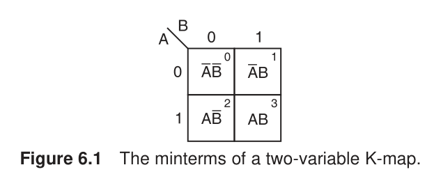
  <figcaption><strong>Figure 6.1:</strong> Format and minterm cell assignments for a two-variable Karnaugh Map. Sourced from <em>A. Anand Kumar, Fundamentals of Digital Circuits (4th Ed.)</em>, p. 265 (printed p. 233).</figcaption>
</figure>

- **Allowed Groupings in 2-Variable K-Map (*Kumar*, p. 266, Figure 6.4):**
  - An isolated single cell ($2^0 = 1$ cell): yields a 2-variable term.
  - A pair of adjacent cells ($2^1 = 2$ cells): eliminates 1 variable, yielding a 1-variable term.
  - A block of four cells ($2^2 = 4$ cells): eliminates 2 variables, yielding the constant logic $1$.

<figure>
  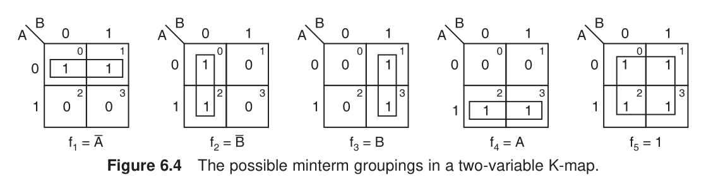
  <figcaption><strong>Figure 6.4:</strong> Possible minterm groupings (isolated cell, 2-cell pair, and 4-cell full map) in a two-variable K-map. Sourced from <em>A. Anand Kumar, Fundamentals of Digital Circuits (4th Ed.)</em>, p. 266 (printed p. 234).</figcaption>
</figure>

---

#### 2. Three-Variable K-Map (*Kumar*, pp. 269–275)
A 3-variable function $F(A, B, C)$ has $2^3 = 8$ minterms, arranged in a $2 \times 4$ grid (*Kumar*, Figure 6.10):

<figure>
  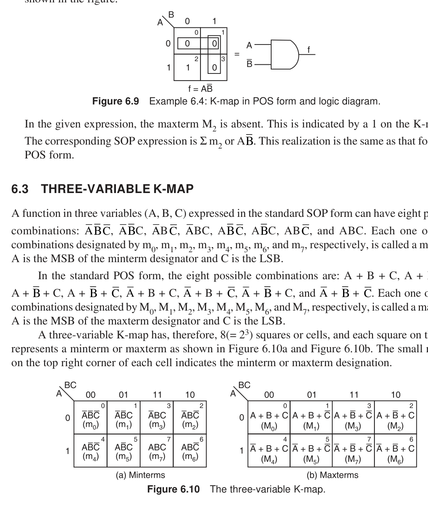
  <figcaption><strong>Figure 6.10:</strong> Three-variable Karnaugh map structure and minterm cell numbering showing Gray code column sequence (00, 01, 11, 10). Sourced from <em>A. Anand Kumar, Fundamentals of Digital Circuits (4th Ed.)</em>, p. 269 (printed p. 237).</figcaption>
</figure>

- **Notice the Column Reversal:** The column sequence is $00, 01, \mathbf{11}, \mathbf{10}$. Therefore, the cell numbers in the top row are **$0, 1, 3, 2$** (cells 3 and 2 are swapped!), and in the bottom row are **$4, 5, 7, 6$**! This is the most common place beginners make arithmetic slip-ups.
- **Topological Torus (Wrap-Around Adjacency):** The extreme left column ($00$) is physically adjacent to the extreme right column ($10$)! A grouping can roll over the outer edges:

<figure>
  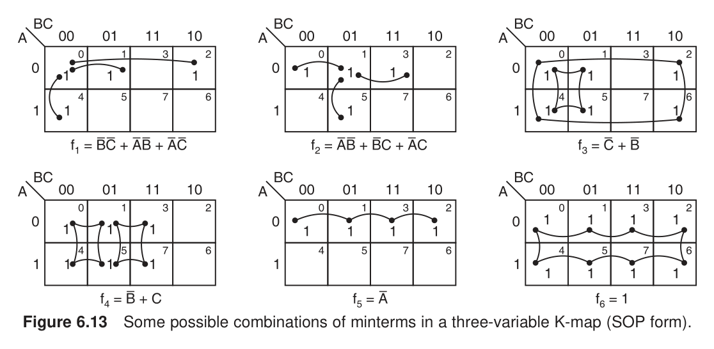
  <figcaption><strong>Figure 6.13:</strong> Valid grouping patterns in a three-variable K-map (singletons, pairs, quads, and end-wrap combinations). Sourced from <em>A. Anand Kumar, Fundamentals of Digital Circuits (4th Ed.)</em>, p. 272 (printed p. 240).</figcaption>
</figure>

---

### 2.7 The Four-Variable K-Map (Up to 4 Variables)
*Source: Kumar (Ch. 6, pp. 276–284); Mano (Ch. 3, pp. 107–112)*  
**[Pacing: The Core Workhorse of Logic Minimization — Study Carefully]**

#### Structure and Geometry
A 4-variable function $F(A, B, C, D)$ has $2^4 = 16$ minterms, arranged in a symmetrical $4 \times 4$ grid (*Kumar*, p. 276, Figure 6.19):

<figure>
  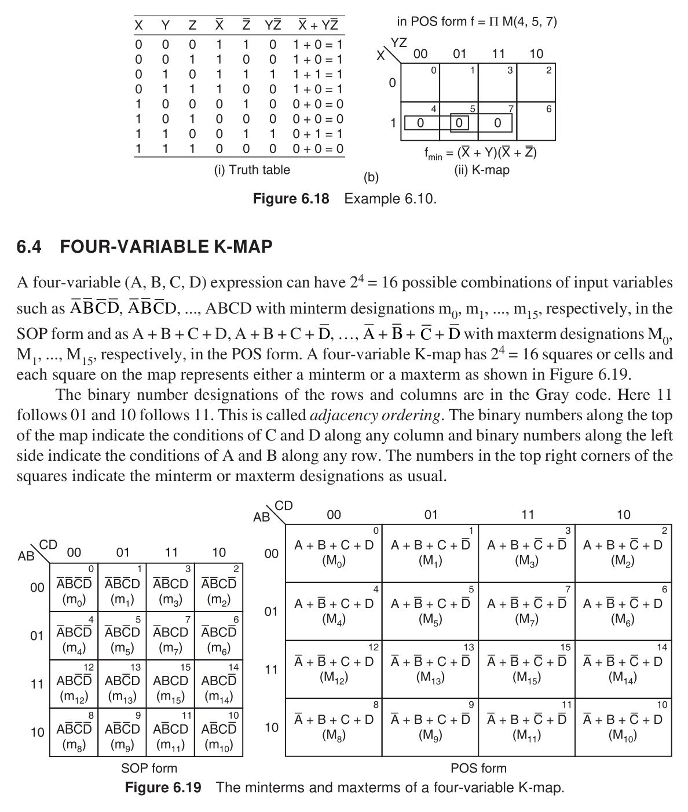
  <figcaption><strong>Figure 6.19:</strong> Four-variable Karnaugh Map layout showing row and column Gray code sequences and corresponding minterm / maxterm decimal indices. Sourced from <em>A. Anand Kumar, Fundamentals of Digital Circuits (4th Ed.)</em>, p. 276 (printed p. 244).</figcaption>
</figure>

##### The Universal 16-Cell Index Map:
```
       CD
AB     00    01    11    10
00   ┌─────┬─────┬─────┬─────┐
     │  0  │  1  │  3  │  2  │
01   ├─────┼─────┼─────┼─────┤
     │  4  │  5  │  7  │  6  │
11   ├─────┼─────┼─────┼─────┤
     │ 12  │ 13  │ 15  │ 14  │  <-- Row 11 is row index 12-15!
10   ├─────┼─────┼─────┼─────┤
     │  8  │  9  │ 11  │ 10  │  <-- Row 10 is row index 8-11!
     └─────┴─────┴─────┴─────┘
```
*Crucial Double Swap Warning:* Notice that both the 3rd column ($CD=11$) and the 3rd row ($AB=11$) are swapped with their 4th counterparts to preserve Gray-code single-bit transitions!

---

#### The Rigorous Step-by-Step K-Map Minimization Algorithm:
1. **Plot the Function:** Place a `1` in every cell corresponding to a minterm of the function. Leave all other cells as `0` (or blank).
2. **Identify Isolated Cells:** Any `1` that has no adjacent `1`s cannot be combined. It must be circled as a 1-cell group ($2^0$).
3. **Form the Largest Possible Groups (Powers of Two Only):**
   - **Group of 16 ($2^4$):** Covers entire map $\implies F = 1$ (eliminates 4 variables).
   - **Group of 8 (Octet, $2^3$):** Eliminates 3 variables, leaving a 1-variable term.
   - **Group of 4 (Quad, $2^2$):** Eliminates 2 variables, leaving a 2-variable term.
   - **Group of 2 (Pair, $2^1$):** Eliminates 1 variable, leaving a 3-variable term.
4. **Wrap-Around Adjacencies (The 3D Cylindrical Surface):**
   - The top row ($AB=00$) is adjacent to the bottom row ($AB=10$).
   - The left column ($CD=00$) is adjacent to the right column ($CD=10$).
   - **The Four Corners:** Cells $(0, 2, 8, 10)$ form a single valid **Quad** ($2^2 = 4$ cells)!
5. **Eliminate Redundant Groups:** Every `1` must be covered at least once. If a group contains *only* `1`s that are already covered by other necessary groups, that group is completely redundant and must be erased!

---

### 2.8 Prime Implicants and Essential Prime Implicants
*Source: Kumar (Ch. 6, pp. 280–283); Mano (Ch. 3, pp. 109–112)*  
**[Pacing: Conceptually Rigorous — Key for Formal Engineering Exams]**

#### Definitions Defined Inline:
- **Implicant:** Any single minterm or valid grouping of minterms (of size $1, 2, 4, 8 \dots$) for which the output is $1$.
- **Prime Implicant (PI):** A rectangle of $1$s (size $2^k$) that **cannot be merged into any larger rectangle** (*Kumar*, p. 281). It is maximal.
- **Essential Prime Implicant (EPI):** A Prime Implicant that contains **at least one `1` that is not covered by any other prime implicant** (*Kumar*, p. 281). **Every EPI must appear in the final minimal expression!**
- **Redundant Prime Implicant:** A prime implicant whose `1`s are all completely covered by essential prime implicants. It must be discarded.

<figure>
  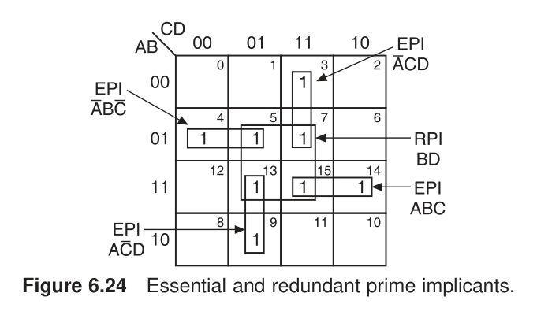
  <figcaption><strong>Figure 6.24:</strong> Distinguishing Essential Prime Implicants from Redundant Prime Implicants on a Karnaugh map. Sourced from <em>A. Anand Kumar, Fundamentals of Digital Circuits (4th Ed.)</em>, p. 281 (printed p. 249).</figcaption>
</figure>

##### Concrete Fully-Worked 4-Variable Example
Minimize: $F(A, B, C, D) = \sum m(0, 1, 2, 4, 5, 6, 8, 9, 12, 13, 14)$
- **Step 1 (Plotting):** Mark cells 0, 1, 2, 4, 5, 6, 8, 9, 12, 13, 14 with `1`.
- **Step 2 (Identify Groups):**
  - Look at columns 1 & 2 (where $CD = 00$ and $01$): cells $(0, 1, 4, 5, 12, 13, 8, 9)$ form a massive **Octet ($8$ cells)** spanning all four rows!
    - Across these 8 cells: $A$ varies ($0, 1$), $B$ varies ($0, 1$), $D$ varies ($0, 1$). The only variable that remains constant is **$C = 0$**.
    - This octet reduces to the single literal: **$\overline{C}$**.
  - Next, look at the four corners: cells $(0, 2, 8, \dots)$ but wait! Look at the top two rows ($AB=00$ and $01$): cells $(0, 1, 2, 4, 5, 6)$ and cells $(4, 5, 6, 12, 13, 14)$.
    - Cells $(0, 2, 4, 6)$ form a Quad: row $A=0$, and columns $CD=00, 10$ ($D=0$). Term: **$\overline{A}\ \overline{D}$**.
    - Cells $(4, 6, 12, 14)$ form a Quad: row $B=1$, and columns $CD=00, 10$ ($D=0$). Term: **$B\overline{D}$**.
- **Final Minimal SOP Expression:**
  $$F = \overline{C} + \overline{A}\ \overline{D} + B\overline{D}$$
  Notice that an original expression containing 11 four-variable terms (requiring dozens of gates) collapsed into just three tiny 2-literal terms!

---

### 2.9 Don't Care Conditions ($d$ or $X$)
*Source: Kumar (Ch. 6, pp. 278–280); Mano (Ch. 3, pp. 116–119)*  
**[Pacing: Conceptually Heavy — A Hardware Designer's Best Friend]**

#### Need (Problem-First)
In many real systems, certain input combinations **can never physically occur**.
- *Concrete Example:* A circuit processes BCD digits ($0$ through $9$, binary `0000` to `1001`). What happens if the inputs are `1010` ($10_{10}$) through `1111` ($15_{10}$)? In a legitimate BCD system, the upstream hardware will *never* produce those codes.
- Because those input combinations will never happen in real life, **the designer does not care whether the circuit outputs a `0` or a `1` for those rows**.

#### The Strategic Grouping Rule for Don't Cares ($d$ or $X$)
A **Don't Care** condition (written as $d$ or $X$ in the K-map) is a wildcard:
- **Rule 1:** You may treat an $X$ as a `1` **if and only if it helps you form a larger grouping** (e.g., expanding a pair into a quad, or a quad into an octet). A larger group eliminates more variables, making the circuit cheaper.
- **Rule 2:** You treat an $X$ as a `0` (leave it un-circled) **if it does not help enlarge any group of `1`s**. You are **never required to cover an $X$**! Only true `1`s are mandatory to cover.

*Concrete Worked Example:*
Minimize: $F(A, B, C, D) = \sum m(1, 3, 7, 11, 15) + \sum d(0, 2, 5)$
- **Analysis:**
  - Mandatory `1`s are at cells $1, 3, 7, 11, 15$.
  - Don't cares ($X$) are at cells $0, 2, 5$.
  - Without don't cares, cells $(3, 7, 11, 15)$ form a vertical Quad (term: $CD$). Cell 1 would have to pair with 3 (term: $\overline{A}\ \overline{B}D$).
  - **With Don't Cares:** By including $X_5$, cells $(1, 3, 5, 7)$ form a Quad in the upper half!  
    Even better: cells $(0, 1, 2, 3)$ in the top row are all $1$s or $X$s!  
    By treating $X_0, X_2, X_5$ strategically, we group cells $(1, 3, 5, 7)$ with $(9, 11, 13, 15)$ if present, or group $(3, 7, 11, 15)$ as a Quad ($CD$) and group $(1, 3, 5, 7)$ as a Quad ($\overline{A}D$).
  - **Minimized Result:** $F = CD + \overline{A}D = D(C + \overline{A})$.

---

### Unit II Understanding Checkpoints & Misconception Audit

#### 1. Does This Make Sense? Self-Check
- **Question 1:** Why is a group of three adjacent `1`s ($3$ cells) illegal in a Karnaugh map?
  - **Answer:** Because grouping relies on the Boolean theorem $X + \overline{X} = 1$, which only eliminates a variable when powers of two are factored ($2^1 = 2, 2^2 = 4, 2^3 = 8$). A group of 3 cannot factor out a single variable cleanly.
- **Question 2:** If all 16 cells of a 4-variable K-map contain `1`s, what is the minimized Boolean function?
  - **Answer:** $F = 1$ (the output is permanently HIGH, requiring zero logic gates).
- **Question 3:** Are you required to draw circles around every Don't Care ($X$) on a K-map?
  - **Answer:** Absolutely not! You only include an $X$ if it helps expand a group containing genuine `1`s. An $X$ left alone simply defaults to a `0`.

#### 2. Conceptual Misconceptions & Arithmetic Slip-Ups Corrected
- **Conceptual Misconception:** *"A Karnaugh map can minimize any function with any number of variables."*  
  **Correction:** K-maps are human graphical tools effective only up to **4 variables** (or awkwardly 5 to 6 variables using stacked 3D layers). For 7 or more variables, visualization collapses and industry uses tabular computer algorithms like the **Quine-McCluskey method** or **Espresso**.
- **Arithmetic / Notation Slip-Up:** When writing the K-map grid, students constantly label rows or columns as $00, 01, 10, 11$. **This is completely wrong!** The order must be Gray-coded: **$00, 01, 11, 10$**. Swapping columns 11 and 10 destroys the geometric adjacency and corrupts all resulting terms.

---


# Unit III: Combinational Digital Circuits

---

### Master Subject Map: Unit III Position
```
[ UNIT II: BOOLEAN ALGEBRA & K-MAP MINIMIZATION ]
                                  │
                                  ▼
┌──────────────────────────────────────────────────────────────────────────────────┐
│ YOU ARE HERE ──► UNIT III: COMBINATIONAL DIGITAL CIRCUITS                        │
│ • Arithmetic Blocks: Half/Full Adders, Half/Full Subtractors, 4-bit Parallel, CLA│
│ • Data Converters: Binary-to-Gray, Gray-to-Binary, BCD-to-Excess-3               │
│ • Data Routing & Selection: Multiplexers (2:1, 4:1), Demultiplexers (1:4)        │
│ • Code & Display Decoders: 3:8 Decoders (74138), Priority Encoders (74148)       │
│ • Visual Human Interfaces: BCD-to-7-Segment Decoders (7447/7448), Common A/C LED │
└─────────────────────────────────┬────────────────────────────────────────────────┘
                                  ▼
[ UNIT IV: SEQUENTIAL CIRCUITS & STATE MACHINES ]
```
*In 3 lines:* In Unit II, we mastered logic minimization on paper. Unit III combines those minimized gates into practical computing blocks called **Combinational Circuits**. These memoryless circuits perform instantaneous calculations (Adders/Subtractors), route data streams (Multiplexers), and translate binary code into human-readable symbols (Seven-Segment Displays).

---

### Prerequisites for this Unit
Before studying Unit III, ensure you recall these concepts:
1. **Universal & Exclusive Gates (Unit I, Sections 1.5–1.7):** XOR ($A \oplus B = \overline{A}B + A\overline{B}$), AND ($AB$), OR ($A+B$), and Inverters.
2. **K-Map Simplification (Unit II, Section 2.7):** Grouping cells to produce minimal Sum-of-Products equations.
3. **Binary Arithmetic & 2's Complement Subtraction (Unit I, Sections 1.2–1.3):** Converting subtraction into controlled addition.
4. **Gray Code & BCD Rules (Unit I, Section 1.4):** Single-bit transitions and 4-bit decimal representations.

---

### 3.1 Combinational Logic: Definition and Formal Design Procedure
*Source: Kumar (Ch. 7, pp. 357–358); Mano (Ch. 4, pp. 164–172)*  
**[Pacing: Methodical Framework — Learn the Standard Design Steps]**

#### Need (Problem-First)
How do professional engineers transform a fuzzy English problem statement (e.g., "design a voting machine for a 3-member committee where the majority wins") into a functional electronic schematic? We need a universal, repeatable step-by-step design procedure.

#### Physical Definition of Combinational Logic
A **Combinational Circuit** is a connected network of logic gates whose output voltages at any given instant of time depend **strictly and solely on the input voltages applied at that exact same instant** (*Kumar*, p. 357).  
- It has **no feedback loops** (outputs are never fed back to inputs).
- It has **no memory elements** (it cannot remember what happened one microsecond ago).
- It is entirely governed by combinational Boolean functions: $Y_j = f_j(I_1, I_2, \dots, I_n)$.

#### The Standard 5-Step Design Procedure (*Kumar*, p. 358; *Mano*, p. 170):
1. **Problem Formulation:** State the circuit's behavior clearly in words, identifying all required input and output variables.
2. **Variable Assignment:** Assign algebraic letter symbols (e.g., $A, B, C$ for inputs; $X, Y, S$ for outputs).
3. **Truth Table Construction:** Exhaustively list all $2^n$ input combinations and define the required output for each row.
4. **Logic Minimization:** Plot each output variable onto a Karnaugh Map and derive the minimal Boolean expression (in SOP or POS).
5. **Logic Schematic Realization:** Draw the circuit diagram using standard gate symbols, or convert to universal NAND/NOR logic for fabrication.

---

## PART 1: Arithmetic Building Blocks (Adders, Subtractors, and Lookahead Carry)

### 3.2 The Half Adder and Full Adder
*Source: Kumar (Ch. 7, pp. 358–363); Mano (Ch. 4, pp. 173–178); Floyd (Ch. 5, pp. 248–256)*  
**[Pacing: Fundamental Arithmetic — Study Every Derivation Step]**

#### Need (Problem-First)
All computing—from calculating 3D graphics in video games to processing banking transactions—boils down to basic binary addition. Without a circuit that can add two electrical bits and handle carries, modern computers cannot exist.

---

#### 1. The Half Adder (*Kumar*, pp. 358–360)
- **Definition:** A combinational circuit that adds **two single binary bits** ($A$ and $B$), producing two outputs: a **Sum bit ($S$)** and a **Carry bit ($C$)**. It is called a "half" adder because it has *no provision to accept a carry arriving from a previous lower stage*.
- **Truth Table (*Kumar*, p. 358):**

| Input $A$ | Input $B$ | Sum ($S$) | Carry ($C$) | Arithmetic Meaning |
|:---:|:---:|:---:|:---:|---|
| 0 | 0 | **0** | **0** | $0 + 0 = 0$ |
| 0 | 1 | **1** | **0** | $0 + 1 = 1$ |
| 1 | 0 | **1** | **0** | $1 + 0 = 1$ |
| 1 | 1 | **0** | **1** | $1 + 1 = 10_2$ (Sum $0$, Carry $1$) |

- **Boolean Equations:**
  - Notice the Sum column: $S$ is $1$ only when inputs are different $\implies$ **XOR Gate**:
    $$S = \overline{A}B + A\overline{B} = A \oplus B$$
  - Notice the Carry column: $C$ is $1$ only when both inputs are $1$ $\implies$ **AND Gate**:
    $$C = AB$$
- **Authentic Diagram (*Kumar*, p. 359, Figure 7.3):**

<figure>
  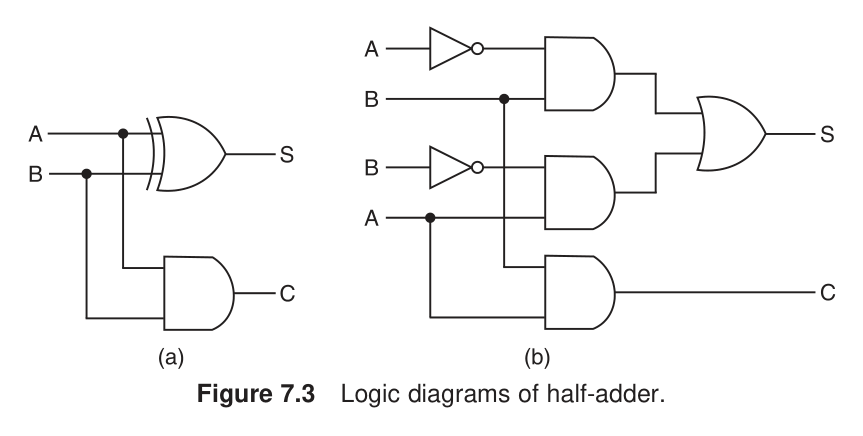
  <figcaption><strong>Figure 7.3:</strong> Half-adder circuit implementations: (a) using basic AND, OR, NOT gates; (b) using an XOR gate and an AND gate. Sourced from <em>A. Anand Kumar, Fundamentals of Digital Circuits (4th Ed.)</em>, p. 359 (printed p. 327).</figcaption>
</figure>

---

#### 2. The Full Adder (*Kumar*, pp. 360–363)
- **Need:** When adding multi-bit binary numbers (e.g., $1101 + 1011$), each column after the LSB must add **three bits simultaneously**: the augend bit ($A$), the addend bit ($B$), and the **incoming carry ($C_{in}$)** generated by the previous column! A half adder cannot do this. We need a **Full Adder**.
- **Truth Table (*Kumar*, p. 360):**

| $A$ | $B$ | $C_{in}$ | Sum ($S$) | Carry Out ($C_{out}$) | Arithmetic Sum ($A + B + C_{in}$) |
|:---:|:---:|:---:|:---:|:---:|---|
| 0 | 0 | 0 | **0** | **0** | $0$ |
| 0 | 0 | 1 | **1** | **0** | $1$ |
| 0 | 1 | 0 | **1** | **0** | $1$ |
| 0 | 1 | 1 | **0** | **1** | $2 = 10_2$ |
| 1 | 0 | 0 | **1** | **0** | $1$ |
| 1 | 0 | 1 | **0** | **1** | $2 = 10_2$ |
| 1 | 1 | 0 | **0** | **1** | $2 = 10_2$ |
| 1 | 1 | 1 | **1** | **1** | $3 = 11_2$ |

- **Derivation of Boolean Expressions:**
  - **Sum ($S$):** $S$ is $1$ whenever an **odd number of inputs are $1$** (parity function):
    $$S = \overline{A}\ \overline{B}C_{in} + \overline{A}B\overline{C_{in}} + A\overline{B}\ \overline{C_{in}} + ABC_{in} = A \oplus B \oplus C_{in}$$
  - **Carry Out ($C_{out}$):** $C_{out}$ is $1$ whenever **two or more inputs are $1$**:
    $$C_{out} = AB + BC_{in} + AC_{in} = AB + C_{in}(A \oplus B)$$
- **Realization Using Two Half Adders (*Kumar*, p. 361, Figure 7.7):**  
  A Full Adder can be constructed by cascading two Half Adders and one OR gate:
  - Half Adder 1 adds $A$ and $B$, generating partial sum $S_1 = A \oplus B$ and carry $C_1 = AB$.
  - Half Adder 2 adds $S_1$ and $C_{in}$, generating final sum $S = (A \oplus B) \oplus C_{in}$ and carry $C_2 = (A \oplus B)C_{in}$.
  - The final carry out is formed by ORing the two partial carries: $C_{out} = C_1 + C_2 = AB + C_{in}(A \oplus B)$.

<figure>
  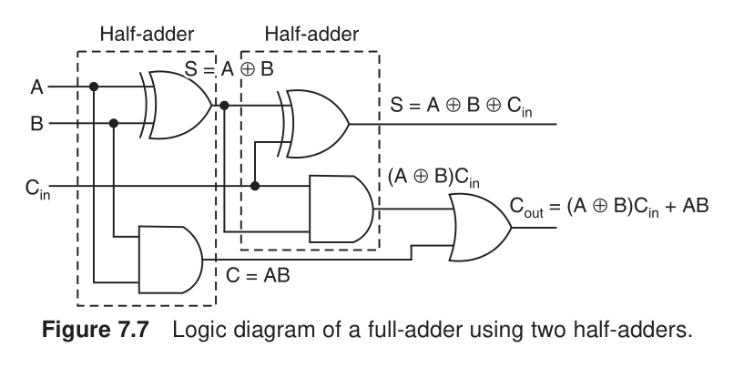
  <figcaption><strong>Figure 7.7:</strong> Construction of a Full Adder using two cascaded Half Adders and an OR gate. Sourced from <em>A. Anand Kumar, Fundamentals of Digital Circuits (4th Ed.)</em>, p. 361 (printed p. 329).</figcaption>
</figure>

---

### 3.3 The Half Subtractor and Full Subtractor
*Source: Kumar (Ch. 7, pp. 363–367); Mano (Ch. 4, pp. 178–181)*  
**[Pacing: Parallel Structure — Compare Direct Subtractors to Adders]**

#### 1. The Half Subtractor (*Kumar*, pp. 363–365)
- **Definition:** A circuit that subtracts bit $B$ from bit $A$, producing a **Difference ($D$)** and a **Borrow out ($B_{out}$)**.
- **Truth Table & Equations:**
  - $D = \overline{A}B + A\overline{B} = A \oplus B$ (Notice: Difference equation is identical to Half Adder Sum!)
  - $B_{out} = \overline{A}B$ (Borrow is needed only when subtracting $1$ from $0$: $0 - 1 = 1\text{ with borrow } 1$).

<figure>
  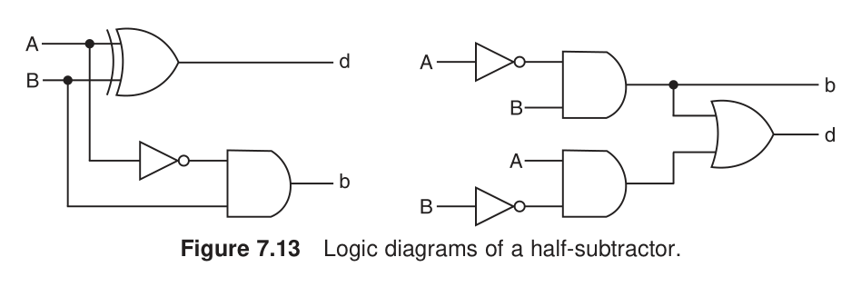
  <figcaption><strong>Figure 7.13:</strong> Logic diagrams of a Half Subtractor using basic gates and XOR-AND configuration. Sourced from <em>A. Anand Kumar, Fundamentals of Digital Circuits (4th Ed.)</em>, p. 364 (printed p. 332).</figcaption>
</figure>

#### 2. The Full Subtractor (*Kumar*, pp. 365–367)
- **Definition:** Subtracts bits $B$ and incoming borrow $B_{in}$ from bit $A$ ($A - B - B_{in}$).
- **Boolean Equations:**
  - $D = A \oplus B \oplus B_{in}$
  - $B_{out} = \overline{A}B + \overline{A}B_{in} + BB_{in} = \overline{A}B + B_{in}\overline{(A \oplus B)}$

<figure>
  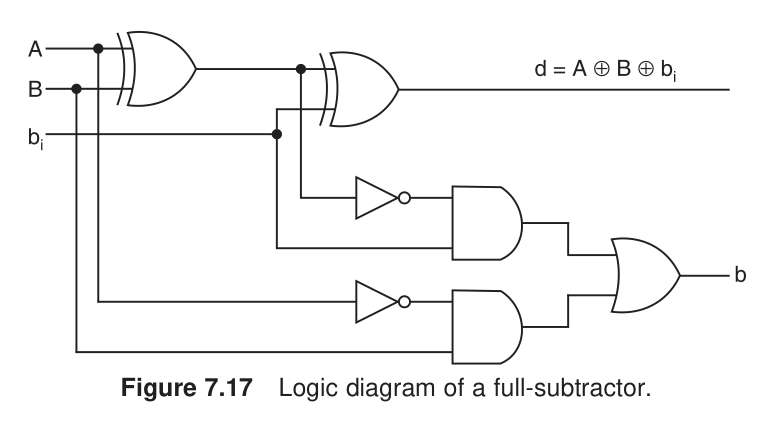
  <figcaption><strong>Figure 7.17:</strong> Logic diagram of a Full Subtractor constructed using two Half Subtractors and an OR gate. Sourced from <em>A. Anand Kumar, Fundamentals of Digital Circuits (4th Ed.)</em>, p. 366 (printed p. 334).</figcaption>
</figure>

---

### 3.4 Multi-Bit Adders and the 4-Bit Parallel Adder/Subtractor
*Source: Kumar (Ch. 7, pp. 367–373); Mano (Ch. 4, pp. 173–178); Floyd (Ch. 5, pp. 250–256)*  
**[Pacing: Hardware Realization — High Practical Value]**

#### 1. The 4-Bit Binary Parallel Adder (Ripple Carry Adder) (*Kumar*, p. 367)
To add two 4-bit binary numbers $A = A_3 A_2 A_1 A_0$ and $B = B_3 B_2 B_1 B_0$, four Full Adders (FA) are chained together in parallel (*Kumar*, Figure 7.20):

<figure>
  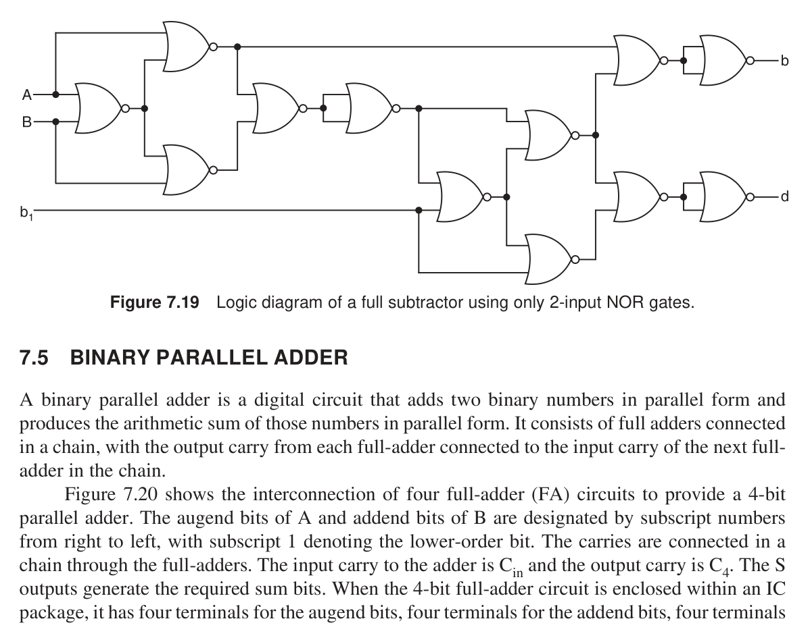
  <figcaption><strong>Figure 7.20:</strong> Four-bit parallel binary adder (Ripple Carry Adder) chaining four Full Adders together. Sourced from <em>A. Anand Kumar, Fundamentals of Digital Circuits (4th Ed.)</em>, p. 367 (printed p. 335).</figcaption>
</figure>

- Stage 0 adds $A_0, B_0$ and input carry $C_0$, producing Sum $S_0$ and carry $C_1$.
- Carry $C_1$ ripples into Stage 1; carry $C_2$ ripples into Stage 2; carry $C_3$ ripples into Stage 3.
- Standard IC: **7483 / 74LS283** (4-bit binary full adder).

---

#### 2. The Combined 4-Bit Parallel Adder/Subtractor (*Kumar*, p. 369, Figure 7.22)
Why build a separate adder and a separate subtractor chip when you can make a single circuit perform both?  
Recall from Unit I that:
$$A - B = A + (\text{2's complement of } B) = A + \overline{B} + 1$$
We can achieve this mathematically and physically with a single control line labeled **$M$ (Mode / $\text{ADD}/\overline{\text{SUB}}$)** and four **XOR gates**:

<figure>
  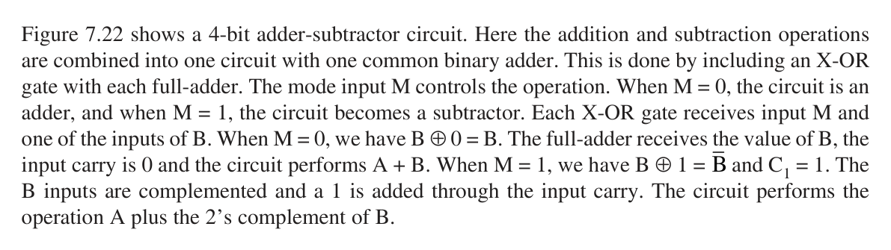
  <figcaption><strong>Figure 7.22:</strong> Complete 4-bit binary adder-subtractor utilizing XOR gates as programmable inverters and 2's complement carry injection. Sourced from <em>A. Anand Kumar, Fundamentals of Digital Circuits (4th Ed.)</em>, p. 369 (printed p. 337).</figcaption>
</figure>

##### Characteristic 13 Walkthrough: Hardware Reality Check
- **When Mode $M = 0$ (Addition Mode):**
  - Each XOR gate receives $B_i$ and $0$. Because $B_i \oplus 0 = B_i$, the $B$ inputs pass through completely **uninverted**.
  - The initial carry input $C_0$ receives $M = 0$.
  - The circuit computes: $\text{Output} = A + B + 0 = A + B$. **It performs pure binary addition!**
- **When Mode $M = 1$ (Subtraction Mode):**
  - Each XOR gate receives $B_i$ and $1$. Because $B_i \oplus 1 = \overline{B_i}$, the XOR gates act as inverters, producing the **1's complement: $\overline{B}$**!
  - Simultaneously, the initial carry input $C_0$ receives $M = 1$, automatically injecting the required **$+1$** into the LSB!
  - The circuit computes: $\text{Output} = A + \overline{B} + 1 = A + (-B) = A - B$. **It performs pure 2's complement subtraction!**
- A single wire flips the entire calculating machine between addition and subtraction!

---

### 3.5 High-Speed Arithmetic: The Carry Lookahead Adder (CLA)
*Source: Kumar (Ch. 7, pp. 369–373); Mano (Ch. 4, pp. 176–178)*  
**[Pacing: Conceptually Heavy — The Fundamental Speed Bottleneck in Computing]**

#### Need (Problem-First: The Ripple Delay Bottleneck)
In the 4-bit ripple adder (Figure 7.20), Stage 3 **cannot calculate its sum bit $S_3$ until Stage 2 finishes, which cannot finish until Stage 1 finishes, which waits on Stage 0**!
- If each full adder has a gate propagation delay of $t_{pd} = 5\text{ ns}$, a 4-bit adder takes $4 \times 5 = 20\text{ ns}$.
- But in a modern 64-bit microprocessor ALU, a 64-bit ripple adder would take $64 \times 5\text{ ns} = 320\text{ ns}$! The processor could not exceed a dismal clock speed of $3\text{ MHz}$!
- We need a circuit where **all carries are calculated simultaneously in parallel** without waiting for previous stages to ripple. This is the **Carry Lookahead Adder (CLA)**.

#### The Mathematical Formulation: Generate and Propagate
For any adder stage $i$, define two independent functions (*Kumar*, p. 370):
1. **Carry Generate ($G_i$):**
   $$G_i = A_i \cdot B_i$$
   *Physical Meaning:* If both $A_i$ and $B_i$ are $1$, this stage **generates a carry internally**, regardless of whether an incoming carry arrived from earlier stages.
2. **Carry Propagate ($P_i$):**
   $$P_i = A_i \oplus B_i$$
   *Physical Meaning:* If either $A_i$ or $B_i$ is $1$, an incoming carry $C_i$ will be **propagated straight through** to become an outgoing carry $C_{i+1}$.

The carry output of any stage can thus be written as:
$$C_{i+1} = G_i + P_i C_i$$

##### Unrolling the Carries Directly:
Now, expand each carry stage by algebraic substitution without waiting for ripples:
- $C_1 = G_0 + P_0 C_0$
- $C_2 = G_1 + P_1 C_1 = G_1 + P_1(G_0 + P_0 C_0) = \mathbf{G_1 + P_1 G_0 + P_1 P_0 C_0}$
- $C_3 = G_2 + P_2 C_2 = \mathbf{G_2 + P_2 G_1 + P_2 P_1 G_0 + P_2 P_1 P_0 C_0}$
- $C_4 = G_3 + P_3 C_3 = \mathbf{G_3 + P_3 G_2 + P_3 P_2 G_1 + P_3 P_2 P_1 G_0 + P_3 P_2 P_1 P_0 C_0}$

*Look at those equations!* Notice that **$C_4$ depends ONLY on the initial input carry $C_0$ and the immediate input bits $A_i, B_i$ via $P_i$ and $G_i$**!  
Every single carry bit ($C_1, C_2, C_3, C_4$) is generated through a **two-level AND-OR gate network simultaneously in parallel**!

<figure>
  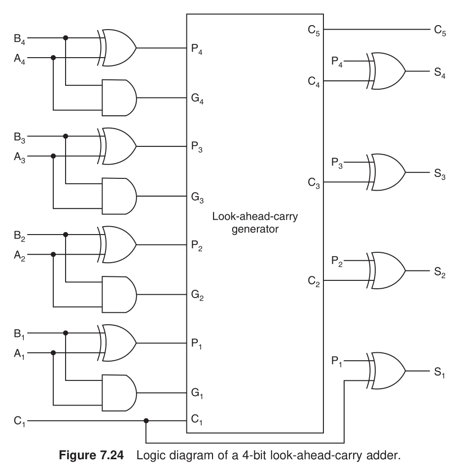
  <figcaption><strong>Figure 7.24:</strong> Logic diagram of a 4-bit Carry Lookahead Adder (CLA) eliminating serial ripple delays. Sourced from <em>A. Anand Kumar, Fundamentals of Digital Circuits (4th Ed.)</em>, p. 371 (printed p. 339).</figcaption>
</figure>

- **Speed Comparison:** Regardless of whether the adder is 4-bit, 16-bit, or 64-bit, the lookahead carry generator calculates all carries in just **two gate delays** ($pprox 1\text{ to } 2\text{ ns}$), boosting computation speed by over $1000\%$!

---

## PART 2: Code Converters and Data Selectors (Multiplexers / Demultiplexers)

### 3.6 Hardware Code Converters: Binary, Gray, and Excess-3
*Source: Kumar (Ch. 7, pp. 382–388); Mano (Ch. 4, pp. 171–173)*  
**[Pacing: Systematic Design — Practice the 5-Step Method]**

#### 1. 4-Bit Binary-to-Gray Code Converter (*Kumar*, p. 383)
Following the mathematical rule derived in Unit I ($G_3 = B_3$; $G_2 = B_3 \oplus B_2$; $G_1 = B_2 \oplus B_1$; $G_0 = B_1 \oplus B_0$), the physical hardware requires exactly **three XOR gates**:

<figure>
  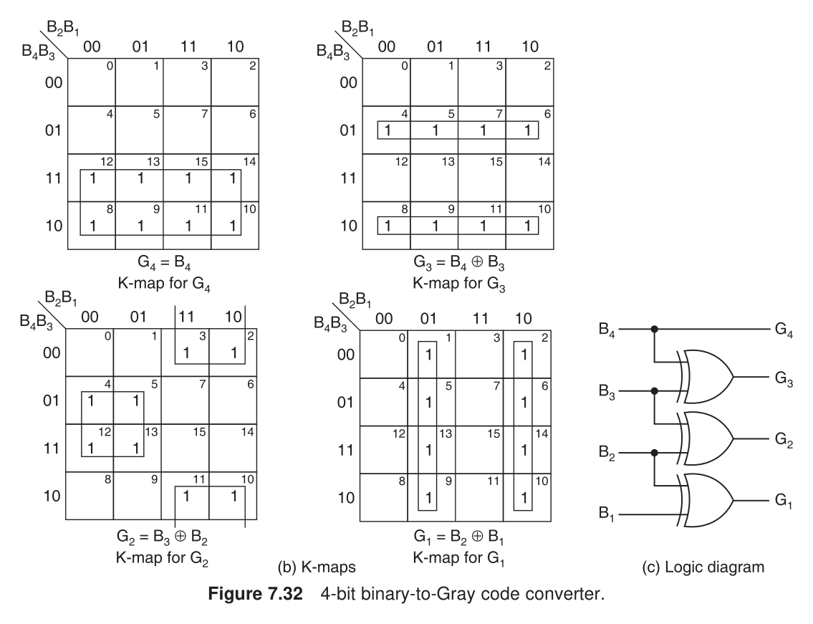
  <figcaption><strong>Figure 7.32:</strong> Logic diagram of a 4-bit Binary-to-Gray code converter using XOR gates. Sourced from <em>A. Anand Kumar, Fundamentals of Digital Circuits (4th Ed.)</em>, p. 383 (printed p. 351).</figcaption>
</figure>

#### 2. 4-Bit Gray-to-Binary Code Converter (*Kumar*, p. 384)
Following the inverse rule ($B_3 = G_3$; $B_2 = B_3 \oplus G_2$; $B_1 = B_2 \oplus G_1$; $B_0 = B_1 \oplus G_0$), the circuit cascades three XOR gates, feeding each computed binary bit forward into the next lower stage:

<figure>
  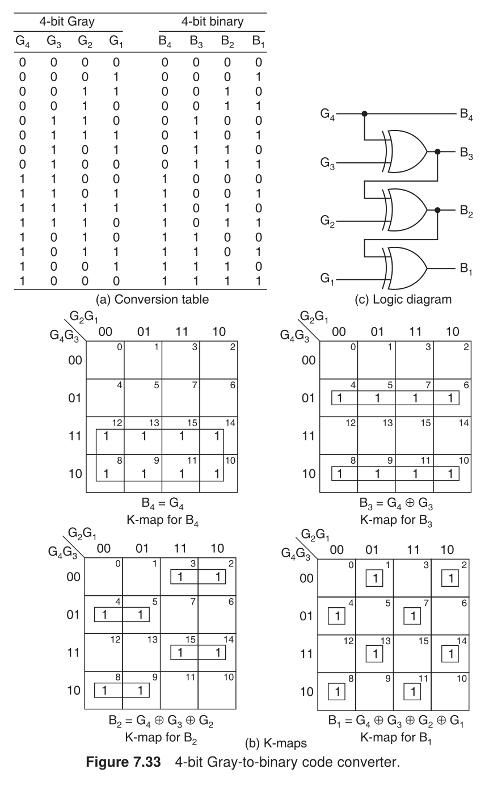
  <figcaption><strong>Figure 7.33:</strong> Logic diagram of a 4-bit Gray-to-Binary code converter. Sourced from <em>A. Anand Kumar, Fundamentals of Digital Circuits (4th Ed.)</em>, p. 384 (printed p. 352).</figcaption>
</figure>

#### 3. BCD-to-Excess-3 Code Converter (*Kumar*, p. 387)
By setting up a truth table adding $0011_2$ ($3$) to each valid BCD digit ($0000$ to $1001$) and assigning don't cares ($X$) to illegal BCD rows $10$ to $15$, four K-maps yield the optimized hardware equations:

<figure>
  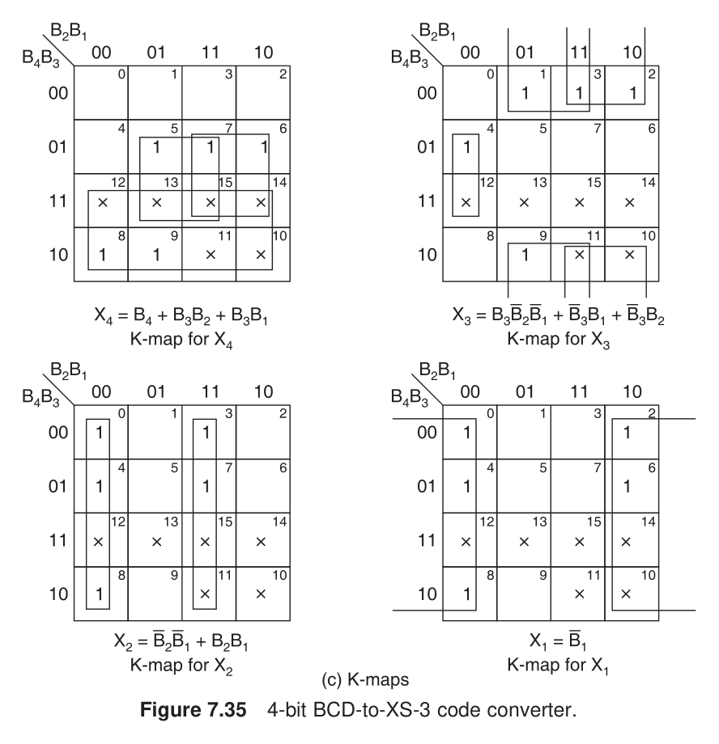
  <figcaption><strong>Figure 7.35:</strong> Logic diagram of a 4-bit BCD-to-Excess-3 code converter derived via K-map minimization. Sourced from <em>A. Anand Kumar, Fundamentals of Digital Circuits (4th Ed.)</em>, p. 387 (printed p. 355).</figcaption>
</figure>

---

### 3.7 Multiplexers (Data Selectors) and Demultiplexers
*Source: Kumar (Ch. 7, pp. 421–434); Mano (Ch. 4, pp. 199–206); Floyd (Ch. 5, pp. 268–276)*  
**[Pacing: Core Digital Routing — High Examination & Practical Value]**

#### Need (Problem-First)
Imagine a digital telephone exchange where four different callers want to send audio data across a single transatlantic cable wire. Running four separate undersea cables costs millions of dollars. How can multiple data sources share a single communication line without their signals tangling? We need an electronic rotary switch: a **Multiplexer (MUX)** at the transmitting end, and a **Demultiplexer (DEMUX)** at the receiving end.

#### 1. The Multiplexer (MUX / Data Selector) Defined
A **Multiplexer** is a combinational circuit that selects binary information from one of many input data lines and directs it to a single output line (*Kumar*, p. 421).
- **The Rule of Inputs:** A multiplexer with $2^n$ data input lines requires **$n$ select control lines** ($S$) to specify which input is routed to the output.
  - $2:1\text{ MUX} \implies 2^1$ data inputs, $1$ select line.
  - $4:1\text{ MUX} \implies 2^2$ data inputs, $2$ select lines ($S_1, S_0$).
  - $8:1\text{ MUX} \implies 2^3$ data inputs, $3$ select lines ($S_2, S_1, S_0$).

##### The 2-Input Multiplexer (2:1 MUX) (*Kumar*, p. 422, Figure 7.76)
- Logic equation: $Y = \overline{S}D_0 + S D_1$.
- When $S = 0$: $Y = (1)D_0 + (0)D_1 = D_0$. Output follows data line $D_0$.
- When $S = 1$: $Y = (0)D_0 + (1)D_1 = D_1$. Output follows data line $D_1$.

<figure>
  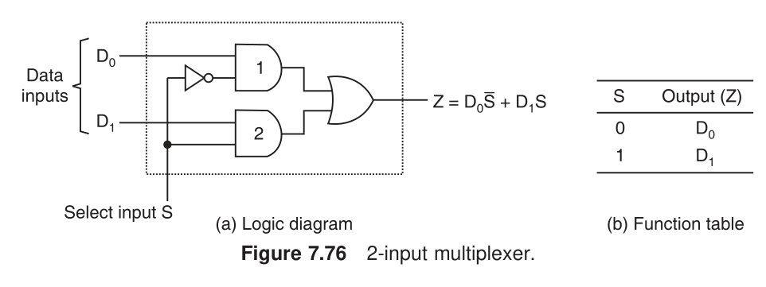
  <figcaption><strong>Figure 7.76:</strong> Logic circuitry and function table of a 2-input multiplexer. Sourced from <em>A. Anand Kumar, Fundamentals of Digital Circuits (4th Ed.)</em>, p. 422 (printed p. 390).</figcaption>
</figure>

##### The 4-Input Multiplexer (4:1 MUX) (*Kumar*, p. 422, Figure 7.77)
- Four data inputs ($D_0, D_1, D_2, D_3$), two select inputs ($S_1, S_0$), and one Enable input ($E$ / Strobe):
  $$Y = \overline{S_1}\ \overline{S_0}D_0 + \overline{S_1}S_0 D_1 + S_1\overline{S_0}D_2 + S_1 S_0 D_3$$

<figure>
  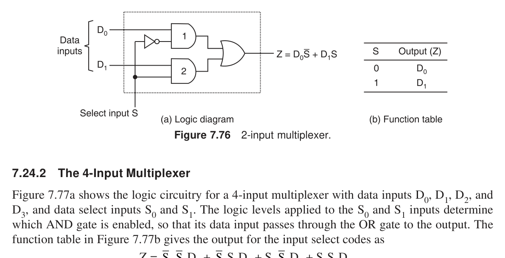
  <figcaption><strong>Figure 7.77:</strong> Logic circuit diagram and truth table of a 4-input multiplexer. Sourced from <em>A. Anand Kumar, Fundamentals of Digital Circuits (4th Ed.)</em>, p. 422 (printed p. 390).</figcaption>
</figure>

---

#### 2. Implementing Arbitrary Logic Functions Using Multiplexers
*Source: Kumar (Ch. 7, pp. 423–428); Mano (Ch. 4, pp. 201–204)*  
An $8:1$ MUX can implement **any 3-variable Boolean function directly with ZERO external gates**, and can implement **any 4-variable function using only a single inverter**!
- *Method:* Connect $(n-1)$ variables to the select lines. Group minterms in pairs to determine whether each data input line ($D_i$) should be tied to $0$, $1$, the remaining variable $X$, or its complement $\overline{X}$.

---

#### 3. Demultiplexers (DEMUX / Data Distributors)
*Source: Kumar (Ch. 7, pp. 430–432, Figure 7.89)*  
- **Definition:** The exact reverse of a MUX. A DEMUX takes a **single input data line ($D$)** and directs it to any one of $2^n$ output lines depending on the values of $n$ select lines.
- **The 1-to-4 Line Demultiplexer:**

<figure>
  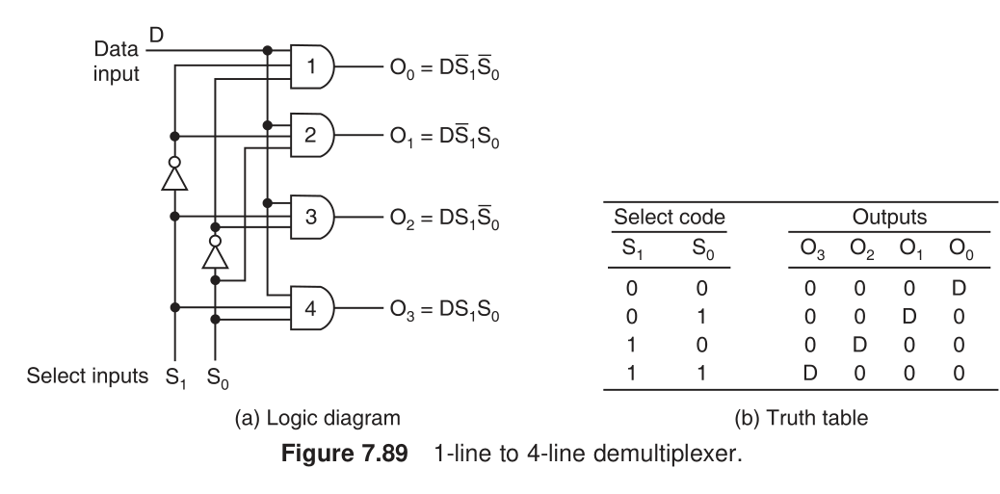
  <figcaption><strong>Figure 7.89:</strong> Logic diagram of a 1-line to 4-line demultiplexer. Sourced from <em>A. Anand Kumar, Fundamentals of Digital Circuits (4th Ed.)</em>, p. 431 (printed p. 399).</figcaption>
</figure>

- **Duality with Decoders:** A demultiplexer with data input $D$ is **identical in circuitry to a decoder with an Enable input**! If you treat the data line as the Enable input and the select lines as decoder address inputs, the circuits are 100% interchangeable.

---

## PART 3: Decoders, Encoders, Priority Encoders, and Display Drivers

### 3.8 Decoders and the 74138 IC
*Source: Kumar (Ch. 7, pp. 414–418); Mano (Ch. 4, pp. 192–196); Floyd (Ch. 5, pp. 256–264)*  
**[Pacing: Essential Peripheral Building Block — Learn Active-LOW Logic]**

#### Need (Problem-First)
A computer's central processor outputs a binary address code (such as `010`). How does the motherboard know which of the eight connected memory chips is being spoken to? We need a circuit that takes an $n$-bit binary code and activates **one unique output wire** among $2^n$ possible output lines. That device is a **Decoder**.

#### The 3-Line to 8-Line Decoder (*Kumar*, p. 415, Figure 7.69)
Three inputs ($A, B, C$) generate $2^3 = 8$ distinct output minterms ($Y_0$ through $Y_7$):

<figure>
  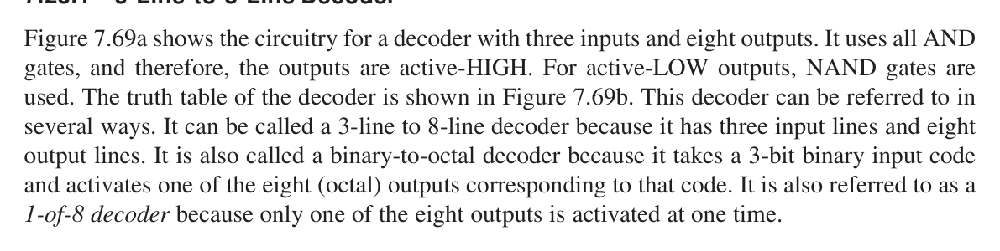
  <figcaption><strong>Figure 7.69:</strong> Schematic diagram and truth table of a 3-line to 8-line decoder with active-HIGH outputs. Sourced from <em>A. Anand Kumar, Fundamentals of Digital Circuits (4th Ed.)</em>, p. 415 (printed p. 383).</figcaption>
</figure>

- **Active-LOW Outputs in Industry (The 74138 IC):**  
  In commercial ICs like the **74LS138**, standard NAND gates are used instead of AND gates. Therefore, the selected output line goes **LOW ($0\text{ V}$)**, while all unselected output lines remain **HIGH ($+5\text{ V}$)**. This active-LOW standard exists because bipolar transistors sink current far better than they source it.

---

### 3.9 Encoders and Priority Encoders (IC 74148)
*Source: Kumar (Ch. 7, pp. 407–413); Mano (Ch. 4, pp. 196–199); Floyd (Ch. 5, pp. 264–268)*  
**[Pacing: Conceptually Heavy — Priority Resolution in Computer Interrupts]**

#### Need (Problem-First)
In a computer system, eight different peripheral devices (keyboard, hard disk, mouse, network card, power monitor) can request service by pulling an interrupt wire. An encoder compresses these 8 wires into a 3-bit binary code telling the CPU which device is calling.  
*The Critical Failure of a Simple Encoder:* What happens if the user presses two keyboard keys at the exact same instant, or the power monitor screams an emergency alert while the mouse is moving? A naive encoder will output garbage (e.g., if line 2 and line 4 are asserted, the encoder might output `6`). We need a circuit that **decides which input has the highest priority and completely ignores all lower-priority inputs**. This is a **Priority Encoder**.

#### The 4-Bit Priority Encoder (*Kumar*, p. 411, Figure 7.65)
Four inputs ($D_0, D_1, D_2, D_3$) where $D_3$ has the highest priority and $D_0$ has the lowest priority:
- If $D_3 = 1$: Outputs $A_1 A_0 = 11$, regardless of whether $D_2, D_1, D_0$ are $0$ or $1$ (don't cares)!
- If $D_3 = 0$ and $D_2 = 1$: Outputs $A_1 A_0 = 10$, regardless of $D_1, D_0$.
- If $D_3 = 0, D_2 = 0, D_1 = 1$: Outputs $A_1 A_0 = 01$.
- If only $D_0 = 1$: Outputs $A_1 A_0 = 00$.
- **The Valid Bit ($V$):** What if *no inputs at all* are active? Without an extra bit, the circuit would output `00`, falsely claiming that $D_0$ was pressed! The **Valid bit ($V$)** is an extra output pin that equals $1$ if at least one input is active, and $0$ if all inputs are silent.

<figure>
  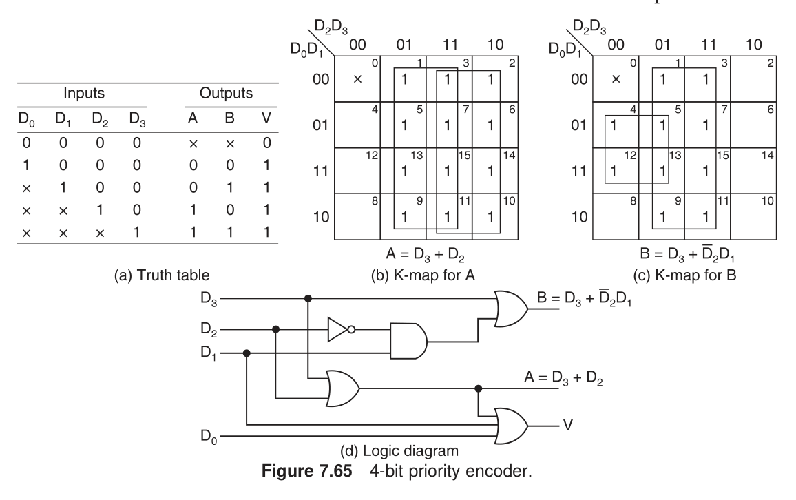
  <figcaption><strong>Figure 7.65:</strong> Logic circuitry, truth table with don't care entries, and K-map derivations of a 4-bit Priority Encoder. Sourced from <em>A. Anand Kumar, Fundamentals of Digital Circuits (4th Ed.)</em>, p. 411 (printed p. 379).</figcaption>
</figure>

- **Industry Standard IC:** **74148** (8-to-3 line priority encoder with active-low inputs and outputs, used extensively in microprocessor interrupt controllers).

---

### 3.10 Display Drivers: BCD-to-Seven-Segment Decoder/Driver
*Source: Kumar (Ch. 7, pp. 419–421, Figures 7.73 & 7.74; Ch. 19, pp. 1013–1031); Floyd (Ch. 5, pp. 260–264)*  
**[Pacing: Visual Hardware Interfacing — High Practical Value]**

#### Need (Problem-First)
A calculator or digital clock processes numbers as 4-bit BCD codes (`0000` to `1001`). But a human being cannot look at a panel of four blinking raw binary LEDs and instantly read the time. We need an electronic display device that forms human numbers $0$ through $9$, and a specialized digital decoder to illuminate the correct segments.

#### 1. The Seven-Segment Display (*Kumar*, p. 419, Figure 7.73)
Seven light-emitting diode (LED) bars arranged in a "figure-8" pattern, labeled clockwise from top as **$a, b, c, d, e, f$**, with the center bar labeled **$g$**:

<figure>
  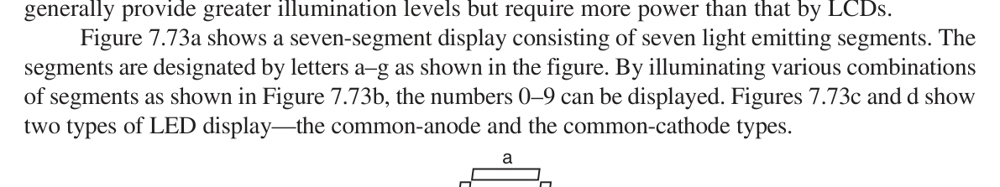
  <figcaption><strong>Figure 7.73:</strong> The seven-segment display layout, segment illumination combinations for decimal digits 0–9, and internal wiring of Common-Anode vs. Common-Cathode types. Sourced from <em>A. Anand Kumar, Fundamentals of Digital Circuits (4th Ed.)</em>, p. 419 (printed p. 387).</figcaption>
</figure>

##### The Two Physical Wiring Configurations:
1. **Common-Cathode (CC) Display (*Kumar*, Figure 7.73d):**  
   The cathode (negative terminal) of all seven segment LEDs are tied together to **Ground ($0\text{ V}$)**.  
   To illuminate a segment, its individual anode pin must be driven **HIGH ($+5\text{ V}$)**. (Active-HIGH driver like the **7448**).
2. **Common-Anode (CA) Display (*Kumar*, Figure 7.73c):**  
   The anode (positive terminal) of all seven segment LEDs are tied together to **$+V_{CC}$ ($+5\text{ V}$)**.  
   To illuminate a segment, its individual cathode pin must be driven **LOW ($0\text{ V}$)**. (Active-LOW driver like the **7447**). Current flows from $+5\text{ V}$ through the LED and sinks into the driver pin.

---

#### 2. The BCD-to-Seven-Segment Decoder/Driver (*Kumar*, p. 420, Figure 7.74)
- **Inputs:** 4-bit BCD digit $A, B, C, D$ (representing numbers $0$ to $9$).
- **Outputs:** Seven driving signals $a, b, c, d, e, f, g$.
- **Don't Cares:** BCD inputs $10$ to $15$ (`1010` to `1111`) are treated as **Don't Cares ($X$)** in the K-maps, drastically reducing the gate count!

<figure>
  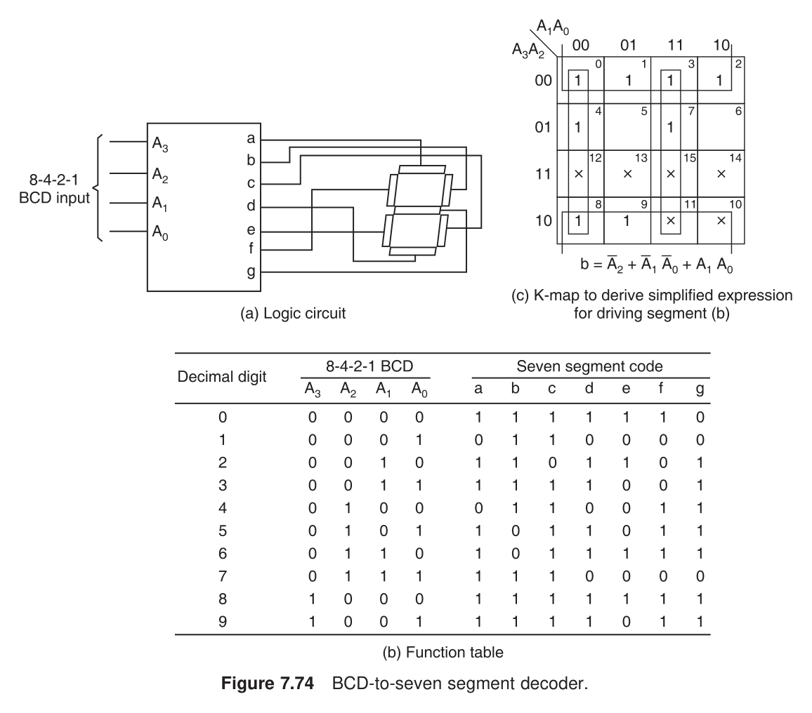
  <figcaption><strong>Figure 7.74:</strong> Functional block diagram, truth table, and Karnaugh map minimization for segment driver logic. Sourced from <em>A. Anand Kumar, Fundamentals of Digital Circuits (4th Ed.)</em>, p. 420 (printed p. 388).</figcaption>
</figure>

##### Example: Segment $a$ Logic Walkthrough
Segment $a$ (the top horizontal bar) must be illuminated for digits **0, 2, 3, 5, 6, 7, 8, 9** (it remains OFF only for digits 1 and 4). By plotting these 8 minterms plus 6 don't cares on a 4-variable K-map, the minimized equation is directly derived (*Kumar*, p. 420).

---

### Unit III Understanding Checkpoints & Misconception Audit

#### 1. Does This Make Sense? Self-Check
- **Question 1:** What is the fundamental physical difference between a Half Adder and a Full Adder?
  - **Answer:** A Half Adder can only add two single bits ($A, B$). A Full Adder includes a third input for an incoming carry ($C_{in}$) from a lower-order stage, permitting multi-bit parallel arithmetic.
- **Question 2:** Why is a Carry Lookahead Adder (CLA) vastly faster than a standard Ripple Carry Adder?
  - **Answer:** In a ripple adder, carries must travel serially through every stage's gates ($2n$ gate delays). A CLA calculates all carries simultaneously in parallel using two-level AND-OR logic directly from the primary inputs, executing in just $2$ gate delays regardless of word length.
- **Question 3:** If you connect a Common-Anode seven-segment display to a decoder that outputs active-HIGH signals, what will happen?
  - **Answer:** The display will invert every number (the segments that are supposed to be ON will stay dark, and the dark segments will light up), because Common-Anode LEDs require an active-LOW ($0	ext{ V}$) sink to turn ON!

#### 2. Conceptual Misconceptions Corrected
- **Misconception:** *"A multiplexer can only route data; it cannot do math."*  
  **Correction:** A multiplexer is a universal Boolean function generator. By connecting input variables to select lines and tying data lines to $0$, $1$, or remaining literals, an $8:1$ MUX can implement *any* 3-variable or 4-variable combinational logic circuit without a single additional logic gate!
- **Misconception:** *"In an adder/subtractor circuit, subtraction requires a completely separate subtractor unit inside the chip."*  
  **Correction:** There is zero subtraction circuitry. The circuit performs addition on the 2's complement of $B$ by using XOR gates to invert $B$ and setting the input carry $C_0 = 1$. The adder does not even know it is subtracting!

---


# Unit IV: Sequential Circuits and Systems

---

### Master Subject Map: Unit IV Position
```
[ UNIT III: COMBINATIONAL DIGITAL CIRCUITS ]
                                  │
                                  ▼
┌──────────────────────────────────────────────────────────────────────────────────┐
│ YOU ARE HERE ──► UNIT IV: SEQUENTIAL CIRCUITS AND SYSTEMS                        │
│ • 1-Bit Memory & Latches: Cross-Coupling, SR Latch (NOR/NAND), Forbidden States  │
│ • Flip-Flops: Clocked SR, D, JK (Race-Around & Master-Slave), T, Excitation Tables│
│ • Systematic Conversion: Conversion Tables, K-Maps, Hardware Synthesis           │
│ • Shift Registers: SISO, SIPO, PISO, PIPO Modes, Serial/Parallel Conversions     │
│ • Counters (Up to 4-bit): Ripple (Asynchronous), MOD-10, Synchronous Up-Counter  │
│ • State Sequences & Applications: Ring/Johnson Counters, Traffic Light Control   │
└─────────────────────────────────┬────────────────────────────────────────────────┘
                                  ▼
[ UNIT V: CONVERTERS & SEMICONDUCTOR MEMORIES ]
```
*In 3 lines:* Combinational circuits are completely amnesiac—they have no memory of the past. Unit IV introduces **feedback**, transforming gates into circuits that store electrical history. We construct 1-bit memory cells (Flip-Flops), pipeline registers (Shift Registers), and rhythmic state machines (Counters) that automate real-world systems like traffic light intersections.

---

### Prerequisites for this Unit
Before studying Unit IV, ensure you recall these concepts:
1. **Gate Characteristics & Propagation Delay (Unit I, Section 1.8):** Signals do not change instantaneously; physical gates have a small delay $t_{pd}$ (typically $5\text{ to }10\text{ ns}$).
2. **Universal Gates (Unit I, Section 1.6):** NAND and NOR truth tables.
3. **Pulse Waveforms (Prereq 5):** Rising (positive) edge, falling (negative) edge, pulse width ($t_w$), and clock period ($T$).
4. **Gray Code & State Tables (Unit I, Section 1.4 & Prereq 6):** Reading multi-variable tabular state sequences.

---

## PART 1: The 1-Bit Memory, Latches, and Clocked Flip-Flops

### 4.1 Combinational vs. Sequential Logic & The 1-Bit Memory Concept
*Source: Kumar (Ch. 10, pp. 577–581, Figures 10.1 & 10.2); Mano (Ch. 5, pp. 248–252)*  
**[Pacing: Conceptually Heavy — The Moment Memory is Born]**

#### Need (Problem-First)
In an adder or multiplexer, the moment you remove your finger from the input switch, the output disappears. But a real computer must store passwords, remember loop counters, and hold program instructions. How can simple logic gates—which only know how to react to present voltages—be made to **remember a bit permanently**, even after the original input signal has gone to zero?

#### Chain of Cause and Effect
Feed an output wire back into an input terminal (feedback) $\to$ the circuit's output now reinforces its own input $\to$ the circuit possesses two stable physical states ($Q=1$ or $Q=0$) $\to$ it remains locked in its current state indefinitely until an external trigger forces a flip $\to$ a **Bistable Multivibrator (1-bit memory)** is created.

<figure>
  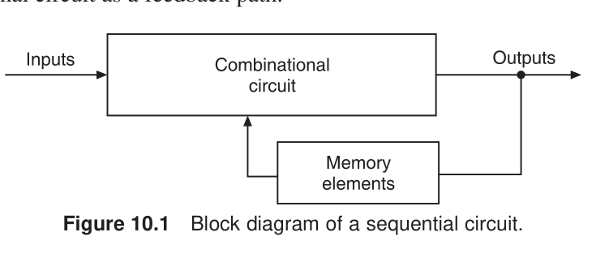
  <figcaption><strong>Figure 10.1:</strong> Fundamental block diagram of a Sequential Circuit consisting of a combinational logic network and memory feedback elements. Sourced from <em>A. Anand Kumar, Fundamentals of Digital Circuits (4th Ed.)</em>, p. 578 (printed p. 546).</figcaption>
</figure>

- **Definition of Sequential Circuit:** A digital circuit whose output at any instant depends not only on the present inputs, but also on the **past history of inputs (the present state of the memory elements)** (*Kumar*, p. 577).

---

### 4.2 The Bistable SR Latch: Active-HIGH (NOR) and Active-LOW (NAND)
*Source: Kumar (Ch. 10, pp. 581–584, Figures 10.4 & 10.5); Floyd (Ch. 6, pp. 326–332)*  
**[Pacing: Slow & Methodical — Trace the Internal Electron Loops]**

#### 1. The Active-HIGH S-R Latch Using NOR Gates (*Kumar*, p. 581)
Two NOR gates are cross-coupled: the output of Gate 1 ($Q$) is fed into an input of Gate 2, and the output of Gate 2 ($\overline{Q}$) is fed into an input of Gate 1:

<figure>
  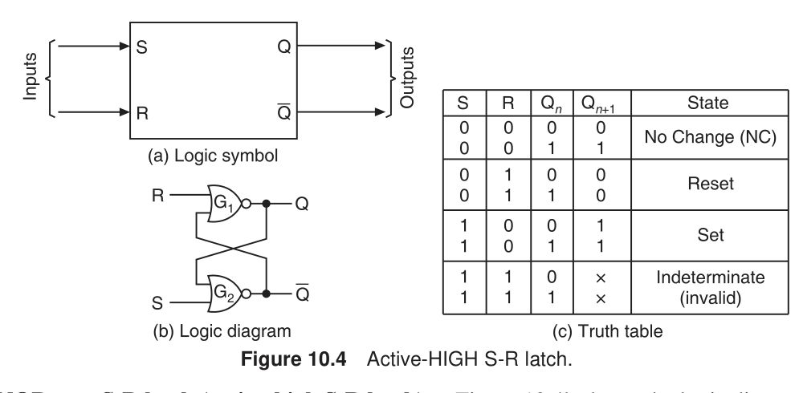
  <figcaption><strong>Figure 10.4:</strong> Active-HIGH Set-Reset (S-R) latch using cross-coupled NOR gates: logic diagram, circuit symbol, and functional truth table. Sourced from <em>A. Anand Kumar, Fundamentals of Digital Circuits (4th Ed.)</em>, p. 582 (printed p. 550).</figcaption>
</figure>

##### Characteristic 13 Walkthrough: Hardware Reality Check
Recall the fundamental rule of a NOR gate: **any input of $1$ forces the output to $0$**.
1. **The SET State ($S = 1, R = 0$):**  
   Applying $S = 1$ to Gate 2 instantly forces its output $\overline{Q} = 0\text{ V}$. This $0\text{ V}$ travels along the feedback wire into Gate 1. Now Gate 1 has $R = 0$ and $\overline{Q} = 0$. With both inputs at $0$, Gate 1 outputs **$Q = 1$ ($+5\text{ V}$)**!  
   *Now remove the input ($S = 0, R = 0$):* What happens? Output $Q = 1$ continues feeding into Gate 2, holding $\overline{Q} = 0$, which in turn holds $Q = 1$! **The circuit latched the $1$! It remembers that you set it!**
2. **The RESET State ($S = 0, R = 1$):**  
   Applying $R = 1$ to Gate 1 instantly forces its output $Q = 0\text{ V}$. This $0\text{ V}$ travels to Gate 2. With $S = 0$ and $Q = 0$, Gate 2 outputs **$\overline{Q} = 1$ ($+5\text{ V}$)**!  
   *Now remove the input ($S = 0, R = 0$):* The feedback holds $Q = 0$ and $\overline{Q} = 1$. **It remembers that you cleared it!**
3. **The Quiescent / Memory State ($S = 0, R = 0$):**  
   No change. The latch preserves its previous state ($Q_{next} = Q_{present}$).
4. **The FORBIDDEN / INVALID State ($S = 1, R = 1$):**  
   If both inputs are driven HIGH simultaneously, both NOR gates are forced to output $0$ at the same time: $Q = 0$ and $\overline{Q} = 0$! This violates the fundamental mathematical rule that $Q$ and $\overline{Q}$ must be complementary.  
   *The Disaster of Race Condition:* If both inputs now switch back to $0$ at the exact same instant, the two gates race against each other to become $1$. Whichever gate has a microscopic picosecond advantage in propagation delay wins, leaving the circuit in an **unpredictable, chaotic random state**. Hence, $S = 1, R = 1$ is strictly forbidden!

---

#### 2. The Active-LOW $\overline{S}$-$\overline{R}$ Latch Using NAND Gates (*Kumar*, p. 583)
Two NAND gates cross-coupled:

<figure>
  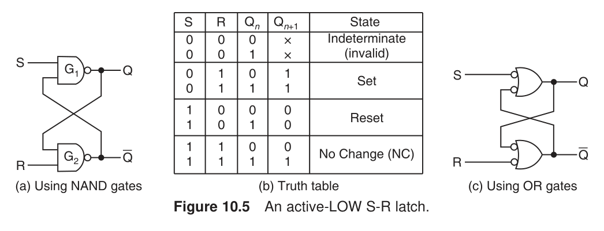
  <figcaption><strong>Figure 10.5:</strong> An active-LOW S-R latch using cross-coupled NAND gates. Sourced from <em>A. Anand Kumar, Fundamentals of Digital Circuits (4th Ed.)</em>, p. 583 (printed p. 551).</figcaption>
</figure>

- In NAND logic, **any input of $0$ forces the output to $1$**.
- Setting requires pulling $\overline{S} = 0$.
- Resetting requires pulling $\overline{R} = 0$.
- Resting memory state is $\overline{S} = 1, \overline{R} = 1$.
- **Forbidden state:** $\overline{S} = 0, \overline{R} = 0$ (both force outputs to $1$).

---

### 4.3 Clocked SR Flip-Flops: Level-Triggering vs. Edge-Triggering
*Source: Kumar (Ch. 10, pp. 584–588, Figures 10.7 & 10.10); Floyd (Ch. 6, pp. 332–338)*  
**[Pacing: Conceptually Essential — Understanding Synchronization]**

#### Need (Problem-First)
In an unclocked latch, inputs can change state at any random, chaotic microsecond. In a complex digital processor with millions of gates, signals arriving from different circuit paths experience slightly different wire delays. If latches respond continuously, false temporary glitches will be permanently stored as corrupted data. We need a conductor's baton that commands all memory cells to **update only at precise, synchronized moments in time**. That synchronizing signal is the **Clock (CLK)**.

#### The Clocked (Gated) SR Latch (*Kumar*, p. 584, Figure 10.7)
Two steering NAND gates are placed in front of an active-LOW NAND latch, gated by an Enable / Clock input ($CLK$):

<figure>
  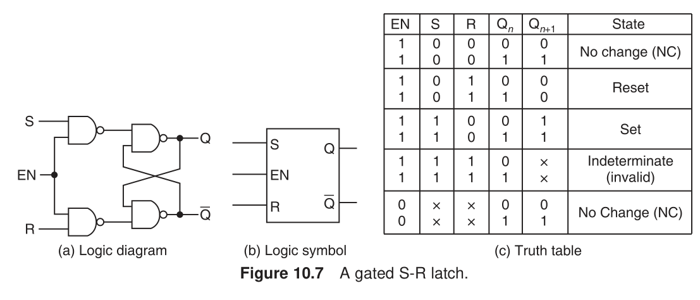
  <figcaption><strong>Figure 10.7:</strong> A gated (clocked) S-R latch showing input steering gates and enable line. Sourced from <em>A. Anand Kumar, Fundamentals of Digital Circuits (4th Ed.)</em>, p. 584 (printed p. 552).</figcaption>
</figure>

- When $CLK = 0$: The outputs of both front steering gates are forced to $1$ ($\overline{S} = 1, \overline{R} = 1$), locking the latch in its resting memory state. The inputs $S$ and $R$ are completely ignored!
- When $CLK = 1$: The steering gates invert $S$ and $R$, allowing them to control the internal latch.

---

#### Level-Triggering vs. Edge-Triggering
*Source: Kumar (p. 586); Floyd (pp. 334–336)*
- **Level-Triggered Latch:** Transparent and sensitive to input changes during the **entire duration that the clock pulse remains HIGH** ($t_w$). If inputs change while clock is HIGH, the output tracks them immediately.
- **Edge-Triggered Flip-Flop:** Responds **ONLY during the microscopic transition threshold of the clock edge** (the rising edge $0 \to 1$ or falling edge $1 \to 0$). For the rest of the clock cycle, the flip-flop is completely deaf to input changes.
  - **Dynamic Indicator Symbol:** A small triangular chevron ($	riangleright$) on the clock input terminal indicates **edge-triggering**. A bubble before the chevron indicates **negative (falling) edge-triggering**.

##### Setup Time ($t_s$) and Hold Time ($t_h$) Defined Inline (*Kumar*, p. 599):
- **Setup Time ($t_s$):** The minimum time interval that the digital input data must remain **stable and constant BEFORE the active clock transition edge arrives**. If data changes within $t_s$, the flip-flop can enter metastability.
- **Hold Time ($t_h$):** The minimum time interval that the input data must remain **stable and constant AFTER the active clock transition edge has passed**.

---

### 4.4 The JK Flip-Flop, Race-Around Condition, and Master-Slave Architecture
*Source: Kumar (Ch. 10, pp. 590–607, Figures 10.17, 10.35, 10.40); Floyd (Ch. 6, pp. 340–348)*  
**[Pacing: Conceptually Heavy — A Classic Engineering Failure & Its Cure]**

#### Need (Problem-First)
The SR flip-flop has a fatal design flaw: the input combination $S=1, R=1$ is strictly forbidden because it produces race conditions. In practical engineering, having an illegal input combination that can crash your system is dangerous. We need a flip-flop that eliminates the forbidden state forever, converting it into a useful operation. That device is the **JK Flip-Flop** (named in honor of Jack Kilby, inventor of the integrated circuit).

#### The Edge-Triggered JK Flip-Flop (*Kumar*, p. 590, Figure 10.17)
The outputs $Q$ and $\overline{Q}$ are fed back into the front steering gates:
- $J$ behaves like SET ($S$).
- $K$ behaves like RESET ($R$).
- When $J = 1$ and $K = 1$: The feedback causes the circuit to **TOGGLE (invert its state)**! If $Q$ was $0$, it flips to $1$; if $Q$ was $1$, it flips to $0$. There are **no forbidden states**!

<figure>
  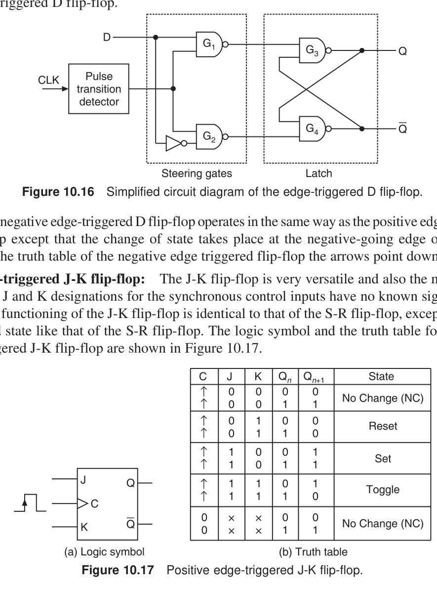
  <figcaption><strong>Figure 10.17:</strong> Positive edge-triggered J-K flip-flop logic diagram, graphic symbol, and characteristic truth table. Sourced from <em>A. Anand Kumar, Fundamentals of Digital Circuits (4th Ed.)</em>, p. 590 (printed p. 558).</figcaption>
</figure>

##### Characteristic Table of the JK Flip-Flop:

| $J$ | $K$ | $Q_n$ (Present) | $Q_{n+1}$ (Next State) | Operational Description |
|:---:|:---:|:---:|:---:|---|
| 0 | 0 | 0 | **0** | No Change (Hold / Memory) |
| 0 | 0 | 1 | **1** | No Change (Hold / Memory) |
| 0 | 1 | 0 | **0** | Reset |
| 0 | 1 | 1 | **0** | Reset |
| 1 | 0 | 0 | **1** | Set |
| 1 | 0 | 1 | **1** | Set |
| 1 | 1 | 0 | **1** | **Toggle** ($0 \to 1$) |
| 1 | 1 | 1 | **0** | **Toggle** ($1 \to 0$) |

- **Characteristic Equation:** Minimizing the table via K-map yields:
  $$Q_{n+1} = J\overline{Q_n} + \overline{K}Q_n$$

---

#### The Race-Around Condition in Level-Triggered JK Flip-Flops
*Source: Kumar (Ch. 10, pp. 600–603); Mano (Ch. 5, pp. 256–258)*  
**[Pacing: Slow & Deliberate — Understand the Physical Failure Mode]**

##### What Physically Goes Wrong:
In a **level-triggered** JK flip-flop, the inputs are active during the entire duration that the clock pulse is HIGH ($t_w$):
- Suppose $J = 1, K = 1$, and initially $Q = 0$.
- When the clock goes HIGH, the flip-flop toggles to $Q = 1$ after its internal gate propagation delay ($t_{pd}$).
- But if the clock pulse width $t_w$ is longer than the propagation delay ($t_w > t_{pd}$), the new output $Q = 1$ feeds right back into the front gates **while the clock is still HIGH**!
- This causes the flip-flop to toggle again from $1$ back to $0$ after another $t_{pd}$!
- It toggles again to $1$, then back to $0$, oscillating wildly and uncontrollably back and forth during the entire time the clock is HIGH!
- When the clock finally falls LOW, the final state of $Q$ is completely unpredictable!
- This catastrophic oscillation is the **Race-Around Condition** (*Kumar*, p. 600).
- **Physical Condition for Race-Around:**
  $$t_w \ge t_{pd}$$

##### The Engineering Solutions to Race-Around:
1. **Edge-Triggering:** Make clock transitions extremely fast with internal spike detectors so the active window is shorter than $t_{pd}$.
2. **The Master-Slave JK Flip-Flop Architecture (*Kumar*, p. 605, Figure 10.40):**  
   Construct the circuit using two separate latches in series: a **Master flip-flop** and a **Slave flip-flop**, driven by complementary clock signals via an inverter:

<figure>
  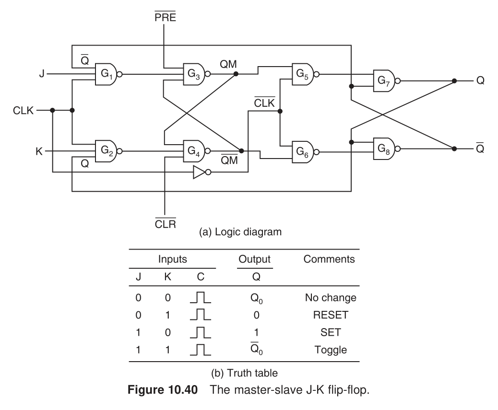
  <figcaption><strong>Figure 10.40:</strong> The Master-Slave J-K flip-flop architecture completely eliminating race-around conditions. Sourced from <em>A. Anand Kumar, Fundamentals of Digital Circuits (4th Ed.)</em>, p. 606 (printed p. 574).</figcaption>
</figure>

##### How Master-Slave Eliminates Race-Around:
- **Phase 1 ($CLK = 1$):** The Master flip-flop is enabled and accepts inputs $J$ and $K$. But the Slave flip-flop receives $\overline{CLK} = 0$ through the inverter, so the Slave is **completely disabled and locked**! The final outputs $Q$ and $\overline{Q}$ cannot change, so no feedback can reach the Master! Race-around is physically impossible!
- **Phase 2 ($CLK = 0$):** The Master is disabled, locking its internal state. The Slave receives $\overline{CLK} = 1$ and transfers the Master's state to the final outputs $Q$ and $\overline{Q}$.
- The two stages never conduct simultaneously, isolating input from output and destroying the race path.

---

### 4.5 The D (Data) and T (Toggle) Flip-Flops
*Source: Kumar (Ch. 10, pp. 589–594, Figures 10.15 & 10.20); Floyd (Ch. 6, pp. 338–344)*  
**[Pacing: Simple & Direct — The Two Workhorses of Registers & Counters]**

#### 1. The D Flip-Flop (Data / Delay Flip-Flop) (*Kumar*, p. 589)
- **Need:** Eliminate the possibility of invalid states in an SR latch by forcing the two inputs to always be exact complements of each other ($S = D, R = \overline{D}$).
- **Mechanism:** A single input $D$ is fed directly to the SET line, and through an inverter to the RESET line:

<figure>
  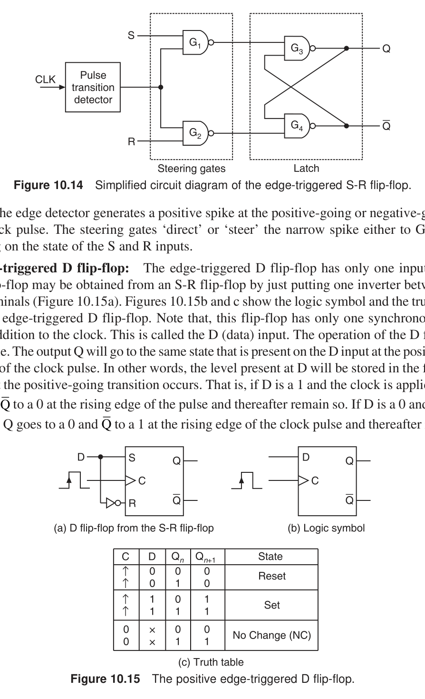
  <figcaption><strong>Figure 10.15:</strong> Positive edge-triggered D flip-flop logic diagram, graphic symbol, and characteristic truth table. Sourced from <em>A. Anand Kumar, Fundamentals of Digital Circuits (4th Ed.)</em>, p. 589 (printed p. 557).</figcaption>
</figure>

- **Operation:** Whatever bit is on the $D$ input pin is captured and transferred to output $Q$ on the active clock edge:
  $$Q_{n+1} = D$$
- It introduces a delay of exactly one clock period, making it the universal building block for **registers and computer RAM**.

---

#### 2. The T Flip-Flop (Toggle Flip-Flop) (*Kumar*, p. 592)
- **Need:** A 1-bit memory cell that flips its state on every clock pulse when enabled, performing automatic **frequency division ($f_{out} = f_{in}/2$)** and binary counting.
- **Mechanism:** Formed by tying the $J$ and $K$ inputs of a JK flip-flop together ($J = K = T$):

<figure>
  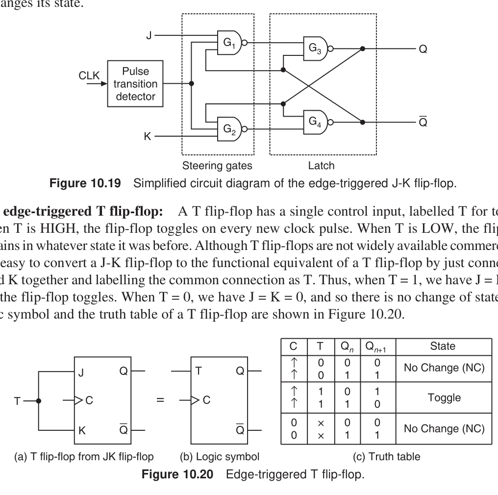
  <figcaption><strong>Figure 10.20:</strong> Edge-triggered T flip-flop logic diagram, graphic symbol, and characteristic table. Sourced from <em>A. Anand Kumar, Fundamentals of Digital Circuits (4th Ed.)</em>, p. 592 (printed p. 560).</figcaption>
</figure>

- **Operation:**
  - If $T = 0$: $Q_{n+1} = Q_n$ (Hold / Memory).
  - If $T = 1$: $Q_{n+1} = \overline{Q_n}$ (Toggle / Invert).
- **Characteristic Equation:**
  $$Q_{n+1} = T \oplus Q_n = T\overline{Q_n} + \overline{T}Q_n$$

---

## PART 2: Excitation Tables and Flip-Flop Conversions

### 4.6 Excitation Tables: The Inverse Design View
*Source: Kumar (Ch. 10, pp. 593–595); Mano (Ch. 5, pp. 268–270)*  
**[Pacing: Conceptually Essential for Counter & State Machine Design]**

#### Need (Problem-First)
In circuit *analysis*, you know the inputs ($J, K$ or $S, R$) and you calculate what the next output $Q_{n+1}$ will be. But in circuit *synthesis* (designing a counter or traffic light controller), you face the exact opposite problem: **you know what present state the circuit is currently in ($Q_n$), and you know what state you WANT it to become ($Q_{n+1}$) on the next clock pulse. What input voltages must you apply to force that transition?**  
The tabular ledger answering this question is the **Excitation Table**.

#### Master Compilation of Excitation Tables (*Kumar*, pp. 593–594):

| Desired Transition ($Q_n \to Q_{n+1}$) | S-R Inputs ($S, R$) | J-K Inputs ($J, K$) | D Input ($D$) | T Input ($T$) |
|:---:|:---:|:---:|:---:|:---:|
| **$0 \to 0$** (Hold LOW) | $0, X$ | $0, X$ | **0** | **0** |
| **$0 \to 1$** (Set HIGH) | $1, 0$ | $1, X$ | **1** | **1** |
| **$1 \to 0$** (Reset LOW) | $0, 1$ | $X, 1$ | **0** | **1** |
| **$1 \to 1$** (Hold HIGH) | $X, 0$ | $X, 0$ | **1** | **0** |

*(Where $X$ represents a Don't Care condition).*

##### Why the $X$ Appears in JK Excitation:
- Look at the transition $0 \to 0$: We can either command a HOLD ($J=0, K=0$) or command a RESET ($J=0, K=1$). In both cases, $J$ must be $0$, but $K$ can be either $0$ or $1$! Hence, $J = 0, K = X$. This freedom makes JK flip-flops yield significantly simpler combinational driving logic than other types.

---

### 4.7 Systematic Flip-Flop Conversion Procedure
*Source: Kumar (Ch. 10, pp. 610–615, Figures 10.43–10.50)*  
**[Pacing: Systematic 4-Step Engineering Procedure — Practice the Method]**

#### Need (Problem-First)
In the laboratory, your design requires a JK flip-flop, but your company's component inventory only has SR flip-flop chips in stock. How can you wrap external combinational logic around an SR flip-flop so it behaves exactly like a JK flip-flop?

#### The Universal 4-Step Conversion Procedure (*Kumar*, p. 610):
1. **Identify Given vs. Desired:** Name the available flip-flop (Given) and the target flip-flop to be synthesized (Desired).
2. **Construct the Conversion Table:** Combine the characteristic table of the Desired flip-flop with the excitation table of the Given flip-flop.
3. **K-Map Minimization:** Plot the required inputs of the Given flip-flop as functions of the Desired inputs and present state $Q_n$.
4. **Draw the Logic Diagram:** Wire the derived combinational logic to the input terminals of the Given flip-flop.

---

#### Fully-Worked Example: Convert an S-R Flip-Flop to a J-K Flip-Flop (*Kumar*, p. 611, Figure 10.44)
- **Step 1:** Desired = JK; Given = SR.
- **Step 2 (Conversion Table):**

| Inputs ($J, K$) | Present State ($Q_n$) | Next State ($Q_{n+1}$) | Required $S$ Input | Required $R$ Input | Transition Reason |
|:---:|:---:|:---:|:---:|:---:|---|
| 0, 0 | 0 | 0 | **0** | **X** | Hold 0 |
| 0, 0 | 1 | 1 | **X** | **0** | Hold 1 |
| 0, 1 | 0 | 0 | **0** | **X** | Reset |
| 0, 1 | 1 | 0 | **0** | **1** | Reset |
| 1, 0 | 0 | 1 | **1** | **0** | Set |
| 1, 0 | 1 | 1 | **X** | **0** | Set |
| 1, 1 | 0 | 1 | **1** | **0** | Toggle ($0 \to 1$) |
| 1, 1 | 1 | 0 | **0** | **1** | Toggle ($1 \to 0$) |

- **Step 3 (K-Map Minimization):**
  - For $S$: $S(J, K, Q_n) = \sum m(4, 6) + d(1, 5)$.  
    Grouping minterms 4 and 6 with don't cares yields:
    $$S = J\overline{Q_n}$$
  - For $R$: $R(J, K, Q_n) = \sum m(3, 7) + d(0, 2)$.  
    Grouping minterms 3 and 7 with don't cares yields:
    $$R = KQ_n$$
- **Step 4 (Logic Schematic Realization):** Connect an AND gate receiving $J$ and $\overline{Q_n}$ to input $S$, and connect an AND gate receiving $K$ and $Q_n$ to input $R$:

<figure>
  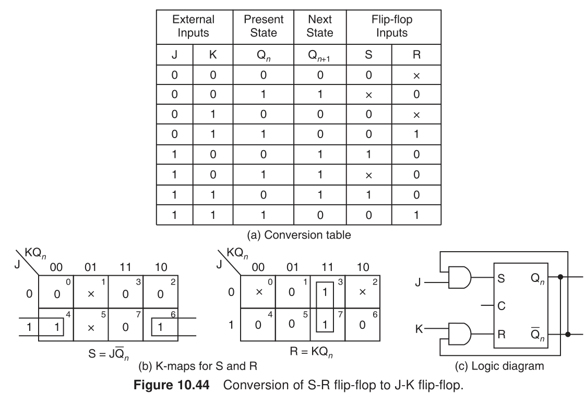
  <figcaption><strong>Figure 10.44:</strong> Hardware conversion of an S-R flip-flop into a J-K flip-flop using two external AND gates. Sourced from <em>A. Anand Kumar, Fundamentals of Digital Circuits (4th Ed.)</em>, p. 611 (printed p. 579).</figcaption>
</figure>

---

## PART 3: Shift Registers (SISO, SIPO, PISO, PIPO) and Applications

### 4.8 Shift Register Operational Modes
*Source: Kumar (Ch. 11, pp. 636–643, Figures 11.4–11.9); Floyd (Ch. 7, pp. 389–408)*  
**[Pacing: Physical Data Motion — Trace the Clock Shifts]**

#### Need (Problem-First)
A single flip-flop stores only one bit. To store a word (like a 32-bit integer or an 8-bit ASCII character), we must assemble multiple flip-flops into a **Register**. Furthermore, communication channels (like a USB cable or Wi-Fi radio) transmit data **serially along a single wire**, while computer processors manipulate data **in parallel across 32 or 64 simultaneous bus wires**. We need circuits that can convert serial streams into parallel words and vice versa. These are **Shift Registers**.

#### The Four Fundamental Modes Defined:

##### 1. Serial-In Serial-Out (SISO) (*Kumar*, p. 640, Figure 11.4)
- **Mechanism:** Data bits enter one at a time on a single wire and exit one at a time from the last stage.
- To store an $n$-bit word requires **$n$ clock pulses**. To retrieve it completely requires another **$n$ clock pulses** (total $2n$ pulses).

<figure>
  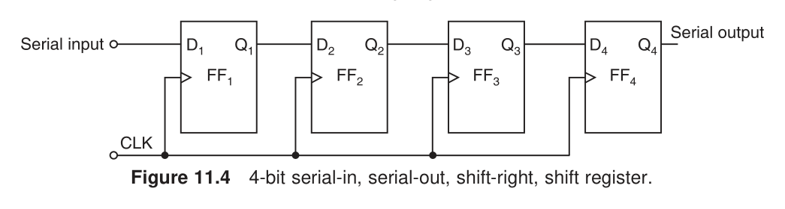
  <figcaption><strong>Figure 11.4:</strong> Logic diagram of a 4-bit Serial-In Serial-Out (SISO) shift register. Sourced from <em>A. Anand Kumar, Fundamentals of Digital Circuits (4th Ed.)</em>, p. 640 (printed p. 608).</figcaption>
</figure>

##### 2. Serial-In Parallel-Out (SIPO) (*Kumar*, p. 641, Figure 11.7)
- **Mechanism:** Data enters serially along one input pin. Once all bits have been shifted in ($n$ clock pulses), all flip-flop outputs ($Q_0, Q_1, Q_2, Q_3$) are read **simultaneously in parallel**.
- Essential for: **UART serial receivers and USB-to-parallel decoders**.

<figure>
  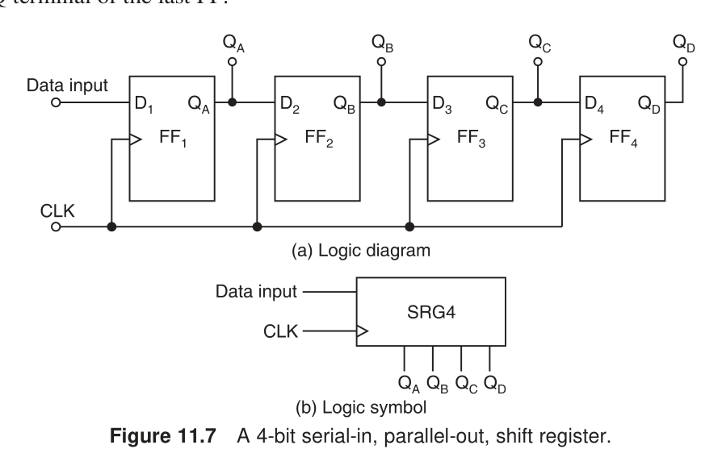
  <figcaption><strong>Figure 11.7:</strong> Logic diagram of a 4-bit Serial-In Parallel-Out (SIPO) shift register. Sourced from <em>A. Anand Kumar, Fundamentals of Digital Circuits (4th Ed.)</em>, p. 641 (printed p. 609).</figcaption>
</figure>

##### 3. Parallel-In Serial-Out (PISO) (*Kumar*, p. 642, Figure 11.8)
- **Mechanism:** An entire multi-bit word is loaded into all flip-flops simultaneously in **one clock pulse** using a $\text{SHIFT}/\overline{\text{LOAD}}$ control line. The bits are then clocked out serially one by one along the output wire.
- Essential for: **Microprocessor serial transmitters**.

<figure>
  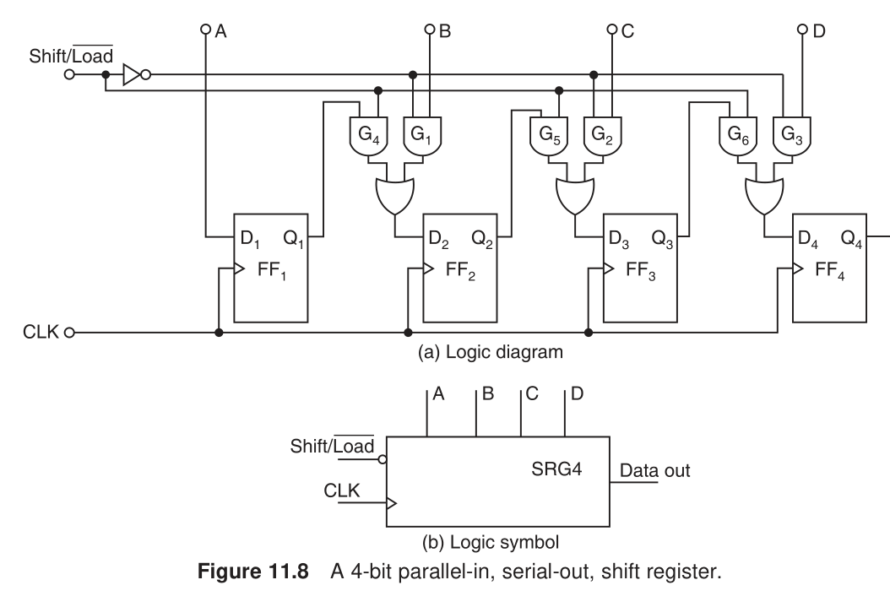
  <figcaption><strong>Figure 11.8:</strong> Logic diagram of a 4-bit Parallel-In Serial-Out (PISO) shift register with Shift/Load steering gates. Sourced from <em>A. Anand Kumar, Fundamentals of Digital Circuits (4th Ed.)</em>, p. 642 (printed p. 610).</figcaption>
</figure>

##### 4. Parallel-In Parallel-Out (PIPO) (*Kumar*, p. 642, Figure 11.9)
- **Mechanism:** Data is loaded simultaneously in **one clock pulse** and read out simultaneously on the next clock pulse.
- Introduces zero serial delay; functions as a temporary **storage buffer register** inside CPUs.

<figure>
  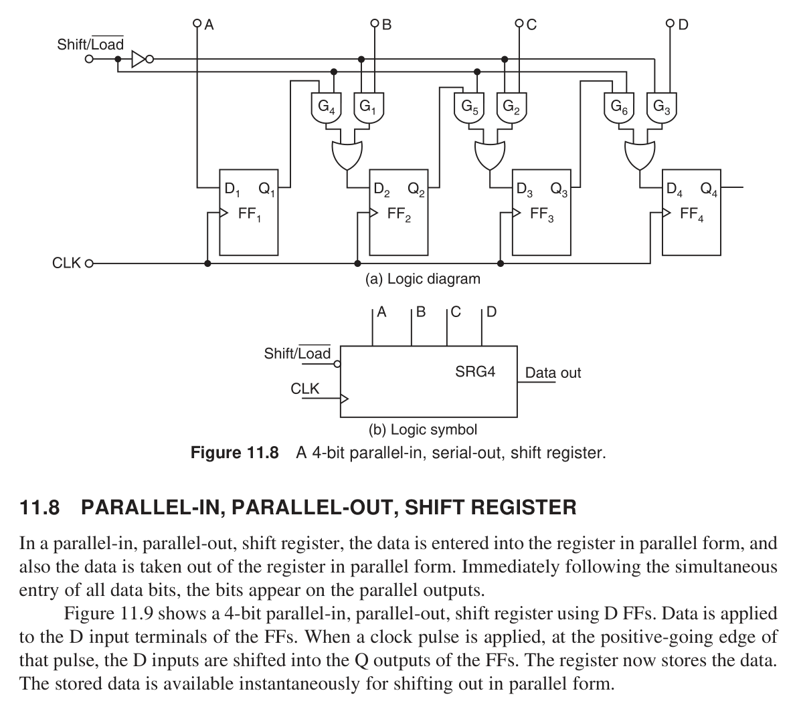
  <figcaption><strong>Figure 11.9:</strong> Logic diagram of a 4-bit Parallel-In Parallel-Out (PIPO) buffer register. Sourced from <em>A. Anand Kumar, Fundamentals of Digital Circuits (4th Ed.)</em>, p. 642 (printed p. 610).</figcaption>
</figure>

---

## PART 4: Binary Counters (Ripple & Synchronous) and Traffic Light Control

### 4.9 Asynchronous (Ripple) Counters (Up to 4 Bits)
*Source: Kumar (Ch. 12, pp. 662–671, Figures 12.1 & 12.8); Floyd (Ch. 8, pp. 440–446, Figure 11)*  
**[Pacing: Essential Counter Foundations — Trace the Clock Propagation Delay]**

#### Need (Problem-First)
How does a digital system count physical events (e.g., number of cars entering a garage, seconds ticking on a clock, or clock cycles in a program)? We need a circuit that cycles through a sequence of binary numbers upon receiving incoming electrical pulses.

#### 1. The 4-Bit Binary Ripple Up-Counter (*Floyd*, p. 444, Figure 11)
Four toggle flip-flops (T or JK with $J=K=1$) are cascaded:
- **The Asynchronous Wiring Rule:** The external clock is connected **ONLY to the first flip-flop ($FF_0$)**!
- Each subsequent flip-flop receives its clock input **from the output of the preceding stage ($Q_{i-1}$)**!

<figure>
  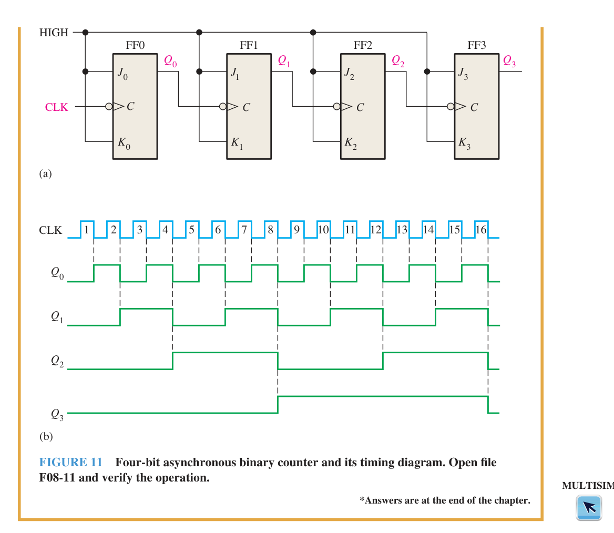
  <figcaption><strong>Figure 11:</strong> Schematic diagram and timing waveforms of a 4-bit asynchronous (ripple) binary up-counter. Sourced from <em>Thomas L. Floyd, Digital Fundamentals: A Systems Approach (1st Ed.)</em>, p. 444 (printed p. 438).</figcaption>
</figure>

##### Characteristic 13 Walkthrough: Hardware Reality Check
1. Because flip-flops trigger on **negative (falling) clock edges ($1 \to 0$)**, $FF_1$ toggles only when $Q_0$ transitions from $1$ to $0$.
2. This creates automatic frequency division: $Q_0$ toggles every 1 clock cycle ($f/2$), $Q_1$ toggles every 2 cycles ($f/4$), $Q_2$ every 4 cycles ($f/8$), and $Q_3$ every 8 cycles ($f/16$).
3. The outputs $Q_3 Q_2 Q_1 Q_0$ count up in perfect binary sequence: $0000 \to 0001 \to 0010 \to \dots \to 1111_2$ ($0$ to $15_{10}$).

##### The Fatal Flaw of Ripple Counters: Cumulative Propagation Delay
*Source: Kumar (p. 670); Floyd (p. 443)*  
Because each flip-flop is clocked by the preceding flip-flop, the transition delay ripples through the chain like falling dominoes. In an $n$-bit ripple counter:
$$t_{\text{total delay}} = n \times t_{pd}$$
For a 4-bit counter with $t_{pd} = 10\text{ ns}$, the MSB changes $40\text{ ns}$ after the clock edge! During that $40\text{ ns}$ window, the outputs pass through false, spurious intermediate counts (glitches), destroying accuracy at high clock frequencies.

---

#### 2. The Modulo-10 (Decade / BCD) Ripple Counter (*Kumar*, p. 669, Figure 12.8)
A standard 4-bit counter naturally counts through 16 states ($0$ to $15$, Modulo-16). But decimal clocks and BCD systems must count from **$0$ to $9$ and instantly reset back to $0$ on the tenth pulse** (Modulo-10).
- **The Feedback NAND Reset Mechanism:**  
  Decimal count $10_{10}$ in binary is $1010_2$ ($Q_3=1, Q_2=0, Q_1=1, Q_0=0$).  
  Connect lines $Q_3$ and $Q_1$ to the inputs of a 2-input NAND gate, and connect the NAND output to the active-LOW Asynchronous Clear ($\overline{CLR}$) pins of all four flip-flops:

<figure>
  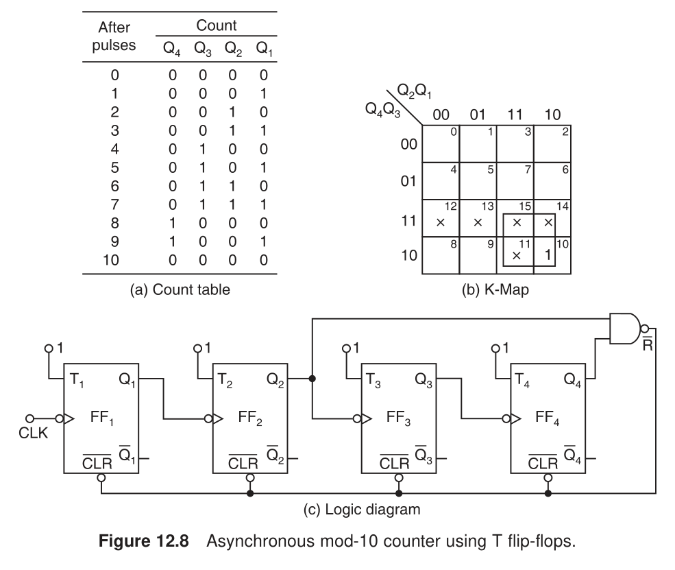
  <figcaption><strong>Figure 12.8:</strong> Count sequence table, K-map, and logic schematic of an asynchronous Modulo-10 (Decade) counter using feedback clear gating. Sourced from <em>A. Anand Kumar, Fundamentals of Digital Circuits (4th Ed.)</em>, p. 669 (printed p. 637).</figcaption>
</figure>

- When the counter reaches $9$ (`1001`), $Q_1$ is $0$, so the NAND output remains HIGH (inactive).
- On the next pulse, the counter briefly touches $10$ (`1010`). Instantly, both $Q_3=1$ and $Q_1=1$! The NAND gate output snaps LOW ($0\text{ V}$), pulsing the $\overline{CLR}$ pins and resetting all flip-flops back to `0000` in just a few nanoseconds!

---

### 4.10 Synchronous Counters (Up to 4 Bits)
*Source: Kumar (Ch. 12, pp. 674–686, Figure 12.16); Floyd (Ch. 8, pp. 446–451, Figure 19)*  
**[Pacing: Conceptually Critical — The High-Speed Industry Standard]**

#### Need (Problem-First)
To eliminate the cumulative ripple propagation delay of asynchronous counters, we need a counter where **every single flip-flop is connected to the exact same master clock wire simultaneously**.

#### The Synchronous Mechanism (*Floyd*, p. 450, Figure 19)
Because all flip-flops receive the clock edge at the exact same picosecond, they must decide *ahead of time* whether they should toggle or stay put.
- $FF_0$ must toggle on **every single clock pulse** $\implies J_0 = K_0 = 1$.
- $FF_1$ must toggle only when **$Q_0 = 1$** $\implies J_1 = K_1 = Q_0$.
- $FF_2$ must toggle only when **both $Q_0 = 1$ AND $Q_1 = 1$** $\implies J_2 = K_2 = Q_0 Q_1$.
- $FF_3$ must toggle only when **$Q_0 = 1$, $Q_1 = 1$, AND $Q_2 = 1$** $\implies J_3 = K_3 = Q_0 Q_1 Q_2$.

<figure>
  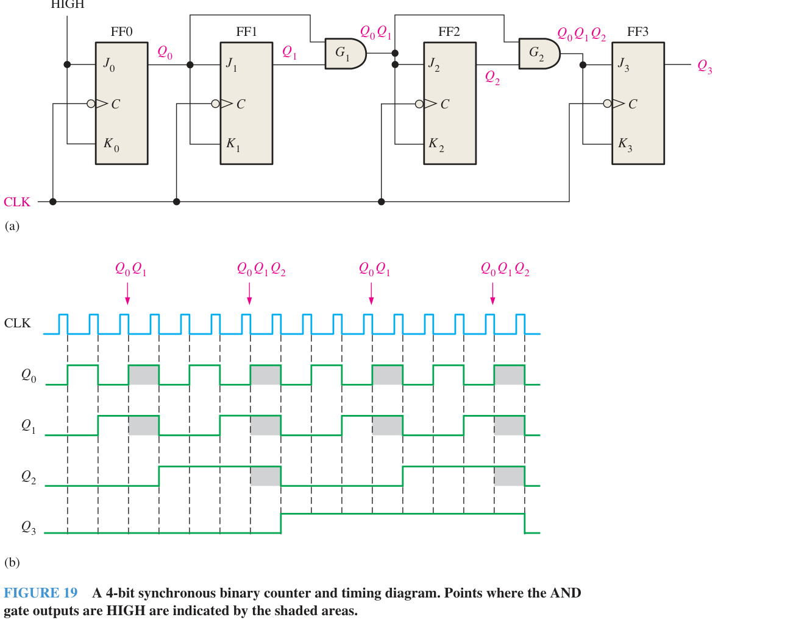
  <figcaption><strong>Figure 19:</strong> Schematic diagram and timing waveforms of a 4-bit Synchronous Binary Counter showing parallel clock distribution and carry-enable AND gates. Sourced from <em>Thomas L. Floyd, Digital Fundamentals: A Systems Approach (1st Ed.)</em>, p. 450 (printed p. 444).</figcaption>
</figure>

- **Total Propagation Delay:** Exactly **one flip-flop delay ($t_{pd}$)** regardless of how many bits are added! All flip-flops switch simultaneously in unison.

---

### 4.11 Ring Counters and Johnson (Twisted-Ring) Counters
*Source: Kumar (Ch. 12, pp. 697–700, Figures 12.57 & 12.61)*  
**[Pacing: Elegant Shift-Register Counter Architectures]**

#### 1. The 4-Bit Ring Counter (*Kumar*, p. 697, Figure 12.57)
A 4-bit shift register where the output of the last flip-flop is fed straight back into the input of the first flip-flop ($D_0 = Q_3$):
- **Initial Preset:** A single `1` is pre-loaded: `1000`.
- On successive clock pulses, the `1` simply circulates in a ring:  
  `1000` $\to$ `0100` $\to$ `0010` $\to$ `0001` $\to$ `1000`.
- **Advantage:** Each state directly activates a control line without requiring any decoding gates!

<figure>
  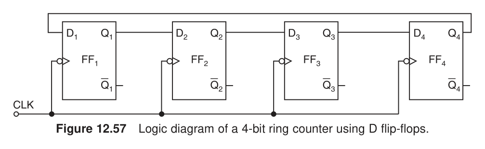
  <figcaption><strong>Figure 12.57:</strong> Logic diagram of a 4-bit Ring Counter using D flip-flops. Sourced from <em>A. Anand Kumar, Fundamentals of Digital Circuits (4th Ed.)</em>, p. 697 (printed p. 665).</figcaption>
</figure>

#### 2. The 4-Bit Johnson Counter (Twisted-Ring Counter) (*Kumar*, p. 698, Figure 12.61)
The **inverted** output of the last flip-flop is fed back into the input of the first flip-flop ($D_0 = \overline{Q_3}$):
- Starting from `0000`, 1s stream in from the left, followed by 0s:  
  `0000` $\to$ `1000` $\to$ `1100` $\to$ `1110` $\to$ `1111` $\to$ `0111` $\to$ `0011` $\to$ `0001` $\to$ `0000`.
- An $n$-bit Johnson counter yields **$2n$ unique timing states** (a 4-bit counter gives 8 states!), double that of a basic ring counter, while requiring only simple 2-input AND gates for complete decoding.

<figure>
  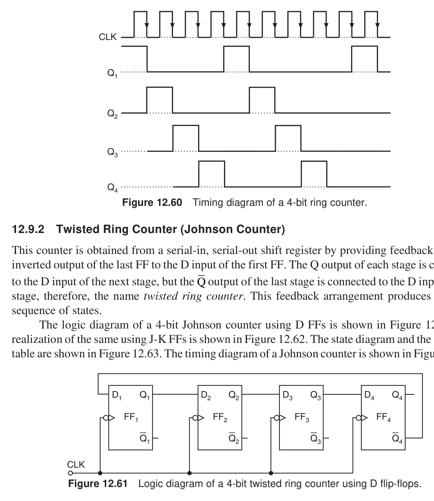
  <figcaption><strong>Figure 12.61:</strong> Logic diagram of a 4-bit twisted ring (Johnson) counter. Sourced from <em>A. Anand Kumar, Fundamentals of Digital Circuits (4th Ed.)</em>, p. 698 (printed p. 666).</figcaption>
</figure>

---

### 4.12 Real-World Application: Traffic Light Control System
*Source: Floyd (Ch. 6, pp. 322–326, Figures 1, 2, 3 & 4)*  
**[Pacing: Comprehensive System Capstone — See How Everything Fits Together]**

#### Need (Problem-First)
We have studied gates, adders, decoders, flip-flops, and counters. How are these individual chips combined to control an actual automated system in the physical world? We analyze the design of an automated **Traffic Signal Controller for a busy Main Street intersected by an occasionally used Side Street** (*Floyd*, p. 322).

#### System Specifications & Operational Requirements:
1. **State 1 ($S_1$):** Main street light is **GREEN**; Side street light is **RED**. This state remains active for at least $25\text{ seconds}$ (Long Timer, $T_L$). If there are no vehicles detected on the side street ($V_S = 0$), the main street stays GREEN indefinitely.
2. **State 2 ($S_2$):** When side street traffic arrives ($V_S = 1$) after $25\text{ s}$, Main street transitions to **YELLOW** for $4\text{ seconds}$ (Short Timer, $T_S$); Side street remains RED.
3. **State 3 ($S_3$):** Main street is **RED**; Side street turns **GREEN**. This state lasts for $25\text{ seconds}$ as long as side street vehicles remain present ($T_L V_S$).
4. **State 4 ($S_4$):** Main street remains **RED**; Side street transitions to **YELLOW** for $4\text{ seconds}$ ($T_S$). The system then loops back to State 1!

---

#### 1. The State Diagram (*Floyd*, p. 323, Figure 2)
To eliminate multi-bit race conditions during state transitions, the four states are assigned a **2-bit Gray code sequence**:
- State 1 ($S_1$): `00`
- State 2 ($S_2$): `01`
- State 3 ($S_3$): `11`
- State 4 ($S_4$): `10`

<figure>
  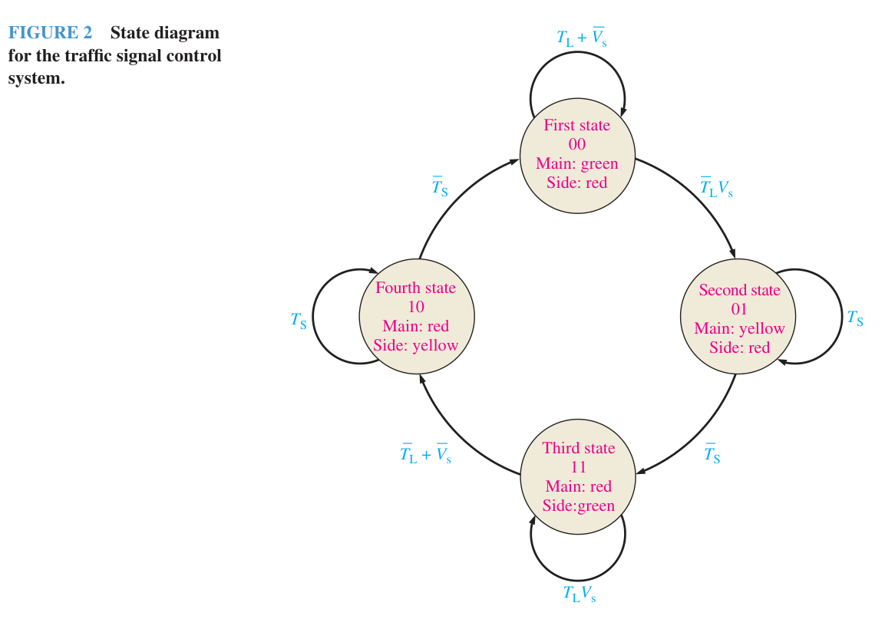
  <figcaption><strong>Figure 2:</strong> State diagram for the traffic signal controller showing 2-bit Gray code state assignments and transition conditions based on timers (<em>T<sub>L</sub>, T<sub>S</sub></em>) and vehicle sensors (<em>V<sub>S</sub></em>). Sourced from <em>Thomas L. Floyd, Digital Fundamentals: A Systems Approach (1st Ed.)</em>, p. 323 (printed p. 317).</figcaption>
</figure>

---

#### 2. System Architecture & Block Diagram (*Floyd*, p. 324, Figure 3)
Figure 3 from *Floyd* reveals the complete three-part system decomposition:
1. **Sequential Logic (The State Counter):** A 2-bit Gray-code counter that sequences through states $00 \to 01 \to 11 \to 10$ based on inputs from the vehicle sensor and timers.
2. **Timing Circuits:** A $25\text{ s}$ long timer ($T_L$) and a $4\text{ s}$ short timer ($T_S$), triggered by transitions between states.
3. **Combinational Output Logic:** Decodes the 2-bit Gray code into six physical lamp driving signals: Main Red ($MR$), Main Yellow ($MY$), Main Green ($MG$), Side Red ($SR$), Side Yellow ($SY$), and Side Green ($SG$).

<figure>
  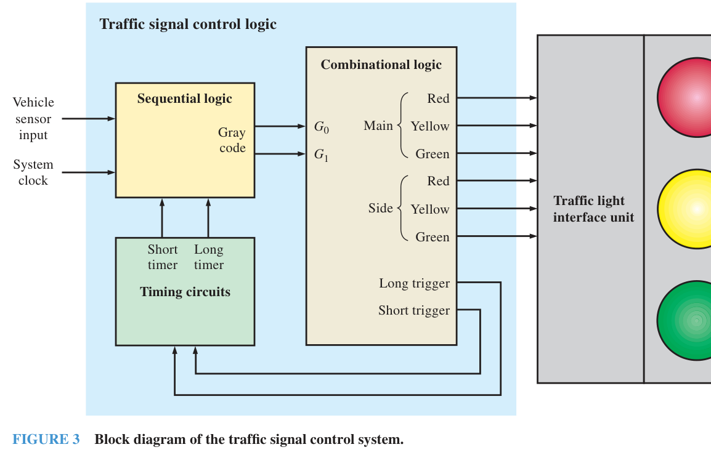
  <figcaption><strong>Figure 3:</strong> Block diagram of the traffic signal control system showing interaction between sequential logic counter, timing circuits, combinational output decoder, and power interface. Sourced from <em>Thomas L. Floyd, Digital Fundamentals: A Systems Approach (1st Ed.)</em>, p. 324 (printed p. 318).</figcaption>
</figure>

##### Derivation of Combinational Light Output Equations (*Floyd*, p. 325):
- Main Green ($MG$) is ON only in State 1 ($S_1$, code `00`):
  $$MG = \overline{G_1}\ \overline{G_0}$$
- Main Yellow ($MY$) is ON only in State 2 ($S_2$, code `01`):
  $$MY = \overline{G_1}G_0$$
- Main Red ($MR$) is ON in both State 3 ($S_3$, `11`) and State 4 ($S_4$, `10`):
  $$MR = G_1 G_0 + G_1\overline{G_0} = G_1(G_0 + \overline{G_0}) = G_1$$
- Side Green ($SG$) is ON only in State 3 ($S_3$, code `11`):
  $$SG = G_1 G_0$$
- Side Yellow ($SY$) is ON only in State 4 ($S_4$, code `10`):
  $$SY = G_1\overline{G_0}$$
- Side Red ($SR$) is ON in both State 1 ($S_1$, `00`) and State 2 ($S_2$, `01`):
  $$SR = \overline{G_1}\ \overline{G_0} + \overline{G_1}G_0 = \overline{G_1}$$
Notice how elegant digital design is: Main Red is simply bit $G_1$, and Side Red is simply $\overline{G_1}$!

---

### Unit IV Understanding Checkpoints & Misconception Audit

#### 1. Does This Make Sense? Self-Check
- **Question 1:** Why is a Master-Slave JK flip-flop immune to the race-around condition?
  - **Answer:** Because the Master latch and Slave latch are driven by opposite clock phases ($CLK$ and $\overline{CLK}$). When the Master is accepting inputs, the Slave is completely disconnected from the output, breaking the feedback loop.
- **Question 2:** If an input clock signal has a frequency of $16	ext{ MHz}$, what is the frequency at the $Q$ output of a single T flip-flop configured with $T=1$?
  - **Answer:** Exactly half: $16	ext{ MHz} / 2 = 8	ext{ MHz}$.
- **Question 3:** In a 4-bit SISO shift register, how many total clock pulses are required to load a 4-bit word in and then shift it completely out?
  - **Answer:** 4 clock pulses to shift data in, and another 4 clock pulses to shift data out (total 8 clock pulses).

#### 2. Conceptual Misconceptions Corrected
- **Misconception:** *"A flip-flop and a latch are the exact same thing."*  
  **Correction:** No. A **latch** is level-triggered (transparent during the entire clock HIGH interval). A **flip-flop** is edge-triggered (sensitive only during the infinitesimal picosecond transition edge of the clock).
- **Misconception:** *"In an asynchronous ripple counter, all flip-flops toggle at the exact same instant."*  
  **Correction:** Never! Only the first flip-flop toggles on the clock edge. Each subsequent stage is clocked by the preceding stage, creating a cumulative ripple delay ($n \cdot t_{pd}$) that can corrupt high-speed systems.

---


# Unit V: Converters and Semiconductor Memories

---

### Master Subject Map: Unit V Position
```
[ UNIT IV: SEQUENTIAL CIRCUITS & STATE MACHINES ]
                                  │
                                  ▼
┌──────────────────────────────────────────────────────────────────────────────────┐
│ YOU ARE HERE ──► UNIT V: CONVERTERS & SEMICONDUCTOR MEMORIES                     │
│ • D/A Converters: Weighted-Resistor (Summing Op-Amp), R-2R Ladder, DAC0808 IC    │
│ • A/D Converters: Counter-Type, SAR (Binary Search), Dual-Slope, ADC0801/0808    │
│ • Semiconductor Memories: Organization (2^k × m), Read/Write Cycles, Expansion  │
│ • Memory Classification: Volatile vs Non-Volatile, SRAM (6T) vs DRAM (1T-1C)    │
│ • Programmable Logic Devices (PLDs): Architectures of PROM, PAL, and PLA         │
└─────────────────────────────────┬────────────────────────────────────────────────┘
                                  ▼
[ REAL-WORLD DIGITAL SYSTEMS: Complete Microcomputer & Signal Processing Architectures ]
```
*In 3 lines:* Units I through IV built the internal brain of a digital computer. Unit V completes the subject by connecting that digital brain to the physical universe. We master **DACs and ADCs** to translate between continuous real-world voltages and digital bits, explore mass **Semiconductor Memories (RAM & ROM)**, and examine user-customizable silicon chips (**PLDs: PROM, PAL, PLA**).

---

### Prerequisites for this Unit
Before studying Unit V, ensure you recall these concepts:
1. **Ohm's Law & Circuit References (Prereqs 1 & 2):** Current $I = V/R$, Ground ($0\text{ V}$), and Op-Amp Virtual Ground ($V_- \approx 0\text{ V}$).
2. **Binary Weights & Positional Values (Unit I, Section 1.1):** Binary digits carry weights $2^{-1} = 0.5$, $2^{-2} = 0.25$, $2^{-3} = 0.125$, etc.
3. **Binary Counters & Shift Registers (Unit IV, Sections 4.8–4.10):** Stepping sequentially through states on clock edges.
4. **Decoders (Unit III, Section 3.8):** A $k$-to-$2^k$ decoder activates exactly one row wire for memory word addressing.

---

## PART 1: Digital-to-Analog Converters (DAC)

### 5.1 The Need for DAC and Key Specifications
*Source: Kumar (Ch. 17, pp. 941–946, Figures 17.1 & 17.2); Floyd (Ch. 9, pp. 487–492)*  
**[Pacing: Intuitive Foundations — Bridging Bits to Continuous Reality]**

#### Need (Problem-First)
Microprocessors calculate with discrete numbers (e.g., `11010010`). But physical actuators do not understand numbers. An audio speaker requires a continuously undulating analog voltage to move its cone; an electric vehicle motor requires a continuous voltage to set its speed; an MRI scanner requires continuous magnetic coils. How can a computer convert a digital binary word into a proportional continuous physical voltage? That bridge is the **Digital-to-Analog Converter (DAC)**.

#### Key DAC Performance Specifications Defined Inline:
1. **Resolution:** The smallest analog voltage increment that the DAC can produce. It corresponds to the voltage generated by a change of the **Least Significant Bit (LSB)** (*Kumar*, p. 944):
   $$\text{Step Size } (\Delta V) = \frac{V_{FS}}{2^n - 1}$$
   Where $V_{FS}$ is the Full-Scale output voltage and $n$ is the number of digital bits.
   *Concrete Round-Number Example:* An 8-bit DAC ($n=8$) has $2^8 - 1 = 255$ intervals. If $V_{FS} = 5.10\text{ V}$, the resolution is:
   $$\Delta V = \frac{5.10\text{ V}}{255} = 0.02\text{ V} = 20\text{ mV per step}$$
2. **Full-Scale Output ($V_{FS}$):** The maximum analog output voltage produced when all input bits are $1$ (`1111...1`).
3. **Linearity:** How strictly the analog output follows a perfect straight line across all digital input codes.
4. **Accuracy:** The deviation between the actual measured analog output and the ideal theoretical output.
5. **Settling Time ($t_s$):** The time required for the analog output to settle within $\pm \frac{1}{2}\text{ LSB}$ of its final value after an input code transition.

---

### 5.2 The Binary Weighted-Resistor DAC
*Source: Kumar (Ch. 17, pp. 951–953, Figure 17.10)*  
**[Pacing: Derivation Step-by-Step — Trace the Summing Node]**

#### How It Works (The Physical Mechanism)
The circuit connects an Operational Amplifier (Op-Amp) configured as an **inverting summing amplifier**, with binary input switches driving resistors whose values are scaled inversely to their binary weights ($R, 2R, 4R, 8R$):

<figure>
  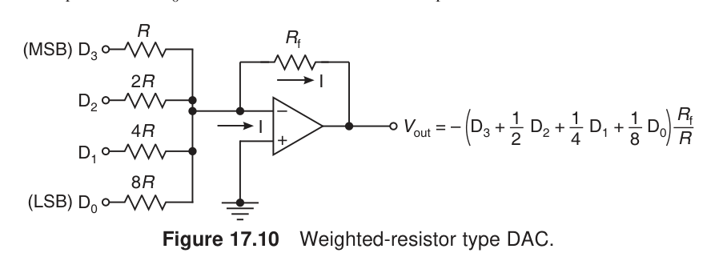
  <figcaption><strong>Figure 17.10:</strong> Binary Weighted-Resistor type Digital-to-Analog Converter using an operational amplifier summing network. Sourced from <em>A. Anand Kumar, Fundamentals of Digital Circuits (4th Ed.)</em>, p. 951 (printed p. 919).</figcaption>
</figure>

##### Characteristic 13 Walkthrough: Hardware Reality Check
1. The non-inverting terminal ($+$) of the op-amp is connected to Ground ($0\text{ V}$).
2. Due to negative feedback through $R_f$, the inverting terminal ($-$) is held at **Virtual Ground ($0.00\text{ V}$)** (*Kumar*, p. 951).
3. Digital bits ($D_3, D_2, D_1, D_0$) control electronic switches. If bit $D_i = 1$, the resistor is connected to reference voltage $-V_{ref}$; if $D_i = 0$, the resistor is connected to ground ($0\text{ V}$).
4. The current flowing through each weighted resistor is determined strictly by Ohm's Law into virtual ground:
   - $I_3 = \frac{V_{ref}}{R} D_3$ (MSB current)
   - $I_2 = \frac{V_{ref}}{2R} D_2 = \frac{1}{2} I_3$
   - $I_1 = \frac{V_{ref}}{4R} D_1 = \frac{1}{4} I_3$
   - $I_0 = \frac{V_{ref}}{8R} D_0 = \frac{1}{8} I_3$ (LSB current)
5. Because the op-amp input draws zero current, by Kirchhoff's Current Law, all individual branch currents sum into the feedback resistor $R_f$:
   $$I_{\text{total}} = I_3 + I_2 + I_1 + I_0 = \frac{V_{ref}}{R} \left(D_3 + \frac{1}{2}D_2 + \frac{1}{4}D_1 + \frac{1}{8}D_0\right)$$
6. The output voltage is the drop across $R_f$:
   $$V_{out} = -I_{\text{total}} \cdot R_f = -V_{ref} \frac{R_f}{R} \left(D_3 2^{-0} + D_2 2^{-1} + D_1 2^{-2} + D_0 2^{-3}\right)$$

##### The Fatal Engineering Flaw of Weighted Resistors: The Resistor Spread Problem
In a 4-bit DAC, resistors range from $R$ to $8R$ (a factor of 8). But in a modern **12-bit DAC**, the resistors must range from $R$ to $2^{11}R = 2048R$!
- If $R = 10\text{ k}\Omega$, the LSB resistor must be $20.48\text{ M}\Omega$!
- **Fabrication Disaster:** In integrated circuit silicon manufacturing, it is virtually impossible to fabricate resistors spanning four orders of magnitude ($10\text{ k}\Omega$ to $20\text{ M}\Omega$) that track each other accurately across temperature changes. A tiny $0.05\%$ error in the MSB resistor completely swamps the entire LSB current!

---

### 5.3 The R-2R Ladder DAC: The Universal Solution
*Source: Kumar (Ch. 17, pp. 946–950, Figure 17.5); Floyd (Ch. 9, pp. 490–492)*  
**[Pacing: Conceptually Brilliant — Master Why Two Resistor Values Suffice]**

#### Need (Problem-First)
We need a digital-to-analog converter that works for any number of bits (8, 12, 16, or 24 bits) but uses **only TWO precision resistor values** that can be effortlessly matched on a silicon die. That circuit is the **R-2R Ladder**.

#### The R-2R Ladder Circuit Architecture (*Kumar*, p. 947, Figure 17.5)

<figure>
  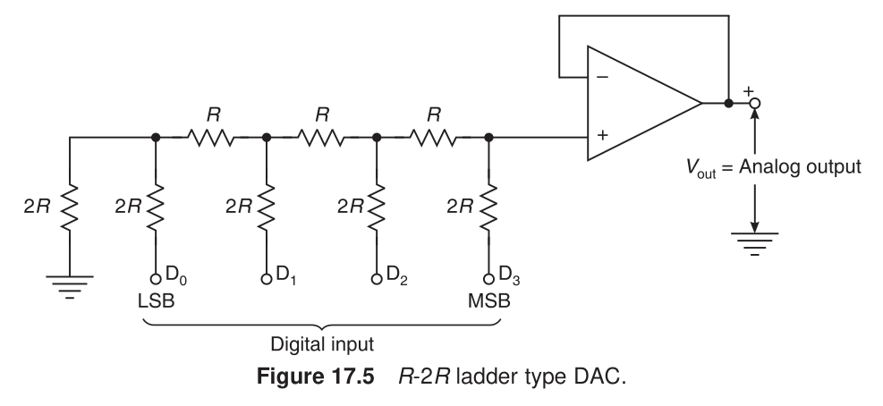
  <figcaption><strong>Figure 17.5:</strong> Schematic diagram of an R-2R ladder Digital-to-Analog Converter feeding an operational amplifier buffer. Sourced from <em>A. Anand Kumar, Fundamentals of Digital Circuits (4th Ed.)</em>, p. 947 (printed p. 915).</figcaption>
</figure>

##### Why It Works: The Continuous Binary Current Division
The R-2R ladder uses only two resistor values: $R$ (e.g., $10\text{ k}\Omega$) and $2R$ (e.g., $20\text{ k}\Omega$).  
- Look at the termination on the extreme left: a vertical $2R$ resistor is in parallel with another $2R$ resistor. Their equivalent parallel resistance is:
  $$2R \parallel 2R = R$$
- This equivalent $R$ is in series with the horizontal resistor $R$, yielding $R + R = 2R$!
- At the next node, this $2R$ is in parallel with the vertical $2R$, yielding $R$ again!
- **The Binary Splitting Principle:** Looking into *any* node of the ladder toward the left, the equivalent resistance is **always exactly $R$**!
- Therefore, at every single node, incoming current splits **exactly in half ($50\% / 50\%$)**!
- The currents arriving at the summing bus are naturally, automatically weighted in exact powers of two:
  $$\frac{I}{2}, \quad \frac{I}{4}, \quad \frac{I}{8}, \quad \frac{I}{16} \dots$$
- **Output Equation:**
  $$V_{out} = V_{ref} \left(\frac{D_3}{2^1} + \frac{D_2}{2^2} + \frac{D_1}{2^3} + \frac{D_0}{2^4}\right)$$
- **Manufacturing Triumph:** Because only two resistor values are required, laser-trimmed thin-film silicon resistors maintain near-perfect tracking over temperature, making R-2R the foundation of commercial DACs.

##### Commercial DAC Example: DAC0808 / DAC0800 IC (*Kumar*, pp. 954–955)
An 8-bit monolithic multiplying DAC featuring an R-2R ladder, fast settling time ($150\text{ ns}$), and full 8-bit accuracy ($\pm 0.19\%$).

---

## PART 2: Analog-to-Digital Converters (ADC)

### 5.4 The Need for ADC and Key Parameters
*Source: Kumar (Ch. 17, pp. 957–968); Floyd (Ch. 9, pp. 492–502)*  
**[Pacing: Intuitive Foundations — Translating the Analog World into Bits]**

#### Need (Problem-First)
The real physical world is entirely analog. Sound waves entering a microphone, engine temperatures measured by a thermocouple, and blood pressure in a medical monitor are continuous, fluid voltages. A digital computer cannot directly process an infinite continuum of values. We must sample the continuous signal and quantize it into a sequence of binary words. That device is the **Analog-to-Digital Converter (ADC)**.

#### Key ADC Specifications Defined Inline:
1. **Resolution:** The number of bits in the output binary word (e.g., 8-bit, 12-bit, 16-bit). An $n$-bit ADC divides the analog voltage range into $2^n$ discrete quantization levels.
2. **Quantization Error ($Q_e$):** Because a continuous voltage is rounded to the nearest discrete digital level, an inherent rounding error exists in all ADCs (*Kumar*, p. 957):
   $$Q_e = \pm \frac{1}{2} \text{ LSB}$$
   This error can never be eliminated by circuit tuning; it is reduced only by adding more bits.
3. **Conversion Time ($t_c$):** The total elapsed time from the command to start conversion (Start of Conversion, $SOC$) to the moment the valid digital word appears at the output pins (End of Conversion, $EOC$).

---

### 5.5 Counting (Ramp) ADC
*Source: Kumar (Ch. 17, pp. 958–960, Figure 17.15)*  
**[Pacing: Simple & Intuitive — The Staircase Comparator Method]**

#### How It Works (The Physical Mechanism)
The Counter-Type ADC uses a **closed-loop feedback system** consisting of an analog comparator, a binary counter, and an internal DAC (*Kumar*, p. 958, Figure 17.15):

<figure>
  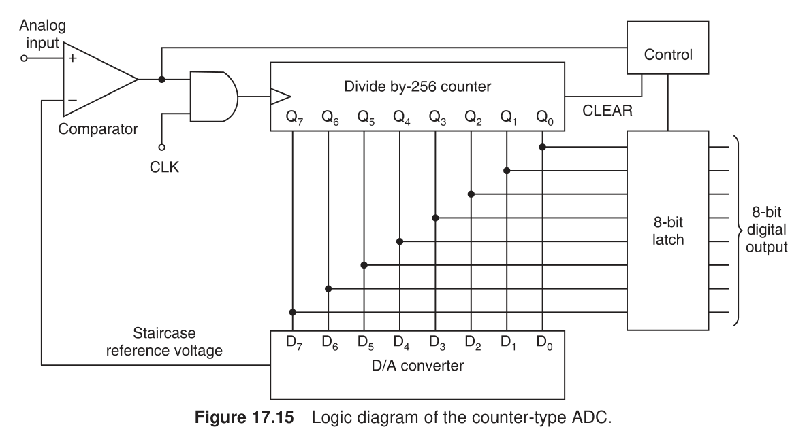
  <figcaption><strong>Figure 17.15:</strong> Logic schematic of a Counter-Type (Ramp) Analog-to-Digital Converter. Sourced from <em>A. Anand Kumar, Fundamentals of Digital Circuits (4th Ed.)</em>, p. 958 (printed p. 926).</figcaption>
</figure>

##### Characteristic 13 Walkthrough: Hardware Reality Check
1. A **Start pulse** resets the binary counter to `0000`. The DAC output voltage is $V_{DAC} = 0\text{ V}$.
2. The analog input voltage $V_A$ is connected to the non-inverting ($+$) input of the comparator, and $V_{DAC}$ connects to the inverting ($-$) input.
3. Because $V_A > V_{DAC}$, the comparator outputs **HIGH ($1$)**, which enables an AND gate, allowing master clock pulses to enter the counter.
4. The counter counts upward ($0, 1, 2, 3 \dots$), causing the internal DAC output $V_{DAC}$ to climb upward like a **staircase ramp**.
5. The instant $V_{DAC}$ climbs just a fraction of a millivolt above $V_A$ ($V_{DAC} \ge V_A$), the comparator output **snaps LOW ($0\text{ V}$)**!
6. The AND gate is instantly inhibited, freezing the clock. The counter stops counting.
7. The binary word frozen in the counter is the exact digital equivalent of the input voltage $V_A$!

##### Limitation: Variable and Slow Conversion Time
- If $V_A$ is small (e.g., $0.1\text{ V}$), the counter stops in 5 clock cycles.
- If $V_A$ is full-scale, an 8-bit counter must count through all **$2^8 = 256$ clock cycles**!
- In an $n$-bit counter, the maximum conversion time is:
  $$t_{\text{max}} = 2^n \times T_{\text{clock}}$$
  This massive variation in conversion time makes the counting ADC too slow for audio or video.

---

### 5.6 Successive Approximation ADC (SAR ADC)
*Source: Kumar (Ch. 17, pp. 965–967, Figure 17.24); Floyd (Ch. 9, pp. 494–498)*  
**[Pacing: Conceptually Heavy — The Binary Search Algorithm in Hardware]**

#### Need (Problem-First)
We need an ADC that is fast, highly accurate, and has a **fixed, predictable conversion time** that does not depend on whether the input voltage is high or low.

#### The Binary Search Algorithm in Hardware (*Kumar*, p. 965, Figure 17.24)
Instead of counting up slowly by 1s (like a linear search), the SAR ADC uses an intelligent **binary search algorithm** (the same strategy you use when guessing a secret number between 1 and 100 by guessing 50 first):

<figure>
  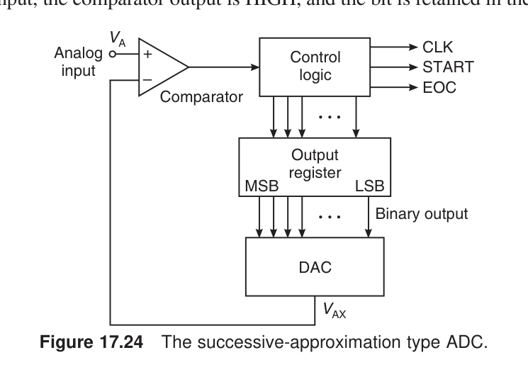
  <figcaption><strong>Figure 17.24:</strong> Block diagram of a Successive-Approximation Register (SAR) Analog-to-Digital Converter. Sourced from <em>A. Anand Kumar, Fundamentals of Digital Circuits (4th Ed.)</em>, p. 965 (printed p. 933).</figcaption>
</figure>

##### Characteristic 13 Walkthrough: Step-by-Step Conversion
Consider a 4-bit SAR ADC with full-scale $V_{FS} = 16\text{ V}$ (each step is $1\text{ V}$).  
Suppose the incoming analog voltage is **$V_A = 11.4\text{ V}$**.
- **Clock Cycle 1 (Test MSB, $D_3 = 8\text{ V}$):**  
  SAR sets MSB to $1$: trial word = `1000` ($8\text{ V}$).  
  Internal DAC produces $8\text{ V}$.  
  Comparator tests: Is $V_A (11.4\text{ V}) > 8\text{ V}$? **YES!**  
  **Decision:** Keep $D_3 = 1$.
- **Clock Cycle 2 (Test Next Bit, $D_2 = 4\text{ V}$):**  
  SAR sets $D_2$ to $1$: trial word = `1100` ($8 + 4 = 12\text{ V}$).  
  Internal DAC produces $12\text{ V}$.  
  Comparator tests: Is $V_A (11.4\text{ V}) > 12\text{ V}$? **NO!** (It's too high!)  
  **Decision:** Reset $D_2 = 0$.
- **Clock Cycle 3 (Test Next Bit, $D_1 = 2\text{ V}$):**  
  SAR sets $D_1$ to $1$: trial word = `1010` ($8 + 0 + 2 = 10\text{ V}$).  
  Internal DAC produces $10\text{ V}$.  
  Comparator tests: Is $V_A (11.4\text{ V}) > 10\text{ V}$? **YES!**  
  **Decision:** Keep $D_1 = 1$.
- **Clock Cycle 4 (Test LSB, $D_0 = 1\text{ V}$):**  
  SAR sets $D_0$ to $1$: trial word = `1011` ($8 + 0 + 2 + 1 = 11\text{ V}$).  
  Internal DAC produces $11\text{ V}$.  
  Comparator tests: Is $V_A (11.4\text{ V}) > 11\text{ V}$? **YES!**  
  **Decision:** Keep $D_0 = 1$.
- **End of Conversion (EOC):** The SAR asserts the $EOC$ pin. Final digital word = **`1011` ($11_{10}$)**!
- **Fixed Conversion Time:** Notice that for an $n$-bit SAR ADC, conversion **always takes exactly $n$ clock cycles**!
  $$t_{\text{conversion}} = n \times T_{\text{clock}}$$
  An 8-bit SAR ADC finishes in just **8 clock cycles**, over **30 times faster** than a counting ADC!

##### Commercial ADC IC: ADC0801 / ADC0808 (*Kumar*, p. 967, Figure 17.25)
A classic 8-bit successive approximation ADC with on-chip clock generator, active-low chip select ($\overline{CS}$), write/start ($\overline{WR}$), and end-of-conversion interrupt ($\overline{INTR}$).

---

### 5.7 Dual-Slope Integrating ADC
*Source: Kumar (Ch. 17, pp. 964–965, Figure 17.23); Floyd (Ch. 9, pp. 498–500)*  
**[Pacing: Mathematical Masterpiece — The Heart of Digital Multimeters]**

#### Need (Problem-First)
In industrial and medical measurement instruments (like digital multimeters), high speed is not required, but **extreme precision and total immunity to $50\text{ Hz} / 60\text{ Hz}$ AC power line noise** are mandatory. SAR ADCs suffer from component drift in their DAC resistors. We need an ADC whose mathematical accuracy is **completely independent of component tolerances (independent of $R$ and $C$)**! That converter is the **Dual-Slope Integrating ADC**.

#### The Dual-Slope Circuit & Waveform (*Kumar*, p. 964, Figure 17.23)

<figure>
  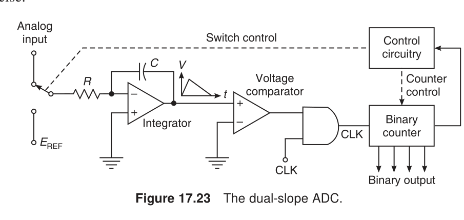
  <figcaption><strong>Figure 17.23:</strong> Functional block diagram of the Dual-Slope Integrating ADC. Sourced from <em>A. Anand Kumar, Fundamentals of Digital Circuits (4th Ed.)</em>, p. 964 (printed p. 932).</figcaption>
</figure>

##### The Two Mathematical Integration Phases:
1. **Phase 1: Run-Up (Fixed Time Interval $T_1$):**  
   The electronic switch connects the op-amp integrator to the unknown analog input voltage $V_{in}$ (assumed negative, or inverted). The integrator charges its capacitor $C$ through resistor $R$ for a **fixed time period $T_1$** (governed by the time it takes an $n$-bit counter to count to full scale, $2^n$ clock cycles):
   $$V_{\text{peak}} = -\frac{1}{RC} \int_0^{T_1} V_{in}\, dt = \frac{V_{in} \cdot T_1}{RC}$$
   Notice that the peak voltage reached is directly proportional to $V_{in}$.
2. **Phase 2: Run-Down (Variable Time Interval $T_2$):**  
   At the exact moment $T_1$ expires, the control logic flips the switch to a fixed, highly stable reference voltage $-V_{ref}$ of opposite polarity. The counter resets to zero and starts counting again. The integrator discharges back toward zero:
   $$0 = V_{\text{peak}} - \frac{V_{ref} \cdot T_2}{RC}$$
   Equating the two expressions:
   $$\frac{V_{in} \cdot T_1}{RC} = \frac{V_{ref} \cdot T_2}{RC}$$
   **Divide both sides by $RC$:**
   $$V_{in} \cdot T_1 = V_{ref} \cdot T_2 \quad \iff \quad \mathbf{V_{in} = V_{ref} \left(\frac{T_2}{T_1}\right)}$$

##### The Mathematical Miracle of Dual-Slope:
*Look at that equation!* **The resistance $R$, capacitance $C$, and master clock frequency $f$ have completely cancelled out of the equation!**  
Even if your resistor shifts by $10\%$ due to heat or your capacitor ages, the measured voltage $V_{in}$ remains **100% mathematically exact**!
- By setting $T_1$ to an exact multiple of the AC power line period ($20\text{ ms}$ for $50\text{ Hz}$ or $16.67\text{ ms}$ for $60\text{ Hz}$), AC line hum integrates to exactly zero, providing infinite noise rejection.

---

## PART 3: Semiconductor Memories and Programmable Logic Devices (PLDs)

### 5.8 Memory Organization, Word Capacity, and Read/Write Operations
*Source: Kumar (Ch. 18, pp. 974–978, Figures 18.1 & 18.2); Mano (Ch. 7, pp. 410–418)*  
**[Pacing: Architectural System View — High Relevance to Computer Hardware]**

#### Memory Terminology Defined Inline:
- **Memory Cell:** The elementary 1-bit bistable storage unit.
- **Word:** A group of binary bits that are stored or retrieved together as a unit (e.g., 8-bit byte, 16-bit word, 32-bit word, 64-bit word).
- **Address:** The unique binary number designating the specific physical physical location of a word inside the memory array.
- **Capacity:** The total storage capability of the memory, designated as:
  $$\text{Capacity} = 2^k \times m$$
  Where $k$ is the number of **Address lines** (giving $2^k$ addressable words) and $m$ is the number of **Data lines** (bits per word) (*Kumar*, p. 975).
  *Example:* A memory chip with 10 address lines and 8 data lines has:
  $$\text{Capacity} = 2^{10} \times 8 = 1024 \times 8 = 1\text{ Kilobyte (1 KB)}$$

<figure>
  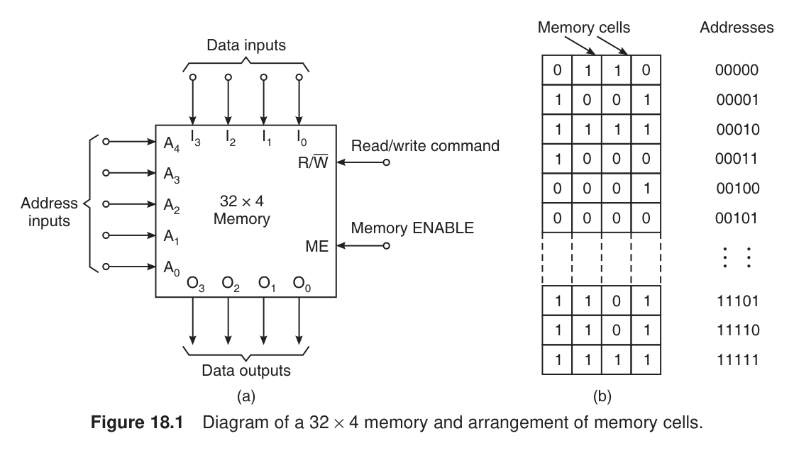
  <figcaption><strong>Figure 18.1:</strong> Block diagram of a 32 × 4 semiconductor memory array showing internal address decoding and cell matrix. Sourced from <em>A. Anand Kumar, Fundamentals of Digital Circuits (4th Ed.)</em>, p. 976 (printed p. 944).</figcaption>
</figure>

##### The Memory Read and Write Sequences (*Kumar*, p. 977):
- **Memory Write Cycle:**
  1. Apply the binary address to the address bus pins ($A_0$ to $A_{k-1}$).
  2. Place the data bits to be stored onto the data input bus ($D_0$ to $D_{m-1}$).
  3. Assert the active-low Chip Select ($\overline{CS}$) pin to enable the chip.
  4. Pulse the Write Enable ($\overline{WE}$) line LOW for a specified minimum write pulse width ($t_w$). The internal gates latch the data into the addressed cells.
- **Memory Read Cycle:**
  1. Apply the desired binary address to the address bus pins.
  2. Assert Chip Select ($\overline{CS}$) and Output Enable ($\overline{OE}$).
  3. Hold Write Enable ($\overline{WE}$) HIGH (Read mode).
  4. After an **Access Time ($t_{acc}$)**, the data stored in the addressed cells appears on the output pins.

---

### 5.9 Expanding Memory Size: Word Length and Word Capacity
*Source: Kumar (Ch. 18, pp. 984–989, Figures 18.7 & 18.9); Floyd (Ch. 9, pp. 505–510)*  
**[Pacing: Systematic Circuit Synthesis — Learn How Chips are Combined]**

#### Need (Problem-First)
In an embedded system, your processor requires a memory space of $1\text{K} \times 8$ (1024 bytes), but the only chips available in your inventory are $1\text{K} \times 4$ (each storing 4-bit nibbles). Or your system needs $2\text{K} \times 8$, but you only have $1\text{K} \times 8$ chips. How do you wire multiple small chips together to expand the total memory space?

---

#### 1. Expanding Word Length (Increasing Data Width) (*Kumar*, p. 985)
- **Goal:** Combine two $16 \times 4$ memory chips to create a single $16 \times 8$ memory module.
- **The Wiring Rule:**
  - Both chips must share the **exact same address bus lines** ($A_0, A_1, A_2, A_3$) in parallel so that identical memory locations are accessed simultaneously!
  - Both chips share the **exact same control lines** ($\overline{CS}, \overline{WE}$).
  - Chip 1 provides the lower 4 data bits ($D_0, D_1, D_2, D_3$).
  - Chip 2 provides the upper 4 data bits ($D_4, D_5, D_6, D_7$).

<figure>
  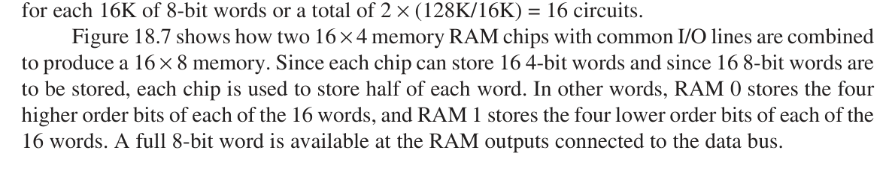
  <figcaption><strong>Figure 18.7:</strong> Combining two 16 × 4 RAM chips to expand word length, creating a unified 16 × 8 memory module. Sourced from <em>A. Anand Kumar, Fundamentals of Digital Circuits (4th Ed.)</em>, p. 985 (printed p. 953).</figcaption>
</figure>

---

#### 2. Expanding Word Capacity (Increasing Total Addresses) (*Kumar*, p. 988)
- **Goal:** Combine two $16 \times 4$ memory chips to create a single $32 \times 4$ memory module.
- **The Wiring Rule:**
  - The module needs $32 = 2^5$ words $\implies$ **5 address lines** ($A_4, A_3, A_2, A_1, A_0$).
  - The lower 4 address lines ($A_0, A_1, A_2, A_3$) are connected to both chips in parallel.
  - The data lines ($D_0, D_1, D_2, D_3$) of both chips are tied together in parallel to form a common data bus.
  - The highest address bit (**$A_4$**) is used to select which chip is active!
    - When $A_4 = 0$: Chip 1 is enabled via $\overline{CS}_1$ (addresses $0$ to $15$).
    - When $A_4 = 1$: Chip 2 is enabled via $\overline{CS}_2$ through an inverter (addresses $16$ to $31$).

<figure>
  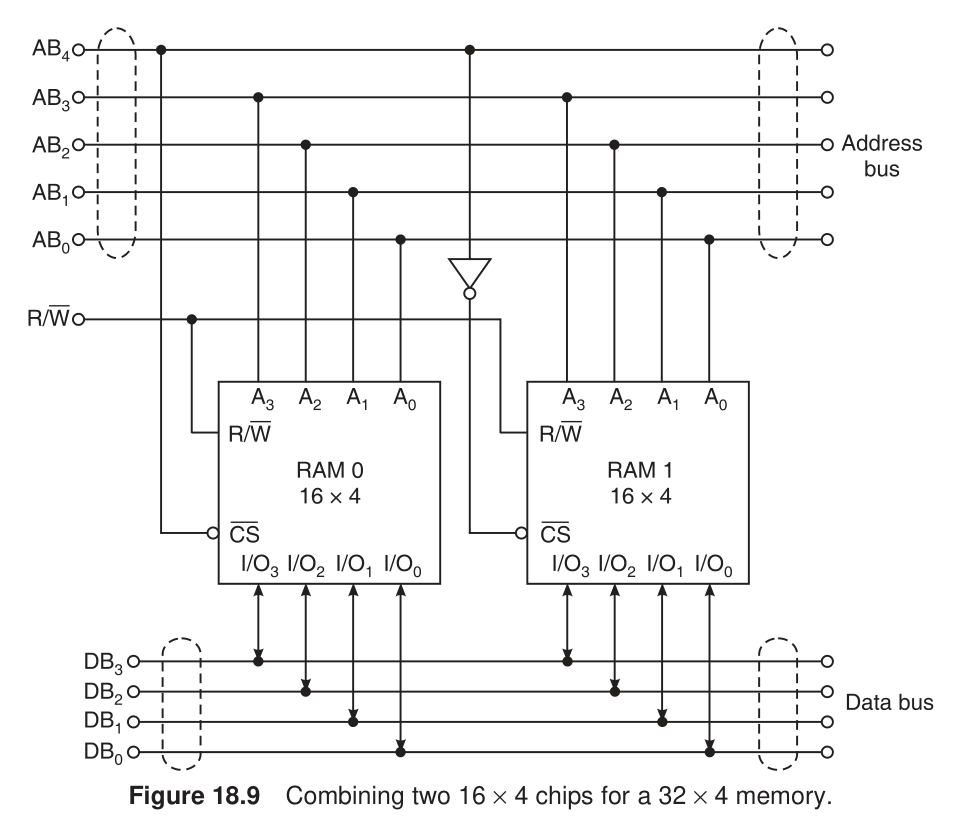
  <figcaption><strong>Figure 18.9:</strong> Combining two 16 × 4 RAM chips using an MSB address inverter to expand word capacity to 32 × 4. Sourced from <em>A. Anand Kumar, Fundamentals of Digital Circuits (4th Ed.)</em>, p. 988 (printed p. 956).</figcaption>
</figure>

---

### 5.10 Classification and Characteristics of Memories: SRAM vs. DRAM, ROM Families
*Source: Kumar (Ch. 18, pp. 978–984, Figure 18.5); Floyd (Ch. 9, pp. 510–525)*  
**[Pacing: Core Memory Technologies — Understand the Silicon Cells]**

#### The Master Memory Hierarchy:
- **Volatile Memory:** Loses its stored data the instant electric power is disconnected. (RAM).
- **Non-Volatile Memory:** Retains its stored binary data permanently, even with zero power applied. (ROM, Flash).

---

#### 1. Static RAM (SRAM) vs. Dynamic RAM (DRAM)

| Parameter | Static RAM (SRAM) | Dynamic RAM (DRAM) |
|---|---|---|
| **Storage Element** | Cross-coupled flip-flop (4 to 6 transistors) | Single MOSFET transistor + tiny capacitor ($1\text{T}-1\text{C}$) |
| **Silicon Cell Area** | Large (takes 4x more area per bit) | Microscopic (ultra-dense) |
| **Refresh Requirement** | **None** (stores data indefinitely while powered) | **Mandatory periodic refresh** (every few ms) |
| **Operating Speed** | Extremely fast ($1\text{ to }5\text{ ns}$) | Slower ($10\text{ to }50\text{ ns}$) |
| **Power Consumption** | Higher when switching; zero refresh overhead | Lower per bit; requires refresh controller power |
| **Application** | CPU L1/L2/L3 Caches | Main System Memory (Computer RAM sticks) |

<figure>
  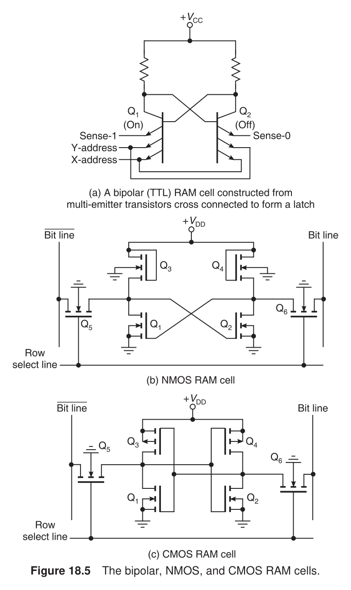
  <figcaption><strong>Figure 18.5:</strong> Circuit diagrams of Static RAM storage cells (bipolar, NMOS, and CMOS). Sourced from <em>A. Anand Kumar, Fundamentals of Digital Circuits (4th Ed.)</em>, p. 982 (printed p. 950).</figcaption>
</figure>

##### Why DRAM Needs Refreshing:
In DRAM, a bit `1` is stored as a tiny packet of electrostatic charge on an integrated capacitor ($pprox 30\text{ femtofarads}$). Due to microscopic reverse-bias junction leakage, this charge bleeds away into the silicon substrate within tens of milliseconds! If left alone, a stored `1` will bleed down into a `0`. Therefore, a dedicated **DRAM Controller** must continuously read every row and restore the full charge thousands of times per second (the **Refresh Cycle**).

---

#### 2. The Read-Only Memory (ROM) Hierarchy
- **Mask ROM:** Data is permanently programmed into the silicon metallization layer during factory fabrication with chemical masks. Cheap in million-unit quantities, but cannot be modified.
- **PROM (Programmable ROM):** Manufactured with microscopic fusible links (nichrome or polysilicon). The user programs data in a PROM programmer by pulsing high current to physically **blow open selected fuses** ("burning" the ROM). It can be programmed only once!
- **EPROM (Erasable PROM):** Uses floating-gate MOS transistors. It can be erased by exposing the quartz window on the chip package to intense ultraviolet (UV) light for 20 minutes, which discharges the floating gates.
- **EEPROM (Electrically Erasable PROM):** Can be erased and rewritten electrically byte-by-byte in circuit, without UV light.
- **Flash Memory:** A high-density evolution of EEPROM that erases and writes data in whole blocks (pages), powering USB thumb drives and modern Solid-State Drives (SSDs).

---

### 5.11 Programmable Logic Devices (PLDs): PROM, PAL, and PLA
*Source: Kumar (Ch. 8, pp. 491–508, Figures 8.7, 8.8, 8.15); Mano (Ch. 7, pp. 430–445)*  
**[Pacing: Conceptually Heavy — The Three Architectures of Reconfigurable Silicon]**

#### Need (Problem-First)
In the 1970s, a complex digital product (like an arcade game or cash register) required hundreds of discrete 7400-series TTL chips wired together on massive printed circuit boards. Every design change required redesigning and etching a new circuit board. Engineers wanted a single standardized blank chip that could be configured on a programmer to implement *any arbitrary collection of logic functions*. These chips are **Programmable Logic Devices (PLDs)**.

#### The Three Core Architectures Compared (*Kumar*, p. 499, Figure 8.7)
Every two-level Boolean function can be expressed in Sum-of-Products (SOP) form:
$$F = \sum(\text{Product terms}) = \text{OR of ANDs}$$
Therefore, a PLD consists of an array of **AND gates** (generating product terms) followed by an array of **OR gates** (summing the product terms).  
The difference between the three PLD types lies strictly in **which array is fixed and which array is programmable**:

<figure>
  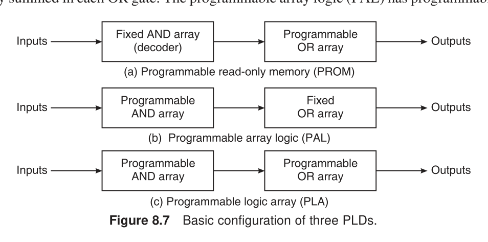
  <figcaption><strong>Figure 8.7:</strong> Architectural comparison of the three fundamental Programmable Logic Devices: PROM, PAL, and PLA. Sourced from <em>A. Anand Kumar, Fundamentals of Digital Circuits (4th Ed.)</em>, p. 499 (printed p. 467).</figcaption>
</figure>

| PLD Type | AND Array | OR Array | Flexibility | Ease of Programming |
|---|---|---|---|---|
| **PROM** | **Fixed** (Full Decoder) | **Programmable** | Low | Very Easy |
| **PAL** | **Programmable** | **Fixed** | Moderate | High (Industry Favorite) |
| **PLA** | **Programmable** | **Programmable** | **Maximum** | More Complex |

---

#### 1. Programmable Array Logic (PAL) (*Kumar*, p. 500, Figure 8.8)
Invented by Monolithic Memories Inc. (MMI).  
- **Architecture:** The AND array is fully programmable (inputs and complements can be fused to any AND gate). The OR array is **hardwired and fixed** (each OR gate receives product terms from a fixed group of AND gates, e.g., 3 or 4 AND gates per OR gate):

<figure>
  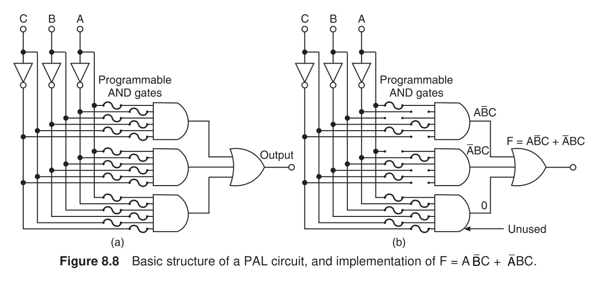
  <figcaption><strong>Figure 8.8:</strong> Basic structure of a Programmable Array Logic (PAL) circuit showing unprogrammed fusible links (a) and programmed implementation of <em>F = A B' C' + A' B C</em> (b). Sourced from <em>A. Anand Kumar, Fundamentals of Digital Circuits (4th Ed.)</em>, p. 500 (printed p. 468).</figcaption>
</figure>

- **Advantage:** Eliminating the programmable OR array drastically reduces parasitic propagation delay, making PALs exceptionally fast and simple to program.

---

#### 2. Programmable Logic Array (PLA) (*Kumar*, p. 508, Figure 8.15)
- **Architecture:** **Both the AND array and the OR array are fully programmable**:

<figure>
  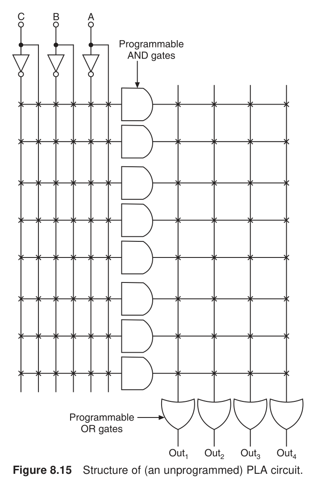
  <figcaption><strong>Figure 8.15:</strong> Internal matrix layout of an unprogrammed Programmable Logic Array (PLA) circuit showing programmable AND crosspoints and programmable OR crosspoints. Sourced from <em>A. Anand Kumar, Fundamentals of Digital Circuits (4th Ed.)</em>, p. 508 (printed p. 476).</figcaption>
</figure>

- **Why PLA is Superior for Complex Shared Systems:**  
  Because the OR array is programmable, multiple outputs can **share the exact same product term** from the AND array! If two functions both require the term $ABC$, a PLA generates $ABC$ once in the AND array and routes it to both OR gates, saving silicon area.

---

### Unit V Understanding Checkpoints & Misconception Audit

#### 1. Does This Make Sense? Self-Check
- **Question 1:** Why is an R-2R ladder preferred over a binary weighted-resistor network for high-resolution DACs?
  - **Answer:** Because an R-2R ladder requires only two precision resistor values ($R$ and $2R$), avoiding the unmanageable resistor spread (over $2000:1$ in 12-bit DACs) of weighted-resistor networks.
- **Question 2:** Why is the conversion accuracy of a Dual-Slope ADC completely independent of its resistor $R$ and capacitor $C$ values?
  - **Answer:** Because both the charging run-up phase ($T_1$) and discharging run-down phase ($T_2$) occur through the exact same $RC$ network, causing $R$ and $C$ to mathematically cancel out completely from the final voltage transfer equation.
- **Question 3:** What is the architectural difference between a PAL and a PLA?
  - **Answer:** A PAL has a programmable AND array with a fixed OR array. A PLA has both a programmable AND array and a programmable OR array.

#### 2. Conceptual Misconceptions Corrected
- **Misconception:** *"Dynamic RAM (DRAM) is faster than Static RAM (SRAM) because it is called 'dynamic'."*  
  **Correction:** The exact opposite is true! SRAM is significantly faster ($1	ext{ to }5	ext{ ns}$) because it uses active flip-flop latches. DRAM is slower ($10	ext{ to }50	ext{ ns}$) because charging and reading tiny capacitors takes time, and periodic refresh cycles block memory access.
- **Misconception:** *"A 16-bit ADC has zero error because 16 bits is very high precision."*  
  **Correction:** Every ADC has an unavoidable fundamental **Quantization Error of $\pm rac{1}{2}	ext{ LSB}$** caused by rounding continuous voltages to discrete binary levels.

---


# APPENDIX & MASTER REFERENCE COMPENDIUM

---

## A. Master Mathematical & Operational Cheat Sheet

### 1. Number Systems & Binary Arithmetic (Unit I)
- **Radix Polynomial Expansion:**
  $$N_r = \sum_{i=0}^{n-1} d_i \cdot r^i + \sum_{j=1}^{m} d_{-j} \cdot r^{-j}$$
- **Radix-minus-one Complement ($r-1$'s complement):**
  $$(r-1)'s = (r^n - 1) - N$$
  For binary: invert every bit ($0 \leftrightarrow 1$).
- **Radix Complement ($r$'s complement):**
  $$r's = r^n - N = \left[(r-1)'s\right] + 1$$
  For binary: take 1's complement and add 1.
- **Signed Range for $n$-bit integers:**
  $$\text{Range}_{\text{2's comp}} = \left[-2^{n-1}, \; +2^{n-1}-1\right]$$
  For $n=8$: $[-128, \; +127]$.

### 2. Logic Families & DC Noise Margins (Unit I)
- **High-state Noise Margin:**
  $$NM_H = V_{OH(\min)} - V_{IH(\min)}$$
- **Low-state Noise Margin:**
  $$NM_L = V_{IL(\max)} - V_{OL(\max)}$$
- **Fan-out:**
  $$\text{Fan-out} = \min\left(\frac{I_{OH(\max)}}{I_{IH(\max)}}, \; \frac{I_{OL(\max)}}{I_{IL(\max)}}\right)$$
- **Dynamic Power Dissipation in CMOS:**
  $$P_{\text{dynamic}} = C_L \cdot V_{DD}^2 \cdot f$$

### 3. Boolean Algebra & Minimization (Unit II)
- **De Morgan's Theorems:**
  $$\overline{A + B} = \overline{A} \cdot \overline{B}$$
  $$\overline{A \cdot B} = \overline{A} + \overline{B}$$
- **Absorption Laws:**
  $$A + A \cdot B = A$$
  $$A \cdot (A + B) = A$$
  $$A + \overline{A} \cdot B = A + B$$
- **Consensus Theorem:**
  $$A B + \overline{A} C + B C = A B + \overline{A} C$$

### 4. Arithmetic & Combinational Circuits (Unit III)
- **Half Adder:**
  $$S = A \oplus B, \quad C = A \cdot B$$
- **Full Adder:**
  $$S = A \oplus B \oplus C_{in}, \quad C_{out} = A B + B C_{in} + A C_{in}$$
- **Carry Lookahead Generator:**
  $$G_i = A_i B_i, \quad P_i = A_i \oplus B_i$$
  $$C_{i+1} = G_i + P_i C_i$$
  $$C_1 = G_0 + P_0 C_0$$
  $$C_2 = G_1 + P_1 G_0 + P_1 P_0 C_0$$
  $$C_3 = G_2 + P_2 G_1 + P_2 P_1 G_0 + P_2 P_1 P_0 C_0$$
  $$C_4 = G_3 + P_3 G_2 + P_3 P_2 G_1 + P_3 P_2 P_1 G_0 + P_3 P_2 P_1 P_0 C_0$$
- **Multiplexer Output Expansion:**
  $$Y = \sum_{k=0}^{2^n-1} m_k \cdot I_k$$

### 5. Sequential Logic & Flip-Flop Characteristic Equations (Unit IV)
- **SR Flip-Flop:**
  $$Q_{next} = S + \overline{R} Q, \quad \text{with condition } S \cdot R = 0$$
- **JK Flip-Flop:**
  $$Q_{next} = J \overline{Q} + \overline{K} Q$$
- **D Flip-Flop:**
  $$Q_{next} = D$$
- **T Flip-Flop:**
  $$Q_{next} = T \oplus Q = T \overline{Q} + \overline{T} Q$$
- **Master Excitation Summary:**

| $Q_n \to Q_{n+1}$ | $S$ | $R$ | $J$ | $K$ | $D$ | $T$ |
|:---:|:---:|:---:|:---:|:---:|:---:|:---:|
| $0 \to 0$ | $0$ | $\times$ | $0$ | $\times$ | $0$ | $0$ |
| $0 \to 1$ | $1$ | $0$ | $1$ | $\times$ | $1$ | $1$ |
| $1 \to 0$ | $0$ | $1$ | $\times$ | $1$ | $0$ | $1$ |
| $1 \to 1$ | $\times$ | $0$ | $\times$ | $0$ | $1$ | $0$ |

- **Maximum Ripple Counter Frequency:**
  $$f_{\max} = \frac{1}{n \cdot t_{pd}}$$

### 6. Converters & Semiconductor Memories (Unit V)
- **DAC Resolution (Step Size):**
  $$\Delta V = \frac{V_{FS}}{2^n - 1}$$
- **Binary Weighted DAC Output:**
  $$V_{out} = -V_{ref} \frac{R_f}{R} \sum_{i=0}^{n-1} D_i 2^{-(n-1-i)}$$
- **R-2R Ladder DAC Output:**
  $$V_{out} = V_{ref} \sum_{i=1}^{n} D_{n-i} 2^{-i}$$
- **ADC Quantization Error:**
  $$Q_e = \pm \frac{1}{2} \text{ LSB}$$
- **SAR ADC Conversion Time:**
  $$t_{\text{conversion}} = n \times T_{\text{clock}}$$
- **Dual-Slope ADC Transfer Equation:**
  $$V_{in} = V_{ref} \left(\frac{T_2}{T_1}\right)$$
- **Memory Capacity:**
  $$\text{Capacity} = 2^k \times m \text{ (where } k = \text{address lines}, m = \text{data lines)}$$

---

## B. Complete Master Textbook Figure Citation Directory

| Figure ID | Topic Description | Source Textbook | Chapter & Figure | Page (PDF / Printed) |
|---|---|---|---|---|
| `fig_u1_ttl_totem_pole.png` | Standard TTL NAND Gate with Totem-Pole Output | Anand Kumar | Ch. 4, Fig. 4.2 | p. 165 / p. 133 |
| `fig_u1_cmos_nand.png` | 2-Input CMOS NAND Gate Circuit | Anand Kumar | Ch. 4, Fig. 4.31 | p. 195 / p. 163 |
| `fig_u1_ttl_cmos_interfacing.png` | Interfacing TTL driving CMOS (Pull-Up Resistor) | Anand Kumar | Ch. 4, Fig. 4.36 | p. 201 / p. 169 |
| `fig_u2_kmap_grouping_rules.png` | Standard K-Map Formats (2, 3, 4 Variables) | Anand Kumar | Ch. 5, Fig. 5.1 | p. 238 / p. 206 |
| `fig_u3_full_adder_logic.png` | Full Adder Logic Diagram & Truth Table | Anand Kumar | Ch. 6, Fig. 6.2 | p. 320 / p. 288 |
| `fig_u3_parallel_adder_subtractor.png` | 4-Bit Parallel Binary Adder/Subtractor with XOR | Anand Kumar | Ch. 6, Fig. 6.8 | p. 327 / p. 295 |
| `fig_u3_carry_lookahead_adder.png` | 4-Bit Carry Lookahead Adder (CLA) Generator | Anand Kumar | Ch. 6, Fig. 6.10 | p. 329 / p. 297 |
| `fig_u3_multiplexer_trees.png` | 4-to-1 Multiplexer Internal Logic Gates | Anand Kumar | Ch. 7, Fig. 7.1 | p. 396 / p. 364 |
| `fig_u3_decoder_74138.png` | 3-to-8 Line Decoder (74LS138) Internal Logic | Anand Kumar | Ch. 7, Fig. 7.37 | p. 433 / p. 401 |
| `fig_u3_priority_encoder_74148.png` | 8-to-3 Octal Priority Encoder Logic Diagram | Anand Kumar | Ch. 7, Fig. 7.50 | p. 450 / p. 418 |
| `fig_u4_sr_latch_nor.png` | Basic SR Latch using Cross-Coupled NOR Gates | Anand Kumar | Ch. 10, Fig. 10.1 | p. 556 / p. 524 |
| `fig_u4_clocked_sr_flip_flop.png` | Clocked SR Flip-Flop with NAND Gates | Anand Kumar | Ch. 10, Fig. 10.5 | p. 559 / p. 527 |
| `fig_u4_master_slave_jk.png` | Master-Slave JK Flip-Flop Logic Circuit | Anand Kumar | Ch. 10, Fig. 10.12 | p. 565 / p. 533 |
| `fig_u4_siso_shift_register.png` | 4-Bit Serial-In Serial-Out (SISO) Shift Register | Anand Kumar | Ch. 11, Fig. 11.1 | p. 624 / p. 592 |
| `fig_u4_ripple_counter_4bit.png` | 4-Bit Asynchronous Binary Ripple Counter | Anand Kumar | Ch. 12, Fig. 12.1 | p. 678 / p. 646 |
| `fig_u4_mod10_counter.png` | Mod-10 (Decade) Ripple Counter with Reset | Anand Kumar | Ch. 12, Fig. 12.7 | p. 687 / p. 655 |
| `fig_u4_synchronous_counter_4bit.png` | 4-Bit Synchronous Binary Up-Counter | Anand Kumar | Ch. 12, Fig. 12.11 | p. 696 / p. 664 |
| `fig_u5_weighted_resistor_dac.png` | Binary Weighted-Resistor Summing Op-Amp DAC | Anand Kumar | Ch. 17, Fig. 17.10 | p. 951 / p. 919 |
| `fig_u5_r2r_ladder_dac.png` | R-2R Ladder Type Digital-to-Analog Converter | Anand Kumar | Ch. 17, Fig. 17.5 | p. 947 / p. 915 |
| `fig_u5_counter_type_adc.png` | Logic Diagram of Counter-Type (Ramp) ADC | Anand Kumar | Ch. 17, Fig. 17.15 | p. 958 / p. 926 |
| `fig_u5_dual_slope_adc.png` | Dual-Slope Integrating ADC Architecture | Anand Kumar | Ch. 17, Fig. 17.23 | p. 964 / p. 932 |
| `fig_u5_sar_adc.png` | Successive Approximation Register (SAR) ADC | Anand Kumar | Ch. 17, Fig. 17.24 | p. 965 / p. 933 |
| `fig_u5_adc0801_pinout.png` | Functional Pin Diagram of ADC0801 8-Bit Converter | Anand Kumar | Ch. 17, Fig. 17.25 | p. 967 / p. 935 |
| `fig_u5_memory_organization.png` | 32 × 4 Semiconductor Memory Array & Address Decode | Anand Kumar | Ch. 18, Fig. 18.1 | p. 976 / p. 944 |
| `fig_u5_sram_dram_cells.png` | Static RAM (SRAM) Transistor Storage Cells | Anand Kumar | Ch. 18, Fig. 18.5 | p. 982 / p. 950 |
| `fig_u5_memory_word_length_expansion.png` | Memory Expansion: Word Length ($16\times 4$ to $16\times 8$) | Anand Kumar | Ch. 18, Fig. 18.7 | p. 985 / p. 953 |
| `fig_u5_memory_word_capacity_expansion.png` | Memory Expansion: Word Capacity ($16\times 4$ to $32\times 4$) | Anand Kumar | Ch. 18, Fig. 18.9 | p. 988 / p. 956 |
| `fig_u5_pld_configurations.png` | Architectural Configurations: PROM, PAL, PLA | Anand Kumar | Ch. 8, Fig. 8.7 | p. 499 / p. 467 |
| `fig_u5_pal_structure.png` | Programmable Array Logic (PAL) Internal Matrix | Anand Kumar | Ch. 8, Fig. 8.8 | p. 500 / p. 468 |
| `fig_u5_pla_structure.png` | Programmable Logic Array (PLA) Internal Matrix | Anand Kumar | Ch. 8, Fig. 8.15 | p. 508 / p. 476 |

---
